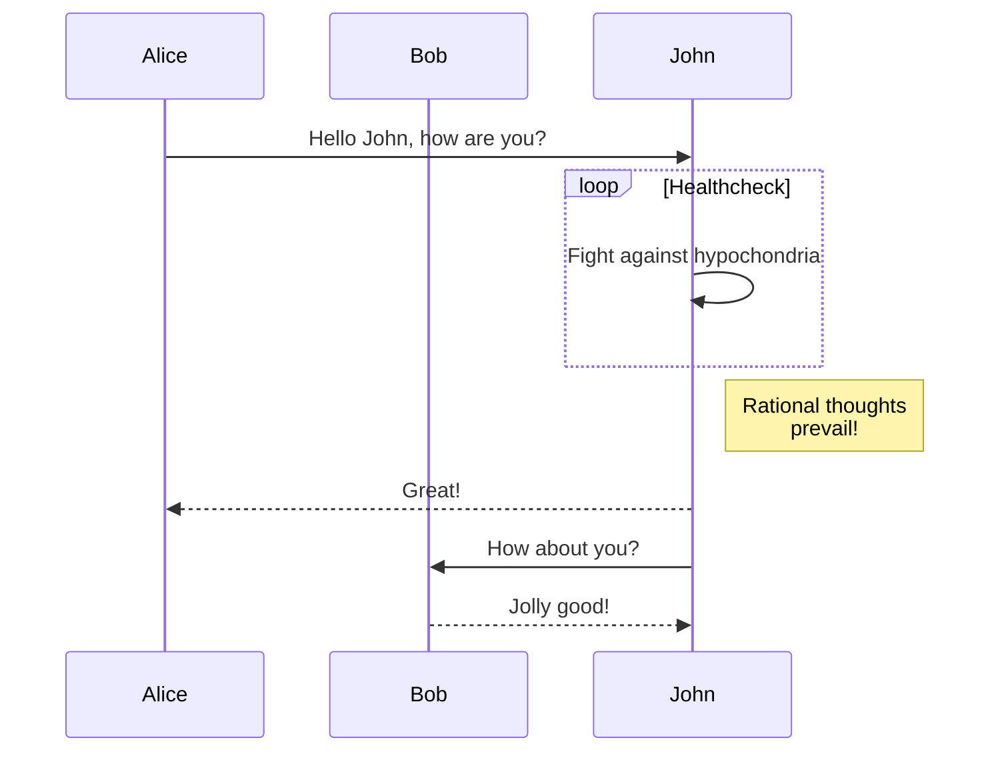

## Code Blocks

Normal rust code:

```rust
fn main() {
	println!("Hello, world!");
}
```

Code with file name:

```toml {data-file="Cargo.toml"}
[package]
name = "beast"
version = "0.1.0"
edition = "2024"

[dependencies]
```

Code with highlighted lines:

```rust {data-file="main.rs", hl_lines=["1-6"]}
enum Tile {
	Empty,       // There will be empty spaces on our board "  "
	Player,      // We will need the player "◀▶"
	Block,       // Some tiles will be blocks "░░"
	StaticBlock, // Others will be blocks that can't be moved "▓▓"
}

fn main() {
	println!("Hello, world!");
}
```

Code with folded code:

```rust {data-file="main.rs", data-fold="['5-11']", hl_lines=[1]}
#[derive(Copy)]
enum Tile {
	Empty,       // There will be empty spaces on our board "  "
	Player,      // We will need the player "◀▶"
	Block,       // Some tiles will be blocks "░░"
	StaticBlock, // Others will be blocks that can't be moved "▓▓"
}

fn main() {
	println!("{:?}", Board::new());
}
```

Console block with color output:

```console
cargo --color=always run 2>&1 | aha --black | pbcopy
<span style="font-weight:bold;color:lime;">   Compiling</span> beast v0.1.0 (/Users/dominik/Desktop/beast)
<span style="font-weight:bold;color:yellow;">warning</span><span style="font-weight:bold;">: constant `BOARD_WIDTH` is never used</span>
 <span style="font-weight:bold;color:#3333FF;">--&gt; </span>src/main.rs:1:7
  <span style="font-weight:bold;color:#3333FF;">|</span>
<span style="font-weight:bold;color:#3333FF;">1</span> <span style="font-weight:bold;color:#3333FF;">|</span> const BOARD_WIDTH: usize = 39;
  <span style="font-weight:bold;color:#3333FF;">|</span>       <span style="font-weight:bold;color:yellow;">^^^^^^^^^^^</span>
  <span style="font-weight:bold;color:#3333FF;">|</span>
  <span style="font-weight:bold;color:#3333FF;">= </span><span style="font-weight:bold;">note</span>: `#[warn(dead_code)]` on by default

<span style="font-weight:bold;color:yellow;">warning</span><span style="font-weight:bold;">: associated items `new` and `render` are never used</span>
  <span style="font-weight:bold;color:#3333FF;">--&gt; </span>src/main.rs:19:5
   <span style="font-weight:bold;color:#3333FF;">|</span>
<span style="font-weight:bold;color:#3333FF;">18</span> <span style="font-weight:bold;color:#3333FF;">|</span> impl Board {
   <span style="font-weight:bold;color:#3333FF;">|</span> <span style="font-weight:bold;color:#3333FF;">----------</span> <span style="font-weight:bold;color:#3333FF;">associated items in this implementation</span>
<span style="font-weight:bold;color:#3333FF;">19</span> <span style="font-weight:bold;color:#3333FF;">|</span>     fn new() -&gt; Self {
   <span style="font-weight:bold;color:#3333FF;">|</span>        <span style="font-weight:bold;color:yellow;">^^^</span>
<span style="font-weight:bold;color:#3333FF;">...</span>
<span style="font-weight:bold;color:#3333FF;">31</span> <span style="font-weight:bold;color:#3333FF;">|</span>     fn render(&amp;self) -&gt; String {
   <span style="font-weight:bold;color:#3333FF;">|</span>        <span style="font-weight:bold;color:yellow;">^^^^^^</span>

<span style="font-weight:bold;color:yellow;">warning</span><span style="font-weight:bold;">:</span> `beast` (bin &quot;beast&quot;) generated 6 warnings
<span style="font-weight:bold;color:lime;">    Finished</span> `dev` profile [unoptimized + debuginfo] target(s) in 0.32s
<span style="font-weight:bold;color:lime;">     Running</span> `target/debug/beast`
This is normal color, <span style="color:yellow;">this is yellow,</span> and this is normal again
```

Cleaning:
- remove HTML at start till `<pre>` and in footer from `</pre>`
- remove `<span style="font-weight:bold;"></span>`
- remove `filter: contrast(70%) brightness(190%);`

Code Diff:

```diff
impl Board {
- 	fn new() -> Self {
- 		Self {
- 			buffer: [[Tile::Empty; 39]; 20],
- 		}
+		fn gen(&self) -> Self
	}
}
```

Code as Mermaid:



Code as goat:

```goat
          .               .                .               .--- 1          .-- 1     / 1
         / \              |                |           .---+            .-+         +
        /   \         .---+---.         .--+--.        |   '--- 2      |   '-- 2   / \ 2
       +     +        |       |        |       |    ---+            ---+          +
      / \   / \     .-+-.   .-+-.     .+.     .+.      |   .--- 3      |   .-- 3   \ / 3
     /   \ /   \    |   |   |   |    |   |   |   |     '---+            '-+         +
     1   2 3   4    1   2   3   4    1   2   3   4         '--- 4          '-- 4     \ 4
```

```goat
                                                                             .
    0       3                          P *              Eye /         ^     /
     *-------*      +y                    \                +)          \   /  Reflection
  1 /|    2 /|       ^                     \                \           \ v
   *-------* |       |                v0    \       v3           --------*--------
   | |4    | |7      |                  *----\-----*
   | *-----|-*       +-----> +x        /      v X   \          .-.<--------        o
   |/      |/       /                 /        o     \        | / | Refraction    / \
   *-------*       v                 /                \        +-'               /   \
  5       6      +z              v1 *------------------* v2    |                o-----o
                                                               v
```

```goat {height=188}
Linux
 ├─Android
 ├─Debian
 │  ├─Ubuntu
 │  │  ├─Lubuntu
 │  │  ├─Kubuntu
 │  │  ├─Xubuntu
 │  │  └─Xubuntu
 │  └─Mint
 ├─Centos
 └─Fedora
```

```goat
┌─────┐       ┌───┐                                    ┌───┐
│Alice│       │Bob│───────────────────────────────────>│End│
└──┬──┘       └─┬─┘                                    └───┘
   │            │  
   │ Hello Bob! │  
   │───────────>│  
   │            │  
   │Hello Alice!│  
   │<───────────│  
┌──┴──┐       ┌─┴─┐
│Alice│       │Bob│
└─────┘       └───┘
```

```goat {class="foo"}
┌────────────────────────────────────────────────┐
│SYNTAX     = { PRODUCTION } .                   │
├────────────────────────────────────────────────┤
│PRODUCTION = IDENTIFIER "=" EXPRESSION "." .    │
├────────────────────────────────────────────────┤
│EXPRESSION = TERM { "|" TERM } .                │
├────────────────────────────────────────────────┤
│TERM       = FACTOR { FACTOR } .                │
├────────────────────────────────────────────────┤
│FACTOR     = IDENTIFIER                         │
├────────────────────────────────────────────────┤
│          | LITERAL                             │
├────────────────────────────────────────────────┤
│          | "[" EXPRESSION "]"                  │
├────────────────────────────────────────────────┤
│          | "(" EXPRESSION ")"                  │
├────────────────────────────────────────────────┤
│          | "{" EXPRESSION "}" .                │
├────────────────────────────────────────────────┤
│IDENTIFIER = letter { letter } .                │
├────────────────────────────────────────────────┤
│LITERAL    = """" character { character } """" .│
└────────────────────────────────────────────────┘
```

## Blockquotes

Normal quote:

> This is a quote

Quote with citation:

> Quote from a famous person
{cite="https://gohugo.io" caption="The person who said it"}

> [!NOTE]
> Useful information that users should know, even when skimming content
> With **multiple lines**.
> 
> And new paragraphs...

> [!TIP]
> Helpful advice for doing things better or more easily.

> [!IMPORTANT]
> Key information users need to know to achieve their goal.

> [!WARNING]
> Urgent info that needs immediate user attention to avoid problems with a longer line for testing.

> [!CAUTION]
> Advises about risks or negative outcomes of certain actions.
