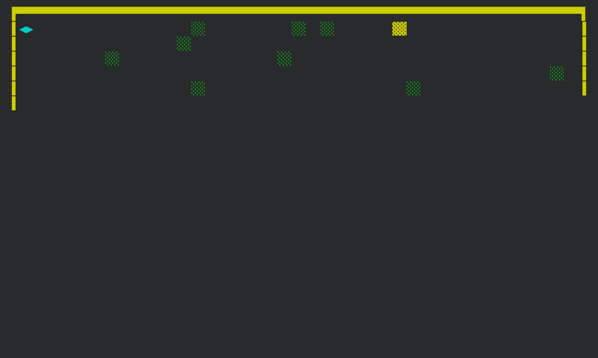

<div class="ribbon"></div>

## Where We Left Of

In [part 1 of this tutorial](../learning-rust-by-building-the-old-terminal-game-beast-from-1984-part-1/), we set up our
board and setup movements for our player.

In [part 2](../learning-rust-by-building-the-old-terminal-game-beast-from-1984-part-2/), we the added our terrain,
made blockchain puns and ended up with this code:



```console
.
├── Cargo.lock
├── Cargo.toml
└── src
    ├── board.rs
    ├── game.rs
    ├── level.rs
    ├── main.rs
    ├── player.rs
    └── raw_mode.rs
```

Our main module contains some global types and the `main` function to pull everything together:

```rust {data-file="main.rs"}
mod board;
mod game;
mod level;
mod player;
mod raw_mode;

use crate::{game::Game, raw_mode::RawMode};

pub const BOARD_WIDTH: usize = 39;
pub const BOARD_HEIGHT: usize = 20;
pub const TILE_SIZE: usize = 2;

pub const ANSI_YELLOW: &str = "\x1B[33m";
pub const ANSI_GREEN: &str = "\x1B[32m";
pub const ANSI_CYAN: &str = "\x1B[36m";
pub const ANSI_RESET: &str = "\x1B[39m";

#[derive(Copy, Clone, Debug, PartialEq)]
pub enum Tile {
	Empty,       // There will be empty spaces on our board "  "
	Player,      // We will need the player "◀▶"
	Block,       // Some tiles will be blocks "░░"
	StaticBlock, // Others will be blocks that can't be moved "▓▓"
}

pub enum Direction {
	Up,
	Right,
	Down,
	Left,
}

#[derive(Debug, Copy, Clone)]
pub struct Coord {
	column: usize,
	row: usize,
}

fn main() {
	let _raw_mode = RawMode::enter();

	let mut game = Game::new();
	game.play();
}
```

The game module contains our `Game` struct with it's own `render` method and the `play` method to start the game:

```rust {data-file="game.rs"}
use std::io::{Read, stdin};

use crate::{
	BOARD_HEIGHT, BOARD_WIDTH, Direction, board::Board, level::Level,
	player::Player,
};

#[derive(Debug)]
pub struct Game {
	board: Board,
	player: Player,
	level: Level,
}

impl Game {
	pub fn new() -> Self {
		Self {
			board: Board::new(),
			player: Player::new(),
			level: Level::One,
		}
	}

	pub fn play(&mut self) {
		let stdin = stdin();
		let mut lock = stdin.lock();
		let mut buffer = [0_u8; 1];
		println!("{}", self.render(false));

		while lock.read_exact(&mut buffer).is_ok() {
			match buffer[0] as char {
				'w' => {
					self.player.advance(&mut self.board, &Direction::Up);
				},
				'd' => {
					self.player.advance(&mut self.board, &Direction::Right);
				},
				's' => {
					self.player.advance(&mut self.board, &Direction::Down);
				},
				'a' => {
					self.player.advance(&mut self.board, &Direction::Left);
				},
				'q' => {
					println!("Good bye");
					break;
				},
				_ => {},
			}

			println!("{}", self.render(true));
		}
	}

	fn render(&self, reset: bool) -> String {
		const BORDER_SIZE: usize = 1;
		const TILE_SIZE: usize = 2;
		const FOOTER_SIZE: usize = 1;

		let mut board = if reset {
			format!(
				"\x1B[{}F",
				BORDER_SIZE + BOARD_HEIGHT + BORDER_SIZE + FOOTER_SIZE
			)
		} else {
			String::new()
		};

		board.push_str(&format!(
			"{board}\n{footer:>width$}{level}",
			board = self.board.render(),
			footer = "Level: ",
			level = self.level,
			width = BORDER_SIZE + BOARD_WIDTH * TILE_SIZE + BORDER_SIZE - FOOTER_SIZE,
		));

		board
	}
}
```

In the board module we setup our `Board` structure which is responsible to generate the terrain, render the inside of
the board and implements our own `Index` trait to make it easier for us to work with the board:

```rust {data-file="board.rs"}
use rand::seq::SliceRandom;

use crate::{
	ANSI_CYAN, ANSI_GREEN, ANSI_RESET, ANSI_YELLOW, BOARD_HEIGHT, BOARD_WIDTH,
	Coord, TILE_SIZE, Tile,
	level::{Level, LevelConfig},
};

use std::ops::{Index, IndexMut};

#[derive(Debug)]
pub struct Board {
	pub buffer: [[Tile; BOARD_WIDTH]; BOARD_HEIGHT],
}

impl Index<&Coord> for Board {
	type Output = Tile;

	fn index(&self, coord: &Coord) -> &Self::Output {
		&self.buffer[coord.row][coord.column]
	}
}

impl IndexMut<&Coord> for Board {
	fn index_mut(&mut self, coord: &Coord) -> &mut Self::Output {
		&mut self.buffer[coord.row][coord.column]
	}
}

impl Board {
	pub fn new() -> Self {
		let mut buffer = [[Tile::Empty; BOARD_WIDTH]; BOARD_HEIGHT];

		let mut all_coords = (0..BOARD_HEIGHT)
			.flat_map(|row| (0..BOARD_WIDTH).map(move |column| Coord { column, row }))
			.filter(|coord| !(coord.column == 0 && coord.row == 0))
			.collect::<Vec<Coord>>();
		let mut rng = rand::rng();
		all_coords.shuffle(&mut rng);

		buffer[0][0] = Tile::Player;

		let LevelConfig {
			block_count,
			static_block_count,
		} = Level::One.get_level_config();

		for _ in 0..block_count {
			let coord = all_coords.pop().expect(
				"We tried to place more blocks than there were available spaces on the board",
			);
			buffer[coord.row][coord.column] = Tile::Block;
		}

		for _ in 0..static_block_count {
			let coord = all_coords.pop().expect(
				"We tried to place more static blocks than there were available spaces on the board",
			);
			buffer[coord.row][coord.column] = Tile::StaticBlock;
		}

		Self { buffer }
	}

	pub fn render(&self) -> String {
		let mut output = format!(
			"{ANSI_YELLOW}▛{}▜{ANSI_RESET}\n",
			"▀".repeat(BOARD_WIDTH * TILE_SIZE)
		);

		for rows in self.buffer {
			output.push_str(&format!("{ANSI_YELLOW}▌{ANSI_RESET}"));
			for tile in rows {
				match tile {
					Tile::Empty => output.push_str("  "),
					Tile::Player => {
						output.push_str(&format!("{ANSI_CYAN}◀▶{ANSI_RESET}"))
					},
					Tile::Block => {
						output.push_str(&format!("{ANSI_GREEN}░░{ANSI_RESET}"))
					},
					Tile::StaticBlock => {
						output.push_str(&format!("{ANSI_YELLOW}▓▓{ANSI_RESET}"))
					},
				}
			}
			output.push_str(&format!("{ANSI_YELLOW}▐{ANSI_RESET}\n"));
		}
		output.push_str(&format!(
			"{ANSI_YELLOW}▙{}▟{ANSI_RESET}",
			"▄".repeat(BOARD_WIDTH * TILE_SIZE)
		));

		output
	}
}
```

The level module contains our level enum which implements a way for us to get a config for each level:

```rust {data-file="level.rs"}
pub struct LevelConfig {
	pub block_count: usize,
	pub static_block_count: usize,
}

#[derive(Debug)]
pub enum Level {
	One,
	Two,
	Three,
}

impl std::fmt::Display for Level {
	fn fmt(&self, f: &mut std::fmt::Formatter) -> std::fmt::Result {
		match self {
			Level::One => write!(f, "1"),
			Level::Two => write!(f, "2"),
			Level::Three => write!(f, "3"),
		}
	}
}

impl Level {
	pub fn get_level_config(&self) -> LevelConfig {
		match self {
			Level::One => LevelConfig {
				block_count: 30,
				static_block_count: 5,
			},
			Level::Two => LevelConfig {
				block_count: 20,
				static_block_count: 10,
			},
			Level::Three => LevelConfig {
				block_count: 12,
				static_block_count: 20,
			},
		}
	}
}
```

The player module is responsible for keeping track of where the player is and how it moves including a way to
push blocks on the board:

```rust {data-file="player.rs"}
use crate::{BOARD_HEIGHT, BOARD_WIDTH, Coord, Direction, Tile, board::Board};

#[derive(Debug)]
pub struct Player {
	position: Coord,
}

impl Player {
	pub fn new() -> Self {
		Self {
			position: Coord { column: 0, row: 0 },
		}
	}

	fn get_next_position(
		position: Coord,
		direction: &Direction,
	) -> Option<Coord> {
		let mut next_position = position;
		match direction {
			Direction::Up => {
				if next_position.row > 0 {
					next_position.row -= 1
				} else {
					return None;
				}
			},
			Direction::Right => {
				if next_position.column < BOARD_WIDTH - 1 {
					next_position.column += 1
				} else {
					return None;
				}
			},
			Direction::Down => {
				if next_position.row < BOARD_HEIGHT - 1 {
					next_position.row += 1
				} else {
					return None;
				}
			},
			Direction::Left => {
				if next_position.column > 0 {
					next_position.column -= 1
				} else {
					return None;
				}
			},
		}

		Some(next_position)
	}

	pub fn advance(&mut self, board: &mut Board, direction: &Direction) {
		if let Some(first_position) =
			Self::get_next_position(self.position, direction)
		{
			match board[&first_position] {
				Tile::Empty => {
					board[&self.position] = Tile::Empty;
					self.position = first_position;
					board[&first_position] = Tile::Player;
				},
				Tile::Block => {
					let mut current_tile = Tile::Block;
					let mut current_position = first_position;

					while current_tile == Tile::Block {
						if let Some(next_position) =
							Self::get_next_position(current_position, direction)
						{
							current_position = next_position;
							current_tile = board[&current_position];

							match current_tile {
								Tile::Block => { /* continue looking */ },
								Tile::Empty => {
									board[&self.position] = Tile::Empty;
									self.position = first_position;
									board[&first_position] = Tile::Player;
									board[&current_position] = Tile::Block;
								},
								Tile::StaticBlock | Tile::Player => break,
							}
						} else {
							break;
						}
					}
				},
				Tile::Player | Tile::StaticBlock => {},
			}
		}
	}
}
```

And lastly we have our raw mode module that helps us set the terminal from cooked mode into raw mode:

```rust {data-file="raw_mode.rs"}
use std::process::Command;

pub struct RawMode;

impl RawMode {
	pub fn enter() -> Self {
		let _ = Command::new("stty")
			.arg("-icanon")
			.arg("-echo")
			.spawn()
			.and_then(|mut child| child.wait());
		print!("\x1b[?25l");
		Self
	}
}

impl Drop for RawMode {
	fn drop(&mut self) {
		let _ = Command::new("stty")
			.arg("icanon")
			.arg("echo")
			.spawn()
			.and_then(|mut child| child.wait());
		print!("\x1b[?25h");
	}
}
```

Ok so how should we add our enemies?

## Adding Our Enemies

The goal is to add a different amount of enemies per level.
While level 1 adds 3, later levels will increase the number of beasts to make the challenge harder as you play through
the game.
We will have to create a single beast module that we can instantiate multiple times per level which will take care of
its own position on the board and how it moves.
In a way, this module will likley be pretty similar to our player module because it will do similar things.
For this tutorial we will only build a single type of beast but the original game had three different types which all
presented a different type of challege.
Because this is a rust tutorial and I think it would be fun for you to build your own beast type on your own outside
this tutorial, we should build our own beast [`trait`](https://doc.rust-lang.org/book/ch10-02-traits.html) to make that
easier.

## What's In A Trait?

We've used a couple traits from the standard library in the past parts like `Copy` and `Debug`.
It's time now to build our very own.
To start off let's create a folder which will contain our beasts, aptly named `beasts` and a module file called
`beasts.rs`.
Inside the beast folder we add a file file called `beast_trait.rs`.

```console
.
├── Cargo.lock
├── Cargo.toml
└── src
<span class="console-add">    ├── beasts</span>
<span class="console-add">    │   └── beast_trait.rs</span>
<span class="console-add">    ├── beasts.rs</span>
    ├── board.rs
    ├── game.rs
    ├── level.rs
    ├── main.rs
    ├── player.rs
    └── raw_mode.rs
```

The `beasts.rs` file we use to re-export everything inside the `beasts/` folder to make importing a little easier.
For now, let's just re-export anything that is inside our `beasts/beast_trait.rs` file:

```rust {data-file="beasts.rs"}
pub mod beast_trait;
pub use beast_trait::*;
```

Now we only need to include the `beasts` module in our `main.rs` file and not each file inside the beasts folder.

```rust {data-file="main.rs", data-fold="['4-45']", hl_lines=[1]}
mod beasts;
mod board;
mod game;
mod level;
mod player;
mod raw_mode;

use crate::{game::Game, raw_mode::RawMode};

pub const BOARD_WIDTH: usize = 39;
pub const BOARD_HEIGHT: usize = 20;
pub const TILE_SIZE: usize = 2;

pub const ANSI_YELLOW: &str = "\x1B[33m";
pub const ANSI_GREEN: &str = "\x1B[32m";
pub const ANSI_CYAN: &str = "\x1B[36m";
pub const ANSI_RESET: &str = "\x1B[39m";

#[derive(Copy, Clone, Debug, PartialEq)]
pub enum Tile {
	Empty,       // There will be empty spaces on our board "  "
	Player,      // We will need the player "◀▶"
	Block,       // Some tiles will be blocks "░░"
	StaticBlock, // Others will be blocks that can't be moved "▓▓"
}

pub enum Direction {
	Up,
	Right,
	Down,
	Left,
}

#[derive(Debug, Copy, Clone)]
pub struct Coord {
	column: usize,
	row: usize,
}

fn main() {
	let _raw_mode = RawMode::enter();

	let mut game = Game::new();
	game.play();
}
```

The idea is to contain all types for beasts in the beasts folder and re-export them from within the `beasts.rs` file.
You might end up with your own enemies later and that folder is where you'd drop them in.

Ok let's now look at the `beasts/beast_trait.rs` file.
What do we need for a beast to slot into our game?
We need to be able to create a new beast and we need to move/advance the beast:

```rust {data-file="beasts/beast_trait.rs", data-fold="[]", hl_lines=[]}
use crate::{Coord, board::Board};

pub trait Beast {
	fn new(position: Coord) -> Self;

	fn advance(
		&mut self,
		board: &Board,
		player_position: &Coord,
	) -> Option<Coord>;
}
```

When creating a new instance of a beast with the `new` method, we will have to tell it where we placed the beast on the
board.
And the `advance` method will need to know about the board and where the player is.
It also may or may not find a coordinate to move into so we return an `Option`.
We will return the coordinate and only take `Board` by immutable reference because the beast could kill a player which
is logic we don't really want to keep in the beast module.
That kind of logic should be contained in the `Game` module as it will effect changes to the players lives and possible
end the game.

Now that we have our trait definition done, let's add our first beast.
In the original came the simplest beasts that appeared in the first view levels were called `Common Beast` so let's roll
with that:

```console
.
├── Cargo.lock
├── Cargo.toml
└── src
    ├── beasts
    │   ├── beast_trait.rs
<span class="console-add">    │   └── common_beast.rs</span>
    ├── beasts.rs
    ├── board.rs
    ├── game.rs
    ├── level.rs
    ├── main.rs
    ├── player.rs
    └── raw_mode.rs
```

Inside our new file called `beasts/common_beast.rs` we add the simplest implementation of our trait we can think of:

```rust {data-file="beasts/common_beast.rs", data-fold="[]", hl_lines=[]}
use crate::{Coord, beasts::Beast, board::Board};

#[derive(Debug)]
pub struct CommonBeast {
	pub position: Coord,
}

impl Beast for CommonBeast {
	fn new(position: Coord) -> Self {
		Self { position }
	}

	fn advance(
		&mut self,
		board: &Board,
		player_position: &Coord,
	) -> Option<Coord> {
		None
	}
}
```

We imported our trait, `Coord` and `Board` and then setup a new struct called `CommonBeast` which will hold a `Coord` in
the position variable.
Then we implement our trait on that new struct.
To keep things simple for now, we just return a `None` from our `advance` method.
Now all we need to do make this new module available to the rest of the codebase is to re-export it from our `beasts.rs`
file:

```rust {data-file="beasts.rs", data-fold="[]", hl_lines=["4-5"]}
pub mod beast_trait;
pub use beast_trait::*;

pub mod common_beast;
pub use common_beast::*;
```

Now any other module in our codebase can import our `CommonBeast` (because we also made it public).
Next, let's us integrate the beast into our code so we have something to look at when we build out the pathfinding
later.

First we need to extend our `Tile` enum to include a common beast:

```rust {data-file="main.rs", data-fold="['1-18', '27-46']", hl_lines=["25"]}
mod beasts;
mod board;
mod game;
mod level;
mod player;
mod raw_mode;

use crate::{game::Game, raw_mode::RawMode};

pub const BOARD_WIDTH: usize = 39;
pub const BOARD_HEIGHT: usize = 20;
pub const TILE_SIZE: usize = 2;

pub const ANSI_YELLOW: &str = "\x1B[33m";
pub const ANSI_GREEN: &str = "\x1B[32m";
pub const ANSI_CYAN: &str = "\x1B[36m";
pub const ANSI_RESET: &str = "\x1B[39m";

#[derive(Copy, Clone, Debug, PartialEq)]
pub enum Tile {
	Empty,
	Player,
	Block,
	StaticBlock,
	CommonBeast,
}

pub enum Direction {
	Up,
	Right,
	Down,
	Left,
}

#[derive(Debug, Copy, Clone)]
pub struct Coord {
	column: usize,
	row: usize,
}

fn main() {
	let _raw_mode = RawMode::enter();

	let mut game = Game::new();
	game.play();
}
```

We also removed the comments for each `Tile` option just to keep things clean.
With new options in options, our compiler will tell us that the `match` call in our `render` method in our `board`
module is non-exhaustive anymore:

```console
cargo check
<span style="font-weight:bold;color:lime;">   Compiling</span> beast v0.1.0 (/Users/code/beast)
<span style="font-style:italic;color:yellow;">   [...some warnings removed]</span>
<span style="font-weight:bold;color:red;">error[E0004]</span><span style="font-weight:bold;">: non-exhaustive patterns: `Tile::CommonBeast` not covered</span>
  <span style="font-weight:bold;color:#3333FF;">--&gt; </span>src/board.rs:74:11
   <span style="font-weight:bold;color:#3333FF;">|</span>
<span style="font-weight:bold;color:#3333FF;">74</span> <span style="font-weight:bold;color:#3333FF;">|</span>                 match tile {
   <span style="font-weight:bold;color:#3333FF;">|</span>                       <span style="font-weight:bold;color:red;">^^^^</span> <span style="font-weight:bold;color:red;">pattern `Tile::CommonBeast` not covered</span>
   <span style="font-weight:bold;color:#3333FF;">|</span>
<span style="font-weight:bold;color:lime;">note</span>: `Tile` defined here
  <span style="font-weight:bold;color:#3333FF;">--&gt; </span>src/main.rs:20:10
   <span style="font-weight:bold;color:#3333FF;">|</span>
<span style="font-weight:bold;color:#3333FF;">20</span> <span style="font-weight:bold;color:#3333FF;">|</span> pub enum Tile {
   <span style="font-weight:bold;color:#3333FF;">|</span>          <span style="font-weight:bold;color:lime;">^^^^</span>
<span style="font-weight:bold;color:#3333FF;">...</span>
<span style="font-weight:bold;color:#3333FF;">25</span> <span style="font-weight:bold;color:#3333FF;">|</span>     CommonBeast,
   <span style="font-weight:bold;color:#3333FF;">|</span>     <span style="font-weight:bold;color:#3333FF;">-----------</span> <span style="font-weight:bold;color:#3333FF;">not covered</span>
   <span style="font-weight:bold;color:#3333FF;">= </span><span style="font-weight:bold;">note</span>: the matched value is of type `Tile`
<span style="font-weight:bold;color:aqua;">help</span>: ensure that all possible cases are being handled by adding a match arm with a wildcard pattern or an explicit pattern as shown
   <span style="font-weight:bold;color:#3333FF;">|</span>
<span style="font-weight:bold;color:#3333FF;">84</span> <span style="color:lime;">~ </span>                    }<span style="color:lime;">,</span>
<span style="font-weight:bold;color:#3333FF;">85</span> <span style="color:lime;">~                     Tile::CommonBeast =&gt; todo!()</span>,
   <span style="font-weight:bold;color:#3333FF;">|</span>

<span style="font-weight:bold;color:red;">error[E0004]</span><span style="font-weight:bold;">: non-exhaustive patterns: `Tile::CommonBeast` not covered</span>
  <span style="font-weight:bold;color:#3333FF;">--&gt; </span>src/player.rs:58:10
   <span style="font-weight:bold;color:#3333FF;">|</span>
<span style="font-weight:bold;color:#3333FF;">58</span> <span style="font-weight:bold;color:#3333FF;">|</span>             match board[&amp;first_position] {
   <span style="font-weight:bold;color:#3333FF;">|</span>                   <span style="font-weight:bold;color:red;">^^^^^^^^^^^^^^^^^^^^^^</span> <span style="font-weight:bold;color:red;">pattern `Tile::CommonBeast` not covered</span>
   <span style="font-weight:bold;color:#3333FF;">|</span>
<span style="font-weight:bold;color:lime;">note</span>: `Tile` defined here
  <span style="font-weight:bold;color:#3333FF;">--&gt; </span>src/main.rs:20:10
   <span style="font-weight:bold;color:#3333FF;">|</span>
<span style="font-weight:bold;color:#3333FF;">20</span> <span style="font-weight:bold;color:#3333FF;">|</span> pub enum Tile {
   <span style="font-weight:bold;color:#3333FF;">|</span>          <span style="font-weight:bold;color:lime;">^^^^</span>
<span style="font-weight:bold;color:#3333FF;">...</span>
<span style="font-weight:bold;color:#3333FF;">25</span> <span style="font-weight:bold;color:#3333FF;">|</span>     CommonBeast,
   <span style="font-weight:bold;color:#3333FF;">|</span>     <span style="font-weight:bold;color:#3333FF;">-----------</span> <span style="font-weight:bold;color:#3333FF;">not covered</span>
   <span style="font-weight:bold;color:#3333FF;">= </span><span style="font-weight:bold;">note</span>: the matched value is of type `Tile`
<span style="font-weight:bold;color:aqua;">help</span>: ensure that all possible cases are being handled by adding a match arm with a wildcard pattern or an explicit pattern as shown
   <span style="font-weight:bold;color:#3333FF;">|</span>
<span style="font-weight:bold;color:#3333FF;">90</span> <span style="color:lime;">~ </span>                Tile::Player | Tile::StaticBlock =&gt; {}<span style="color:lime;">,</span>
<span style="font-weight:bold;color:#3333FF;">91</span> <span style="color:lime;">~                 Tile::CommonBeast =&gt; todo!()</span>,
   <span style="font-weight:bold;color:#3333FF;">|</span>

<span style="font-weight:bold;color:red;">error[E0004]</span><span style="font-weight:bold;">: non-exhaustive patterns: `Tile::CommonBeast` not covered</span>
  <span style="font-weight:bold;color:#3333FF;">--&gt; </span>src/player.rs:75:14
   <span style="font-weight:bold;color:#3333FF;">|</span>
<span style="font-weight:bold;color:#3333FF;">75</span> <span style="font-weight:bold;color:#3333FF;">|</span>                             match current_tile {
   <span style="font-weight:bold;color:#3333FF;">|</span>                                   <span style="font-weight:bold;color:red;">^^^^^^^^^^^^</span> <span style="font-weight:bold;color:red;">pattern `Tile::CommonBeast` not covered</span>
   <span style="font-weight:bold;color:#3333FF;">|</span>
<span style="font-weight:bold;color:lime;">note</span>: `Tile` defined here
  <span style="font-weight:bold;color:#3333FF;">--&gt; </span>src/main.rs:20:10
   <span style="font-weight:bold;color:#3333FF;">|</span>
<span style="font-weight:bold;color:#3333FF;">20</span> <span style="font-weight:bold;color:#3333FF;">|</span> pub enum Tile {
   <span style="font-weight:bold;color:#3333FF;">|</span>          <span style="font-weight:bold;color:lime;">^^^^</span>
<span style="font-weight:bold;color:#3333FF;">...</span>
<span style="font-weight:bold;color:#3333FF;">25</span> <span style="font-weight:bold;color:#3333FF;">|</span>     CommonBeast,
   <span style="font-weight:bold;color:#3333FF;">|</span>     <span style="font-weight:bold;color:#3333FF;">-----------</span> <span style="font-weight:bold;color:#3333FF;">not covered</span>
   <span style="font-weight:bold;color:#3333FF;">= </span><span style="font-weight:bold;">note</span>: the matched value is of type `Tile`
<span style="font-weight:bold;color:aqua;">help</span>: ensure that all possible cases are being handled by adding a match arm with a wildcard pattern or an explicit pattern as shown
   <span style="font-weight:bold;color:#3333FF;">|</span>
<span style="font-weight:bold;color:#3333FF;">83</span> <span style="color:lime;">~ </span>                                Tile::StaticBlock | Tile::Player =&gt; break<span style="color:lime;">,</span>
<span style="font-weight:bold;color:#3333FF;">84</span> <span style="color:lime;">~                                 Tile::CommonBeast =&gt; todo!()</span>,
   <span style="font-weight:bold;color:#3333FF;">|</span>

<span style="font-weight:bold;">For more information about this error, try `rustc --explain E0004`.</span>
<span style="font-weight:bold;color:yellow;">warning</span><span style="font-weight:bold;">:</span> `beast` (bin &quot;beast&quot;) generated 3 warnings
<span style="font-weight:bold;color:red;">error</span><span style="font-weight:bold;">:</span> could not compile `beast` (bin &quot;beast&quot;) due to 3 previous errors; 3 warnings emitted
```

In fact, it finds three areas in our code where we match against `Tile`.
How good is it to have the compiler help us like this?
Refactoring code becomes very straight forward.

Ok let's fix up the board module first:

```rust {data-file="board.rs", data-fold="['1-71', '90-99']", hl_lines=["85-87"]}
use rand::seq::SliceRandom;

use crate::{
	ANSI_CYAN, ANSI_GREEN, ANSI_RESET, ANSI_YELLOW, BOARD_HEIGHT, BOARD_WIDTH,
	Coord, TILE_SIZE, Tile,
	level::{Level, LevelConfig},
};

use std::ops::{Index, IndexMut};

#[derive(Debug)]
pub struct Board {
	pub buffer: [[Tile; BOARD_WIDTH]; BOARD_HEIGHT],
}

impl Index<&Coord> for Board {
	type Output = Tile;

	fn index(&self, coord: &Coord) -> &Self::Output {
		&self.buffer[coord.row][coord.column]
	}
}

impl IndexMut<&Coord> for Board {
	fn index_mut(&mut self, coord: &Coord) -> &mut Self::Output {
		&mut self.buffer[coord.row][coord.column]
	}
}

impl Board {
	pub fn new() -> Self {
		let mut buffer = [[Tile::Empty; BOARD_WIDTH]; BOARD_HEIGHT];

		let mut all_coords = (0..BOARD_HEIGHT)
			.flat_map(|row| (0..BOARD_WIDTH).map(move |column| Coord { column, row }))
			.filter(|coord| !(coord.column == 0 && coord.row == 0))
			.collect::<Vec<Coord>>();
		let mut rng = rand::rng();
		all_coords.shuffle(&mut rng);

		buffer[0][0] = Tile::Player;

		let LevelConfig {
			block_count,
			static_block_count,
		} = Level::One.get_level_config();

		for _ in 0..block_count {
			let coord = all_coords.pop().expect(
				"We tried to place more blocks than there were available spaces on the board",
			);
			buffer[coord.row][coord.column] = Tile::Block;
		}

		for _ in 0..static_block_count {
			let coord = all_coords.pop().expect(
				"We tried to place more static blocks than there were available spaces on the board",
			);
			buffer[coord.row][coord.column] = Tile::StaticBlock;
		}

		Self { buffer }
	}

	pub fn render(&self) -> String {
		let mut output = format!(
			"{ANSI_YELLOW}▛{}▜{ANSI_RESET}\n",
			"▀".repeat(BOARD_WIDTH * TILE_SIZE)
		);

		for rows in self.buffer {
			output.push_str(&format!("{ANSI_YELLOW}▌{ANSI_RESET}"));
			for tile in rows {
				match tile {
					Tile::Empty => output.push_str("  "),
					Tile::Player => {
						output.push_str(&format!("{ANSI_CYAN}◀▶{ANSI_RESET}"))
					},
					Tile::Block => {
						output.push_str(&format!("{ANSI_GREEN}░░{ANSI_RESET}"))
					},
					Tile::StaticBlock => {
						output.push_str(&format!("{ANSI_YELLOW}▓▓{ANSI_RESET}"))
					},
					Tile::CommonBeast => {
						output.push_str(&format!("{ANSI_YELLOW}├┤{ANSI_RESET}"))
					},
				}
			}
			output.push_str(&format!("{ANSI_YELLOW}▐{ANSI_RESET}\n"));
		}
		output.push_str(&format!(
			"{ANSI_YELLOW}▙{}▟{ANSI_RESET}",
			"▄".repeat(BOARD_WIDTH * TILE_SIZE)
		));

		output
	}
}
```

But the beast should be red so let's add a `ANSI_RED` const to our main file and import it here:

```rust {data-file="main.rs", data-fold="['1-13', '19-47']", hl_lines=[17]}
mod beasts;
mod board;
mod game;
mod level;
mod player;
mod raw_mode;

use crate::{game::Game, raw_mode::RawMode};

pub const BOARD_WIDTH: usize = 39;
pub const BOARD_HEIGHT: usize = 20;
pub const TILE_SIZE: usize = 2;

pub const ANSI_YELLOW: &str = "\x1B[33m";
pub const ANSI_GREEN: &str = "\x1B[32m";
pub const ANSI_CYAN: &str = "\x1B[36m";
pub const ANSI_RED: &str = "\x1b[31m";
pub const ANSI_RESET: &str = "\x1B[39m";

#[derive(Copy, Clone, Debug, PartialEq)]
pub enum Tile {
	Empty,
	Player,
	Block,
	StaticBlock,
	CommonBeast,
}

pub enum Direction {
	Up,
	Right,
	Down,
	Left,
}

#[derive(Debug, Copy, Clone)]
pub struct Coord {
	column: usize,
	row: usize,
}

fn main() {
	let _raw_mode = RawMode::enter();

	let mut game = Game::new();
	game.play();
}
```

And use it in our board module:

```rust {data-file="board.rs", data-fold="['8-84', '90-99']", hl_lines=[4, 86]}
use rand::seq::SliceRandom;

use crate::{
	ANSI_CYAN, ANSI_GREEN, ANSI_RED, ANSI_RESET, ANSI_YELLOW, BOARD_HEIGHT,
	BOARD_WIDTH, Coord, TILE_SIZE, Tile,
	level::{Level, LevelConfig},
};

use std::ops::{Index, IndexMut};

#[derive(Debug)]
pub struct Board {
	pub buffer: [[Tile; BOARD_WIDTH]; BOARD_HEIGHT],
}

impl Index<&Coord> for Board {
	type Output = Tile;

	fn index(&self, coord: &Coord) -> &Self::Output {
		&self.buffer[coord.row][coord.column]
	}
}

impl IndexMut<&Coord> for Board {
	fn index_mut(&mut self, coord: &Coord) -> &mut Self::Output {
		&mut self.buffer[coord.row][coord.column]
	}
}

impl Board {
	pub fn new() -> Self {
		let mut buffer = [[Tile::Empty; BOARD_WIDTH]; BOARD_HEIGHT];

		let mut all_coords = (0..BOARD_HEIGHT)
			.flat_map(|row| (0..BOARD_WIDTH).map(move |column| Coord { column, row }))
			.filter(|coord| !(coord.column == 0 && coord.row == 0))
			.collect::<Vec<Coord>>();
		let mut rng = rand::rng();
		all_coords.shuffle(&mut rng);

		buffer[0][0] = Tile::Player;

		let LevelConfig {
			block_count,
			static_block_count,
		} = Level::One.get_level_config();

		for _ in 0..block_count {
			let coord = all_coords.pop().expect(
				"We tried to place more blocks than there were available spaces on the board",
			);
			buffer[coord.row][coord.column] = Tile::Block;
		}

		for _ in 0..static_block_count {
			let coord = all_coords.pop().expect(
				"We tried to place more static blocks than there were available spaces on the board",
			);
			buffer[coord.row][coord.column] = Tile::StaticBlock;
		}

		Self { buffer }
	}

	pub fn render(&self) -> String {
		let mut output = format!(
			"{ANSI_YELLOW}▛{}▜{ANSI_RESET}\n",
			"▀".repeat(BOARD_WIDTH * TILE_SIZE)
		);

		for rows in self.buffer {
			output.push_str(&format!("{ANSI_YELLOW}▌{ANSI_RESET}"));
			for tile in rows {
				match tile {
					Tile::Empty => output.push_str("  "),
					Tile::Player => {
						output.push_str(&format!("{ANSI_CYAN}◀▶{ANSI_RESET}"))
					},
					Tile::Block => {
						output.push_str(&format!("{ANSI_GREEN}░░{ANSI_RESET}"))
					},
					Tile::StaticBlock => {
						output.push_str(&format!("{ANSI_YELLOW}▓▓{ANSI_RESET}"))
					},
					Tile::CommonBeast => {
						output.push_str(&format!("{ANSI_RED}├┤{ANSI_RESET}"))
					},
				}
			}
			output.push_str(&format!("{ANSI_YELLOW}▐{ANSI_RESET}\n"));
		}
		output.push_str(&format!(
			"{ANSI_YELLOW}▙{}▟{ANSI_RESET}",
			"▄".repeat(BOARD_WIDTH * TILE_SIZE)
		));

		output
	}
}
```

Now let's fix the player module:

```rust {data-file="player.rs", data-fold="['1-53']", hl_lines=[83, "91-93"]}
use crate::{BOARD_HEIGHT, BOARD_WIDTH, Coord, Direction, Tile, board::Board};

#[derive(Debug)]
pub struct Player {
	position: Coord,
}

impl Player {
	pub fn new() -> Self {
		Self {
			position: Coord { column: 0, row: 0 },
		}
	}

	fn get_next_position(
		position: Coord,
		direction: &Direction,
	) -> Option<Coord> {
		let mut next_position = position;
		match direction {
			Direction::Up => {
				if next_position.row > 0 {
					next_position.row -= 1
				} else {
					return None;
				}
			},
			Direction::Right => {
				if next_position.column < BOARD_WIDTH - 1 {
					next_position.column += 1
				} else {
					return None;
				}
			},
			Direction::Down => {
				if next_position.row < BOARD_HEIGHT - 1 {
					next_position.row += 1
				} else {
					return None;
				}
			},
			Direction::Left => {
				if next_position.column > 0 {
					next_position.column -= 1
				} else {
					return None;
				}
			},
		}

		Some(next_position)
	}

	pub fn advance(&mut self, board: &mut Board, direction: &Direction) {
		if let Some(first_position) =
			Self::get_next_position(self.position, direction)
		{
			match board[&first_position] {
				Tile::Empty => {
					board[&self.position] = Tile::Empty;
					self.position = first_position;
					board[&first_position] = Tile::Player;
				},
				Tile::Block => {
					let mut current_tile = Tile::Block;
					let mut current_position = first_position;

					while current_tile == Tile::Block {
						if let Some(next_position) =
							Self::get_next_position(current_position, direction)
						{
							current_position = next_position;
							current_tile = board[&current_position];

							match current_tile {
								Tile::Block => { /* continue looking */ },
								Tile::Empty => {
									board[&self.position] = Tile::Empty;
									self.position = first_position;
									board[&first_position] = Tile::Player;
									board[&current_position] = Tile::Block;
								},
								Tile::StaticBlock | Tile::Player | Tile::CommonBeast => break,
							}
						} else {
							break;
						}
					}
				},
				Tile::Player | Tile::StaticBlock => {},
				Tile::CommonBeast => {
					todo!("The player ran into a beast and died");
				},
			}
		}
	}
}
```

We had to add our new `Tile` option to two places.
First we added it to the blockchain seeker (I just came up with this term) and we're saying in the code:

> When you hit a `Block` when moving, look into the direction of the movement until you find anything other than
> `Block`.
> At the end if you find an `Empty`, move there.
> If you find anything else, like `StaticBlock` or... `CommonBeast` then stop the search because the player is trying to
> push a bunch of blocks against those things and you can't push a beast much less a `StaticBlock`.

We can also just as easily use the `_` (underscore) as a catch all at the end of the match to include all other `Tiles`
we might find but since you might add your own Beast later and may decided that your beast is totally pushable, it might
be best to stay explicit in our code for now.

The second place we added the new `Tile` option was in the first match which just checks what `Tile` you're about to
move into.
If that happens to be a beast then, by all means, you should perish and re-spawn if you got enough lives left.
We shall implement that later so for now we use the `todo` macro.

So everything compiles again and all is good in the (computer) world again.
Now we need to add our beasts onto our board.

## Adding A Dash Of Beasts

We need to add beasts to our board and also make sure they move every second toward the player.
To top this all off, we also need to add different amounts of beasts per level when we start a new level.

So let's start this from the back: add our beasts to our level config we return from our `level` module:

```rust {data-file="level.rs", data-fold="['6-23']", hl_lines=[4, 30, 35, 40]}
pub struct LevelConfig {
	pub block_count: usize,
	pub static_block_count: usize,
	pub common_beast_count: usize,
}

#[derive(Debug)]
pub enum Level {
	One,
	Two,
	Three,
}

impl std::fmt::Display for Level {
	fn fmt(&self, f: &mut std::fmt::Formatter) -> std::fmt::Result {
		match self {
			Level::One => write!(f, "1"),
			Level::Two => write!(f, "2"),
			Level::Three => write!(f, "3"),
		}
	}
}

impl Level {
	pub fn get_level_config(&self) -> LevelConfig {
		match self {
			Level::One => LevelConfig {
				block_count: 30,
				static_block_count: 5,
				common_beast_count: 3,
			},
			Level::Two => LevelConfig {
				block_count: 20,
				static_block_count: 10,
				common_beast_count: 5,
			},
			Level::Three => LevelConfig {
				block_count: 12,
				static_block_count: 20,
				common_beast_count: 15,
			},
		}
	}
}
```

We will want to keep all beasts on the `Game` struct in order to move them each second:

```rust {data-file="game.rs", data-fold="['15-80']", hl_lines=[4, 13]}
use std::io::{Read, stdin};

use crate::{
	BOARD_HEIGHT, BOARD_WIDTH, Direction, beasts::CommonBeast, board::Board,
	level::Level, player::Player,
};

#[derive(Debug)]
pub struct Game {
	board: Board,
	player: Player,
	level: Level,
	beasts: Vec<CommonBeast>,
}

impl Game {
	pub fn new() -> Self {
		Self {
			board: Board::new(),
			player: Player::new(),
			level: Level::One,
		}
	}

	pub fn play(&mut self) {
		let stdin = stdin();
		let mut lock = stdin.lock();
		let mut buffer = [0_u8; 1];
		println!("{}", self.render(false));

		while lock.read_exact(&mut buffer).is_ok() {
			match buffer[0] as char {
				'w' => {
					self.player.advance(&mut self.board, &Direction::Up);
				},
				'd' => {
					self.player.advance(&mut self.board, &Direction::Right);
				},
				's' => {
					self.player.advance(&mut self.board, &Direction::Down);
				},
				'a' => {
					self.player.advance(&mut self.board, &Direction::Left);
				},
				'q' => {
					println!("Good bye");
					break;
				},
				_ => {},
			}

			println!("{}", self.render(true));
		}
	}

	fn render(&self, reset: bool) -> String {
		const BORDER_SIZE: usize = 1;
		const TILE_SIZE: usize = 2;
		const FOOTER_SIZE: usize = 1;

		let mut board = if reset {
			format!(
				"\x1B[{}F",
				BORDER_SIZE + BOARD_HEIGHT + BORDER_SIZE + FOOTER_SIZE
			)
		} else {
			String::new()
		};

		board.push_str(&format!(
			"{board}\n{footer:>width$}{level}",
			board = self.board.render(),
			footer = "Level: ",
			level = self.level,
			width = BORDER_SIZE + BOARD_WIDTH * TILE_SIZE + BORDER_SIZE - FOOTER_SIZE,
		));

		board
	}
}
```

Now we need to use that new `common_beast_count` field in our `new` method in the `board` module.
Because we don't want to hold the collection of beasts on the `Board` struct, we will have to somehow return more from
the `new` method than just `Self`.
This is a classic case of:

> How do we return extra stuff from a constructor while keeping ergonomics clean and code idiomatic?

There are multiple ways you could do this:

1. You could create a new struct with two keys `buffer` and `beasts` and return that from the `new` function
2. You could create a separate method called `generate_terrain` and use that to generate both `buffer` and `beasts` Vec
	and then in the `new` method accept a function argument for the `buffer`
3. You could simply return a Tuple from the `new` method with `buffer` and `beasts`

The most common (and fastest) way in rust is `3` so let's go with that.

```rust {data-file="board.rs", data-fold="['9-30', '35-42', '50-62', '75-110']", hl_lines=[6, 32, 47, "64-73"]}
use rand::seq::SliceRandom;

use crate::{
	ANSI_CYAN, ANSI_GREEN, ANSI_RED, ANSI_RESET, ANSI_YELLOW, BOARD_HEIGHT,
	BOARD_WIDTH, Coord, TILE_SIZE, Tile,
	beasts::{Beast, CommonBeast},
	level::{Level, LevelConfig},
};

use std::ops::{Index, IndexMut};

#[derive(Debug)]
pub struct Board {
	pub buffer: [[Tile; BOARD_WIDTH]; BOARD_HEIGHT],
}

impl Index<&Coord> for Board {
	type Output = Tile;

	fn index(&self, coord: &Coord) -> &Self::Output {
		&self.buffer[coord.row][coord.column]
	}
}

impl IndexMut<&Coord> for Board {
	fn index_mut(&mut self, coord: &Coord) -> &mut Self::Output {
		&mut self.buffer[coord.row][coord.column]
	}
}

impl Board {
	pub fn new() -> (Self, Vec<CommonBeast>) {
		let mut buffer = [[Tile::Empty; BOARD_WIDTH]; BOARD_HEIGHT];

		let mut all_coords = (0..BOARD_HEIGHT)
			.flat_map(|row| (0..BOARD_WIDTH).map(move |column| Coord { column, row }))
			.filter(|coord| !(coord.column == 0 && coord.row == 0))
			.collect::<Vec<Coord>>();
		let mut rng = rand::rng();
		all_coords.shuffle(&mut rng);

		buffer[0][0] = Tile::Player;

		let LevelConfig {
			block_count,
			static_block_count,
			common_beast_count,
		} = Level::One.get_level_config();

		for _ in 0..block_count {
			let coord = all_coords.pop().expect(
				"We tried to place more blocks than there were available spaces on the board",
			);
			buffer[coord.row][coord.column] = Tile::Block;
		}

		for _ in 0..static_block_count {
			let coord = all_coords.pop().expect(
				"We tried to place more static blocks than there were available spaces on the board",
			);
			buffer[coord.row][coord.column] = Tile::StaticBlock;
		}

		let mut beasts = Vec::with_capacity(common_beast_count);
		for _ in 0..common_beast_count {
			let coord = all_coords.pop().expect(
				"We tried to place more common beasts than there were available spaces on the board",
			);
			buffer[coord.row][coord.column] = Tile::CommonBeast;
			beasts.push(CommonBeast::new(coord));
		}

		(Self { buffer }, beasts)
	}

	pub fn render(&self) -> String {
		let mut output = format!(
			"{ANSI_YELLOW}▛{}▜{ANSI_RESET}\n",
			"▀".repeat(BOARD_WIDTH * TILE_SIZE)
		);

		for rows in self.buffer {
			output.push_str(&format!("{ANSI_YELLOW}▌{ANSI_RESET}"));
			for tile in rows {
				match tile {
					Tile::Empty => output.push_str("  "),
					Tile::Player => {
						output.push_str(&format!("{ANSI_CYAN}◀▶{ANSI_RESET}"))
					},
					Tile::Block => {
						output.push_str(&format!("{ANSI_GREEN}░░{ANSI_RESET}"))
					},
					Tile::StaticBlock => {
						output.push_str(&format!("{ANSI_YELLOW}▓▓{ANSI_RESET}"))
					},
					Tile::CommonBeast => {
						output.push_str(&format!("{ANSI_RED}├┤{ANSI_RESET}"))
					},
				}
			}
			output.push_str(&format!("{ANSI_YELLOW}▐{ANSI_RESET}\n"));
		}
		output.push_str(&format!(
			"{ANSI_YELLOW}▙{}▟{ANSI_RESET}",
			"▄".repeat(BOARD_WIDTH * TILE_SIZE)
		));

		output
	}
}
```

Now we just need to fix up our `new` method in the `Game` struct:

```rust {data-file="game.rs", data-fold="['1-15', '26-82']", hl_lines=[18, 20, 23]}
use std::io::{Read, stdin};

use crate::{
	BOARD_HEIGHT, BOARD_WIDTH, Direction, beasts::CommonBeast, board::Board,
	level::Level, player::Player,
};

#[derive(Debug)]
pub struct Game {
	board: Board,
	player: Player,
	level: Level,
	beasts: Vec<CommonBeast>,
}

impl Game {
	pub fn new() -> Self {
		let (board, beasts) = Board::new();
		Self {
			board,
			player: Player::new(),
			level: Level::One,
			beasts,
		}
	}

	pub fn play(&mut self) {
		let stdin = stdin();
		let mut lock = stdin.lock();
		let mut buffer = [0_u8; 1];
		println!("{}", self.render(false));

		while lock.read_exact(&mut buffer).is_ok() {
			match buffer[0] as char {
				'w' => {
					self.player.advance(&mut self.board, &Direction::Up);
				},
				'd' => {
					self.player.advance(&mut self.board, &Direction::Right);
				},
				's' => {
					self.player.advance(&mut self.board, &Direction::Down);
				},
				'a' => {
					self.player.advance(&mut self.board, &Direction::Left);
				},
				'q' => {
					println!("Good bye");
					break;
				},
				_ => {},
			}

			println!("{}", self.render(true));
		}
	}

	fn render(&self, reset: bool) -> String {
		const BORDER_SIZE: usize = 1;
		const TILE_SIZE: usize = 2;
		const FOOTER_SIZE: usize = 1;

		let mut board = if reset {
			format!(
				"\x1B[{}F",
				BORDER_SIZE + BOARD_HEIGHT + BORDER_SIZE + FOOTER_SIZE
			)
		} else {
			String::new()
		};

		board.push_str(&format!(
			"{board}\n{footer:>width$}{level}",
			board = self.board.render(),
			footer = "Level: ",
			level = self.level,
			width = BORDER_SIZE + BOARD_WIDTH * TILE_SIZE + BORDER_SIZE - FOOTER_SIZE,
		));

		board
	}
}
```

Ok we now have a collection of beasts that are placed randomly on the board:

```console
cargo run
<span style="font-weight:bold;color:lime;">   Compiling</span> beast v0.1.0 (/Users/code/beast)
<span style="font-style:italic;color:yellow;">   [...some warnings removed]</span>
<span style="font-weight:bold;color:lime;">    Finished</span> `dev` profile [unoptimized + debuginfo] target(s) in 0.38s
<span style="font-weight:bold;color:lime;">     Running</span> `target/debug/beast`
<span style="color:yellow;">▛▀▀▀▀▀▀▀▀▀▀▀▀▀▀▀▀▀▀▀▀▀▀▀▀▀▀▀▀▀▀▀▀▀▀▀▀▀▀▀▀▀▀▀▀▀▀▀▀▀▀▀▀▀▀▀▀▀▀▀▀▀▀▀▀▀▀▀▀▀▀▀▀▀▀▀▀▀▀▜</span>
<span style="color:yellow;">▌</span><span style="color:aqua;">◀▶</span>                <span style="color:lime;">░░</span>      <span style="color:lime;">░░</span>                                <span style="color:lime;">░░</span>      <span style="color:lime;">░░</span>        <span style="color:yellow;">▐</span>
<span style="color:yellow;">▌</span>                                    <span style="color:lime;">░░</span>                                        <span style="color:yellow;">▐</span>
<span style="color:yellow;">▌</span>                                                                      <span style="color:yellow;">▓▓</span>      <span style="color:yellow;">▐</span>
<span style="color:yellow;">▌</span>              <span style="color:lime;">░░</span>              <span style="color:lime;">░░</span><span style="color:lime;">░░</span>                                            <span style="color:yellow;">▐</span>
<span style="color:yellow;">▌</span>            <span style="color:yellow;">▓▓</span>                                          <span style="color:lime;">░░</span>              <span style="color:yellow;">▓▓</span>    <span style="color:yellow;">▐</span>
<span style="color:yellow;">▌</span>                                                                              <span style="color:yellow;">▐</span>
<span style="color:yellow;">▌</span>          <span style="color:lime;">░░</span>                                                              <span style="color:lime;">░░</span>  <span style="color:yellow;">▐</span>
<span style="color:yellow;">▌</span>                  <span style="color:lime;">░░</span>                  <span style="color:lime;">░░</span>                                      <span style="color:yellow;">▐</span>
<span style="color:yellow;">▌</span>                                                                <span style="color:lime;">░░</span>            <span style="color:yellow;">▐</span>
<span style="color:yellow;">▌</span>                                                                      <span style="color:lime;">░░</span>      <span style="color:yellow;">▐</span>
<span style="color:yellow;">▌</span>                            <span style="color:lime;">░░</span>                              <span style="color:lime;">░░</span>      <span style="color:lime;">░░</span>      <span style="color:lime;">░░</span><span style="color:yellow;">▐</span>
<span style="color:yellow;">▌</span>                  <span style="color:lime;">░░</span>                                                          <span style="color:yellow;">▐</span>
<span style="color:yellow;">▌</span>                                                        <span style="color:red;">├┤</span>                    <span style="color:yellow;">▐</span>
<span style="color:yellow;">▌</span>      <span style="color:lime;">░░</span>                      <span style="color:yellow;">▓▓</span>                                <span style="color:lime;">░░</span>            <span style="color:yellow;">▐</span>
<span style="color:yellow;">▌</span>  <span style="color:lime;">░░</span>            <span style="color:yellow;">▓▓</span>                                            <span style="color:lime;">░░</span>              <span style="color:yellow;">▐</span>
<span style="color:yellow;">▌</span>                                                                              <span style="color:yellow;">▐</span>
<span style="color:yellow;">▌</span>                                                              <span style="color:red;">├┤</span>              <span style="color:yellow;">▐</span>
<span style="color:yellow;">▌</span>    <span style="color:lime;">░░</span>                                                                        <span style="color:yellow;">▐</span>
<span style="color:yellow;">▌</span>                <span style="color:lime;">░░</span>          <span style="color:lime;">░░</span>              <span style="color:red;">├┤</span>                <span style="color:lime;">░░</span>          <span style="color:lime;">░░</span>  <span style="color:yellow;">▐</span>
<span style="color:yellow;">▌</span>                                                <span style="color:lime;">░░</span>                            <span style="color:yellow;">▐</span>
<span style="color:yellow;">▙▄▄▄▄▄▄▄▄▄▄▄▄▄▄▄▄▄▄▄▄▄▄▄▄▄▄▄▄▄▄▄▄▄▄▄▄▄▄▄▄▄▄▄▄▄▄▄▄▄▄▄▄▄▄▄▄▄▄▄▄▄▄▄▄▄▄▄▄▄▄▄▄▄▄▄▄▄▄▟</span>
                                                                        Level: 1
```

For simplicity, let's make our beasts walk in a direction until they can't anymore.
That way we can see them move when we integrate them.

```rust {data-file="beasts/common_beast.rs", data-fold="['1-12']", hl_lines=["18-23"]}
use crate::{Coord, beasts::Beast, board::Board};

#[derive(Debug)]
pub struct CommonBeast {
	pub position: Coord,
}

impl Beast for CommonBeast {
	fn new(position: Coord) -> Self {
		Self { position }
	}

	fn advance(
		&mut self,
		board: &Board,
		player_position: &Coord,
	) -> Option<Coord> {
		let mut next_position = self.position;
		if next_position.column > 0 {
			next_position.column -= 1;
			return Some(next_position);
		}

		None
	}
}
```

Now our common beast will walk left until it hits the wall of the board when you call the `advance` method periodically.
But how do we call the `advance` method periodically?

## Making The Beasts Move

How do we make the beasts move every second while also allowing the player to move freely?
Right now, this is what our `play` method looks like:

```rust {data-file="game.rs", data-fold="['1-26', '57-82']", hl_lines=[]}
use std::io::{Read, stdin};

use crate::{
	BOARD_HEIGHT, BOARD_WIDTH, Direction, beasts::CommonBeast, board::Board,
	level::Level, player::Player,
};

#[derive(Debug)]
pub struct Game {
	board: Board,
	player: Player,
	level: Level,
	beasts: Vec<CommonBeast>,
}

impl Game {
	pub fn new() -> Self {
		let (board, beasts) = Board::new();
		Self {
			board,
			player: Player::new(),
			level: Level::One,
			beasts,
		}
	}

	pub fn play(&mut self) {
		let stdin = stdin();
		let mut lock = stdin.lock();
		let mut buffer = [0_u8; 1];
		println!("{}", self.render(false));

		while lock.read_exact(&mut buffer).is_ok() {
			match buffer[0] as char {
				'w' => {
					self.player.advance(&mut self.board, &Direction::Up);
				},
				'd' => {
					self.player.advance(&mut self.board, &Direction::Right);
				},
				's' => {
					self.player.advance(&mut self.board, &Direction::Down);
				},
				'a' => {
					self.player.advance(&mut self.board, &Direction::Left);
				},
				'q' => {
					println!("Good bye");
					break;
				},
				_ => {},
			}

			println!("{}", self.render(true));
		}
	}

	fn render(&self, reset: bool) -> String {
		const BORDER_SIZE: usize = 1;
		const TILE_SIZE: usize = 2;
		const FOOTER_SIZE: usize = 1;

		let mut board = if reset {
			format!(
				"\x1B[{}F",
				BORDER_SIZE + BOARD_HEIGHT + BORDER_SIZE + FOOTER_SIZE
			)
		} else {
			String::new()
		};

		board.push_str(&format!(
			"{board}\n{footer:>width$}{level}",
			board = self.board.render(),
			footer = "Level: ",
			level = self.level,
			width = BORDER_SIZE + BOARD_WIDTH * TILE_SIZE + BORDER_SIZE - FOOTER_SIZE,
		));

		board
	}
}
```

We only make changes to the board and render when the player uses the keyboard.
Now we want the beasts to move every second.
We can't do that within that `while` loop as that only executes when a key on the keyboard is pressed.
We will have to create a game loop that runs in the background and calls our `advance` method of each of our beasts
every second.

But we also have another problem: our call to `read_exact` is blocking which means within our game loop the code will
wait for it to be `Ok` before continuing which means our beasts would only move when keypresses are sent to `sdtin`.
Also later we might want to listen to `stdin` but react to different keys that are pressed like in a help screen for
scrolling through pages.

## Threading A Channel

For all the above reasons and more (_this is a tutorial after all_), let's throw our `stdin` listener into its own
[`thread`](https://doc.rust-lang.org/std/thread/) and listen to it via a
[`channel`](https://doc.rust-lang.org/std/sync/mpsc/fn.channel.html).

```rust {data-file="game.rs", data-fold="['6-11', '53-69', '76-101']", hl_lines=["3-4", 18, "24-36", 43, "50-52", 74]}
use std::{
	io::{Read, stdin},
	sync::mpsc,
	thread,
};

use crate::{
	BOARD_HEIGHT, BOARD_WIDTH, Direction, beasts::CommonBeast, board::Board,
	level::Level, player::Player,
};

#[derive(Debug)]
pub struct Game {
	board: Board,
	player: Player,
	level: Level,
	beasts: Vec<CommonBeast>,
	input_receiver: mpsc::Receiver<u8>,
}

impl Game {
	pub fn new() -> Self {
		let (board, beasts) = Board::new();
		let (input_sender, input_receiver) = mpsc::channel::<u8>();
		{
			let stdin = stdin();
			thread::spawn(move || {
				let mut lock = stdin.lock();
				let mut buffer = [0_u8; 1];
				while lock.read_exact(&mut buffer).is_ok() {
					if input_sender.send(buffer[0]).is_err() {
						break;
					}
				}
			});
		}

		Self {
			board,
			player: Player::new(),
			level: Level::One,
			beasts,
			input_receiver,
		}
	}

	pub fn play(&mut self) {
		println!("{}", self.render(false));

		loop {
			if let Ok(byte) = self.input_receiver.try_recv() {
				match byte as char {
					'w' => {
						self.player.advance(&mut self.board, &Direction::Up);
					},
					'd' => {
						self.player.advance(&mut self.board, &Direction::Right);
					},
					's' => {
						self.player.advance(&mut self.board, &Direction::Down);
					},
					'a' => {
						self.player.advance(&mut self.board, &Direction::Left);
					},
					'q' => {
						println!("Good bye");
						break;
					},
					_ => {},
				}

				println!("{}", self.render(true));
			}
		}
	}

	fn render(&self, reset: bool) -> String {
		const BORDER_SIZE: usize = 1;
		const TILE_SIZE: usize = 2;
		const FOOTER_SIZE: usize = 1;

		let mut board = if reset {
			format!(
				"\x1B[{}F",
				BORDER_SIZE + BOARD_HEIGHT + BORDER_SIZE + FOOTER_SIZE
			)
		} else {
			String::new()
		};

		board.push_str(&format!(
			"{board}\n{footer:>width$}{level}",
			board = self.board.render(),
			footer = "Level: ",
			level = self.level,
			width = BORDER_SIZE + BOARD_WIDTH * TILE_SIZE + BORDER_SIZE - FOOTER_SIZE,
		));

		board
	}
}
```

Within our `new` method we first create a channel for `u8`.
This channel constructor will return two things: a sender and a receiver.
Those will be our way to communicate between threads or more accurately, our way to send data from our `stdin` thread to
our main thread with our game.

Then we create an empty block to make sure whatever is inside is dropped right after we're done with it.
Inside that block we movd our `stdin` call from our `play` method and off we go creating our thread.
The thread constructor takes a closure which we tell to move all ownership to.
Only inside the thread do we lock `stdin`, move our buffer in and try to read from it.
This is all very similar to what we wrote in
[part 1](../learning-rust-by-building-the-old-terminal-game-beast-from-1984-part-1/#listening-to-keyboard-input).
The difference is we now send the bytes we receive from `stdin` to our channel sender instead of matching against it
right away.

We add the channel receiver to our `Game` struct so we can listen to that channel anytime we need to and lastly we do
just that in our `play` method by changing our `while` loop to `loop` loop and call `try_recv` on the channel receiver.
That call is non-blocking and will allow us to do more in that `loop` like moving the beasts.

Everything still runs like before but we now have a separate thread dedicated just for listening to `stdin`.

> [!TIP]
> Usually, when working with threads, you'd' want to join threads when you don't need them anymore but in our case we will
> listen to `stdin` for the entirety of the game.

## Making The Beasts Move, For Real This Time

Now we can add a [`tick`](https://en.wikipedia.org/wiki/Timekeeping_in_games#Ticks) to our game.

## Finding Our Player

Pathfinding

## Detecting The End Of A Level

Adding lives

## Coming Back To Life

Re-spawning

## A Help

<br><br><br>

{title="I won't tell you how to share it, that's up to you. Tell you friends, share on some social site, whisper it to you imaginary friend... up to you. All of it is appreciated"}
