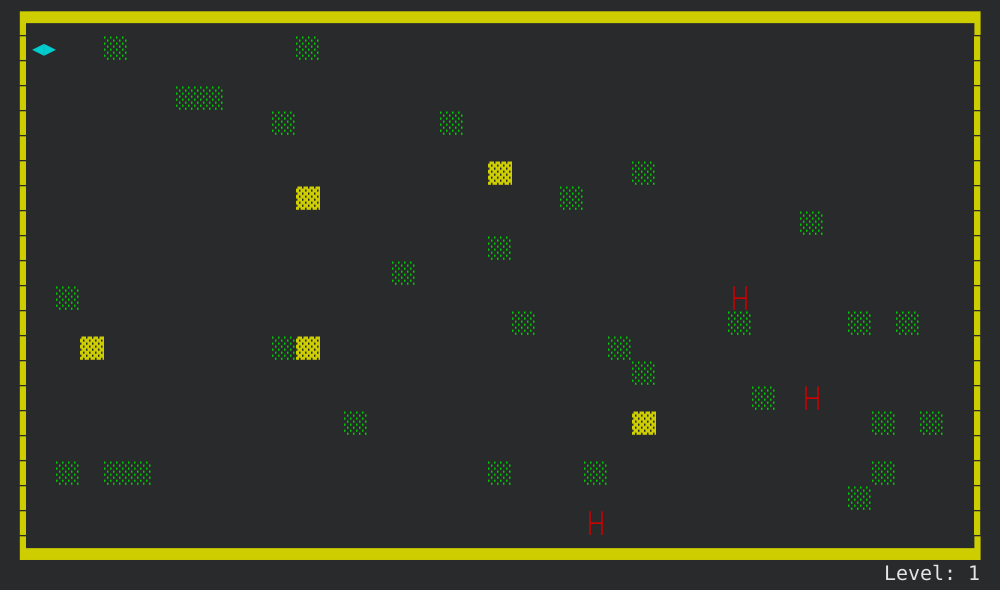

## Where We Left Of

In [part 1](../learning-rust-by-building-the-old-terminal-game-beast-from-1984-part-1/), of this tutorial, we set up our
board and implemented movements for our player.

In [part 2](../learning-rust-by-building-the-old-terminal-game-beast-from-1984-part-2/), we the added our terrain,
made blockchain puns.

In [part 3](../learning-rust-by-building-the-old-terminal-game-beast-from-1984-part-3/), we added our beasts and added
pathfinding to them.

We ended up with this code:

## TODO
- Kill player
- Re-spawning
- Detecting The End Of A Level
- Adding a help

   

{title="I won't tell you how to share it, that's up to you. Tell you friends, share on some social site, whisper it to you imaginary friend... up to you. All of it is appreciated"}
