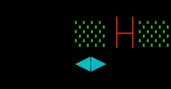

<div class="ribbon"></div>

## Where We Left Off

In [part 1](../learning-rust-by-building-the-old-terminal-game-beast-from-1984-part-1/), of this tutorial, we set up our
board and implemented movements for our player.

In [part 2](../learning-rust-by-building-the-old-terminal-game-beast-from-1984-part-2/), we added our terrain,
made blockchain puns.

In [part 3](../learning-rust-by-building-the-old-terminal-game-beast-from-1984-part-3/), we added our beasts and added
pathfinding to them:


We ended the last part with this code:

```console
.
├── Cargo.lock
├── Cargo.toml
└── src
    ├── beasts
    │   ├── beast_trait.rs
    │   └── common_beast.rs
    ├── beasts.rs
    ├── board.rs
    ├── game.rs
    ├── level.rs
    ├── main.rs
    ├── player.rs
    └── raw_mode.rs
```

<details class="where_we_left_off">
<summary>Show all files</summary>

```toml {data-file="Cargo.toml", data-fold="[]", hl_lines=[]}
[package]
name = "beast"
version = "0.1.0"
edition = "2024"

[dependencies]
rand = "0.9.1"
```

Our main module contains some global types and the main function to pull everything together:

```rust {data-file="main.rs", data-fold="[]", hl_lines=[]}
mod beasts;
mod board;
mod game;
mod level;
mod player;
mod raw_mode;

use crate::{game::Game, raw_mode::RawMode};

pub const BOARD_WIDTH: usize = 39;
pub const BOARD_HEIGHT: usize = 20;
pub const TILE_SIZE: usize = 2;

pub const ANSI_YELLOW: &str = "\x1B[33m";
pub const ANSI_GREEN: &str = "\x1B[32m";
pub const ANSI_CYAN: &str = "\x1B[36m";
pub const ANSI_RED: &str = "\x1b[31m";
pub const ANSI_RESET: &str = "\x1B[39m";

#[derive(Copy, Clone, Debug, PartialEq)]
pub enum Tile {
	Empty,
	Player,
	Block,
	StaticBlock,
	CommonBeast,
}

pub enum Direction {
	Up,
	Right,
	Down,
	Left,
}

#[derive(Debug, Copy, Clone)]
pub struct Coord {
	column: usize,
	row: usize,
}

fn main() {
	let _raw_mode = RawMode::enter();

	let mut game = Game::new();
	game.play();
}
```

The game module contains our `Game` struct with it's own `render` method and the `play` method to start the game:

```rust {data-file="game.rs", data-fold="[]", hl_lines=[]}
use std::{
	io::{Read, stdin},
	sync::mpsc,
	thread,
	time::{Duration, Instant},
};

use crate::{
	BOARD_HEIGHT, BOARD_WIDTH, Direction, TILE_SIZE, Tile,
	beasts::{Beast, CommonBeast},
	board::Board,
	level::Level,
	player::Player,
};

#[derive(Debug)]
pub struct Game {
	board: Board,
	player: Player,
	level: Level,
	beasts: Vec<CommonBeast>,
	input_receiver: mpsc::Receiver<u8>,
}

impl Game {
	pub fn new() -> Self {
		let (board, beasts) = Board::new();
		let (input_sender, input_receiver) = mpsc::channel::<u8>();
		let stdin = stdin();
		thread::spawn(move || {
			let mut lock = stdin.lock();
			let mut buffer = [0_u8; 1];
			while lock.read_exact(&mut buffer).is_ok() {
				if input_sender.send(buffer[0]).is_err() {
					break;
				}
			}
		});

		Self {
			board,
			player: Player::new(),
			level: Level::One,
			beasts,
			input_receiver,
		}
	}

	pub fn play(&mut self) {
		let mut last_tick = Instant::now();
		println!("{}", self.render(false));

		loop {
			if let Ok(byte) = self.input_receiver.try_recv() {
				match byte as char {
					'w' => {
						self.player.advance(&mut self.board, &Direction::Up);
					},
					'd' => {
						self.player.advance(&mut self.board, &Direction::Right);
					},
					's' => {
						self.player.advance(&mut self.board, &Direction::Down);
					},
					'a' => {
						self.player.advance(&mut self.board, &Direction::Left);
					},
					'q' => {
						println!("Good bye");
						break;
					},
					_ => {},
				}

				println!("{}", self.render(true));
			}

			if last_tick.elapsed() > Duration::from_millis(1000) {
				last_tick = Instant::now();
				for beast in self.beasts.iter_mut() {
					if let Some(new_position) =
						beast.advance(&self.board, &self.player.position)
					{
						match self.board[&new_position] {
							Tile::Empty => {
								self.board[&beast.position] = Tile::Empty;
								beast.position = new_position;
								self.board[&new_position] = Tile::CommonBeast;
							},
							Tile::Player => {
								todo!("The beast just killed our player");
							},
							_ => {},
						}
					}
				}
				println!("{}", self.render(true));
			}
		}
	}

	fn render(&self, reset: bool) -> String {
		const BORDER_SIZE: usize = 1;
		const FOOTER_SIZE: usize = 1;

		let mut board = if reset {
			format!(
				"\x1B[{}F",
				BORDER_SIZE + BOARD_HEIGHT + BORDER_SIZE + FOOTER_SIZE
			)
		} else {
			String::new()
		};

		board.push_str(&format!(
			"{board}\n{footer:>width$}{level}",
			board = self.board.render(),
			footer = "Level: ",
			level = self.level,
			width = BORDER_SIZE + BOARD_WIDTH * TILE_SIZE + BORDER_SIZE - FOOTER_SIZE,
		));

		board
	}
}
```

In the board module we setup our `Board` structure which is responsible to generate the terrain, render the inside of
the board and implements our own `Index` trait to make it easier for us to work with the board:

```rust {data-file="board.rs", data-fold="[]", hl_lines=[]}
use rand::seq::SliceRandom;

use crate::{
	ANSI_CYAN, ANSI_GREEN, ANSI_RED, ANSI_RESET, ANSI_YELLOW, BOARD_HEIGHT,
	BOARD_WIDTH, Coord, TILE_SIZE, Tile,
	beasts::{Beast, CommonBeast},
	level::{Level, LevelConfig},
};

use std::ops::{Index, IndexMut};

#[derive(Debug)]
pub struct Board {
	pub buffer: [[Tile; BOARD_WIDTH]; BOARD_HEIGHT],
}

impl Index<&Coord> for Board {
	type Output = Tile;

	fn index(&self, coord: &Coord) -> &Self::Output {
		&self.buffer[coord.row][coord.column]
	}
}

impl IndexMut<&Coord> for Board {
	fn index_mut(&mut self, coord: &Coord) -> &mut Self::Output {
		&mut self.buffer[coord.row][coord.column]
	}
}

impl Board {
	pub fn new() -> (Self, Vec<CommonBeast>) {
		let mut buffer = [[Tile::Empty; BOARD_WIDTH]; BOARD_HEIGHT];

		let mut all_coords = (0..BOARD_HEIGHT)
			.flat_map(|row| (0..BOARD_WIDTH).map(move |column| Coord { column, row }))
			.filter(|coord| !(coord.column == 0 && coord.row == 0))
			.collect::<Vec<Coord>>();
		let mut rng = rand::rng();
		all_coords.shuffle(&mut rng);

		buffer[0][0] = Tile::Player;

		let LevelConfig {
			block_count,
			static_block_count,
			common_beast_count,
		} = Level::One.get_level_config();

		for _ in 0..block_count {
			let coord = all_coords.pop().expect(
				"We tried to place more blocks than there were available spaces on the board",
			);
			buffer[coord.row][coord.column] = Tile::Block;
		}

		for _ in 0..static_block_count {
			let coord = all_coords.pop().expect(
				"We tried to place more static blocks than there were available spaces on the board",
			);
			buffer[coord.row][coord.column] = Tile::StaticBlock;
		}

		let mut beasts = Vec::with_capacity(common_beast_count);
		for _ in 0..common_beast_count {
			let coord = all_coords.pop().expect(
				"We tried to place more common beasts than there were available spaces on the board",
			);
			buffer[coord.row][coord.column] = Tile::CommonBeast;
			beasts.push(CommonBeast::new(coord));
		}

		(Self { buffer }, beasts)
	}

	pub fn render(&self) -> String {
		let mut output = format!(
			"{ANSI_YELLOW}▛{}▜{ANSI_RESET}\n",
			"▀".repeat(BOARD_WIDTH * TILE_SIZE)
		);

		for rows in self.buffer {
			output.push_str(&format!("{ANSI_YELLOW}▌{ANSI_RESET}"));
			for tile in rows {
				match tile {
					Tile::Empty => output.push_str("  "),
					Tile::Player => {
						output.push_str(&format!("{ANSI_CYAN}◀▶{ANSI_RESET}"))
					},
					Tile::Block => {
						output.push_str(&format!("{ANSI_GREEN}░░{ANSI_RESET}"))
					},
					Tile::StaticBlock => {
						output.push_str(&format!("{ANSI_YELLOW}▓▓{ANSI_RESET}"))
					},
					Tile::CommonBeast => {
						output.push_str(&format!("{ANSI_RED}├┤{ANSI_RESET}"))
					},
				}
			}
			output.push_str(&format!("{ANSI_YELLOW}▐{ANSI_RESET}\n"));
		}
		output.push_str(&format!(
			"{ANSI_YELLOW}▙{}▟{ANSI_RESET}",
			"▄".repeat(BOARD_WIDTH * TILE_SIZE)
		));

		output
	}
}
```

The level module contains our level enum which implements a way for us to get a config for each level:

```rust {data-file="level.rs", data-fold="[]", hl_lines=[]}
pub struct LevelConfig {
	pub block_count: usize,
	pub static_block_count: usize,
	pub common_beast_count: usize,
}

#[derive(Debug)]
pub enum Level {
	One,
	Two,
	Three,
}

impl std::fmt::Display for Level {
	fn fmt(&self, f: &mut std::fmt::Formatter) -> std::fmt::Result {
		match self {
			Level::One => write!(f, "1"),
			Level::Two => write!(f, "2"),
			Level::Three => write!(f, "3"),
		}
	}
}

impl Level {
	pub fn get_level_config(&self) -> LevelConfig {
		match self {
			Level::One => LevelConfig {
				block_count: 30,
				static_block_count: 5,
				common_beast_count: 3,
			},
			Level::Two => LevelConfig {
				block_count: 20,
				static_block_count: 10,
				common_beast_count: 5,
			},
			Level::Three => LevelConfig {
				block_count: 12,
				static_block_count: 20,
				common_beast_count: 15,
			},
		}
	}
}
```

The player module is responsible for keeping track of where the player is and how it moves including a way to
push blocks on the board:

```rust {data-file="player.rs", data-fold="[]", hl_lines=[]}
use crate::{BOARD_HEIGHT, BOARD_WIDTH, Coord, Direction, Tile, board::Board};

#[derive(Debug)]
pub struct Player {
	pub position: Coord,
}

impl Player {
	pub fn new() -> Self {
		Self {
			position: Coord { column: 0, row: 0 },
		}
	}

	fn get_next_position(
		position: Coord,
		direction: &Direction,
	) -> Option<Coord> {
		let mut next_position = position;
		match direction {
			Direction::Up => {
				if next_position.row > 0 {
					next_position.row -= 1
				} else {
					return None;
				}
			},
			Direction::Right => {
				if next_position.column < BOARD_WIDTH - 1 {
					next_position.column += 1
				} else {
					return None;
				}
			},
			Direction::Down => {
				if next_position.row < BOARD_HEIGHT - 1 {
					next_position.row += 1
				} else {
					return None;
				}
			},
			Direction::Left => {
				if next_position.column > 0 {
					next_position.column -= 1
				} else {
					return None;
				}
			},
		}

		Some(next_position)
	}

	pub fn advance(&mut self, board: &mut Board, direction: &Direction) {
		if let Some(first_position) =
			Self::get_next_position(self.position, direction)
		{
			match board[&first_position] {
				Tile::Empty => {
					board[&self.position] = Tile::Empty;
					self.position = first_position;
					board[&first_position] = Tile::Player;
				},
				Tile::Block => {
					let mut current_tile = Tile::Block;
					let mut current_position = first_position;

					while current_tile == Tile::Block {
						if let Some(next_position) =
							Self::get_next_position(current_position, direction)
						{
							current_position = next_position;
							current_tile = board[&current_position];

							match current_tile {
								Tile::Block => { /* continue looking */ },
								Tile::Empty => {
									board[&self.position] = Tile::Empty;
									self.position = first_position;
									board[&first_position] = Tile::Player;
									board[&current_position] = Tile::Block;
								},
								Tile::StaticBlock | Tile::Player | Tile::CommonBeast => break,
							}
						} else {
							break;
						}
					}
				},
				Tile::Player | Tile::StaticBlock => {},
				Tile::CommonBeast => {
					todo!("The player ran into a beast and died");
				},
			}
		}
	}
}
```

The beast trait module that contains the trait for all of our enemies:

```rust {data-file="beasts/beast_trait.rs", data-fold="[]", hl_lines=[]}
use crate::{Coord, board::Board};

pub trait Beast {
	fn new(position: Coord) -> Self;

	fn advance(
		&mut self,
		board: &Board,
		player_position: &Coord,
	) -> Option<Coord>;
}
```

Our common beast module that implements the `Beast` trait including pathfinding:

```rust {data-file="beasts/common_beast.rs", data-fold="[]", hl_lines=[]}
use std::cmp::Ordering;

use crate::{
	BOARD_HEIGHT, BOARD_WIDTH, Coord, Tile, beasts::Beast, board::Board,
};

#[derive(Debug)]
pub struct CommonBeast {
	pub position: Coord,
}

impl Beast for CommonBeast {
	fn new(position: Coord) -> Self {
		Self { position }
	}

	fn advance(
		&mut self,
		board: &Board,
		player_position: &Coord,
	) -> Option<Coord> {
		// Top row
		let left_top = if self.position.column > 0 && self.position.row > 0 {
			Some(Coord {
				column: self.position.column - 1,
				row: self.position.row - 1,
			})
		} else {
			None
		};
		let middle_top = if self.position.row > 0 {
			Some(Coord {
				column: self.position.column,
				row: self.position.row - 1,
			})
		} else {
			None
		};
		let right_top =
			if self.position.column < BOARD_WIDTH - 1 && self.position.row > 0 {
				Some(Coord {
					column: self.position.column + 1,
					row: self.position.row - 1,
				})
			} else {
				None
			};

		// Middle row
		let left_middle = if self.position.column > 0 {
			Some(Coord {
				column: self.position.column - 1,
				row: self.position.row,
			})
		} else {
			None
		};
		// The middle middle position is an invalid position
		let right_middle = if self.position.column < BOARD_WIDTH - 1 {
			Some(Coord {
				column: self.position.column + 1,
				row: self.position.row,
			})
		} else {
			None
		};

		// Bottom row
		let left_bottom =
			if self.position.column > 0 && self.position.row < BOARD_HEIGHT - 1 {
				Some(Coord {
					column: self.position.column - 1,
					row: self.position.row + 1,
				})
			} else {
				None
			};
		let middle_bottom = if self.position.row < BOARD_HEIGHT - 1 {
			Some(Coord {
				column: self.position.column,
				row: self.position.row + 1,
			})
		} else {
			None
		};
		let right_bottom = if self.position.column < BOARD_WIDTH - 1
			&& self.position.row < BOARD_HEIGHT - 1
		{
			Some(Coord {
				column: self.position.column + 1,
				row: self.position.row + 1,
			})
		} else {
			None
		};

		let possible_moves = match (
			player_position.column.cmp(&self.position.column),
			player_position.row.cmp(&self.position.row),
		) {
			(Ordering::Greater, Ordering::Greater) => {
				/* player: right-bottom */
				// 8 7  5
				// 6 ├┤ 3
				// 4 2  1
				[
					right_bottom,
					middle_bottom,
					right_middle,
					left_bottom,
					right_top,
					left_middle,
					middle_top,
					left_top,
				]
			},
			(Ordering::Greater, Ordering::Less) => {
				/* player: right-top */
				// 4 2  1
				// 6 ├┤ 3
				// 8 7  5
				[
					right_top,
					middle_top,
					right_middle,
					left_top,
					right_bottom,
					left_middle,
					middle_bottom,
					left_bottom,
				]
			},
			(Ordering::Greater, Ordering::Equal) => {
				/* player: right_middle */
				// 6 4  2
				// 8 ├┤ 1
				// 7 5  3
				[
					right_middle,
					right_top,
					right_bottom,
					middle_top,
					middle_bottom,
					left_top,
					left_bottom,
					left_middle,
				]
			},
			(Ordering::Less, Ordering::Greater) => {
				/* player: left_bottom */
				// 4 6  8
				// 2 ├┤ 7
				// 1  3 5
				[
					left_bottom,
					left_middle,
					middle_bottom,
					left_top,
					right_bottom,
					right_middle,
					middle_top,
					right_top,
				]
			},
			(Ordering::Less, Ordering::Less) => {
				/* player: left_top */
				// 1  3 5
				// 2 ├┤ 7
				// 4 6  8
				[
					left_top,
					left_middle,
					middle_top,
					left_bottom,
					right_top,
					middle_bottom,
					right_middle,
					right_bottom,
				]
			},
			(Ordering::Less, Ordering::Equal) => {
				/* player: left_middle */
				// 2 4  6
				// 1 ├┤ 8
				// 3 5  7
				[
					left_middle,
					left_top,
					left_bottom,
					middle_top,
					middle_bottom,
					right_top,
					right_bottom,
					right_middle,
				]
			},
			(Ordering::Equal, Ordering::Greater) => {
				/* player: middle_bottom */
				// 6 8  7
				// 4 ├┤ 5
				// 2 1  3
				[
					middle_bottom,
					left_bottom,
					right_bottom,
					left_middle,
					right_middle,
					left_top,
					right_top,
					middle_top,
				]
			},
			(Ordering::Equal, Ordering::Less) => {
				/* player: middle_top */
				// 2 1  3
				// 4 ├┤ 5
				// 6 8  7
				[
					middle_top,
					left_top,
					right_top,
					left_middle,
					right_middle,
					left_bottom,
					right_bottom,
					middle_bottom,
				]
			},
			(Ordering::Equal, Ordering::Equal) => {
				/* player: same position */
				unreachable!();
			},
		}
		.into_iter()
		.flatten()
		.collect::<Vec<Coord>>();

		possible_moves
			.into_iter()
			.find(|&next_move| board[&next_move] == Tile::Empty)
	}
}
```

The beast module that makes sure we can import from the beasts folder seamlessly:

```rust {data-file="beasts.rs", data-fold="[]", hl_lines=[]}
pub mod beast_trait;
pub use beast_trait::*;

pub mod common_beast;
pub use common_beast::*;
```

And lastly we have our raw mode module that helps us set the terminal from cooked mode into raw mode:

```rust {data-file="raw_mode.rs", data-fold="[]", hl_lines=[]}
use std::process::Command;

pub struct RawMode;

impl RawMode {
	pub fn enter() -> Self {
		let _ = Command::new("stty")
			.arg("-icanon")
			.arg("-echo")
			.spawn()
			.and_then(|mut child| child.wait());
		print!("\x1b[?25l");
		Self
	}
}

impl Drop for RawMode {
	fn drop(&mut self) {
		let _ = Command::new("stty")
			.arg("icanon")
			.arg("echo")
			.spawn()
			.and_then(|mut child| child.wait());
		print!("\x1b[?25h");
	}
}
```

</details>

When we play our game as we have built it so far, we notice that the beasts will follow us just as they're supposed to
but when they get close they never actually move in for the kill.
Even though we check in our game engine method if we walk into a tile with `Player`:

```rust {data-file="game.rs", data-fold="['1-89', '93-125']", hl_lines=[]}
use std::{
	io::{Read, stdin},
	sync::mpsc,
	thread,
	time::{Duration, Instant},
};

use crate::{
	BOARD_HEIGHT, BOARD_WIDTH, Direction, TILE_SIZE, Tile,
	beasts::{Beast, CommonBeast},
	board::Board,
	level::Level,
	player::Player,
};

#[derive(Debug)]
pub struct Game {
	board: Board,
	player: Player,
	level: Level,
	beasts: Vec<CommonBeast>,
	input_receiver: mpsc::Receiver<u8>,
}

impl Game {
	pub fn new() -> Self {
		let (board, beasts) = Board::new();
		let (input_sender, input_receiver) = mpsc::channel::<u8>();
		let stdin = stdin();
		thread::spawn(move || {
			let mut lock = stdin.lock();
			let mut buffer = [0_u8; 1];
			while lock.read_exact(&mut buffer).is_ok() {
				if input_sender.send(buffer[0]).is_err() {
					break;
				}
			}
		});

		Self {
			board,
			player: Player::new(),
			level: Level::One,
			beasts,
			input_receiver,
		}
	}

	pub fn play(&mut self) {
		let mut last_tick = Instant::now();
		println!("{}", self.render(false));

		loop {
			if let Ok(byte) = self.input_receiver.try_recv() {
				match byte as char {
					'w' => {
						self.player.advance(&mut self.board, &Direction::Up);
					},
					'd' => {
						self.player.advance(&mut self.board, &Direction::Right);
					},
					's' => {
						self.player.advance(&mut self.board, &Direction::Down);
					},
					'a' => {
						self.player.advance(&mut self.board, &Direction::Left);
					},
					'q' => {
						println!("Good bye");
						break;
					},
					_ => {},
				}

				println!("{}", self.render(true));
			}

			if last_tick.elapsed() > Duration::from_millis(1000) {
				last_tick = Instant::now();
				for beast in self.beasts.iter_mut() {
					if let Some(new_position) =
						beast.advance(&self.board, &self.player.position)
					{
						match self.board[&new_position] {
							Tile::Empty => {
								self.board[&beast.position] = Tile::Empty;
								beast.position = new_position;
								self.board[&new_position] = Tile::CommonBeast;
							},
							Tile::Player => {
								todo!("The beast just killed our player");
							},
							_ => {},
						}
					}
				}
				println!("{}", self.render(true));
			}
		}
	}

	fn render(&self, reset: bool) -> String {
		const BORDER_SIZE: usize = 1;
		const FOOTER_SIZE: usize = 1;

		let mut board = if reset {
			format!(
				"\x1B[{}F",
				BORDER_SIZE + BOARD_HEIGHT + BORDER_SIZE + FOOTER_SIZE
			)
		} else {
			String::new()
		};

		board.push_str(&format!(
			"{board}\n{footer:>width$}{level}",
			board = self.board.render(),
			footer = "Level: ",
			level = self.level,
			width = BORDER_SIZE + BOARD_WIDTH * TILE_SIZE + BORDER_SIZE - FOOTER_SIZE,
		));

		board
	}
}
```

So the game should panic with a message that tells us the this codepath hasn't been implemented yet.

It seems our game engine `play` method never gets a `Coord` for the player so let's look at our `advance` method of our
common beast:

```rust {data-file="beasts/common_beast.rs", data-fold="['1-237']", hl_lines=[]}
use std::cmp::Ordering;

use crate::{
	BOARD_HEIGHT, BOARD_WIDTH, Coord, Tile, beasts::Beast, board::Board,
};

#[derive(Debug)]
pub struct CommonBeast {
	pub position: Coord,
}

impl Beast for CommonBeast {
	fn new(position: Coord) -> Self {
		Self { position }
	}

	fn advance(
		&mut self,
		board: &Board,
		player_position: &Coord,
	) -> Option<Coord> {
		// Top row
		let left_top = if self.position.column > 0 && self.position.row > 0 {
			Some(Coord {
				column: self.position.column - 1,
				row: self.position.row - 1,
			})
		} else {
			None
		};
		let middle_top = if self.position.row > 0 {
			Some(Coord {
				column: self.position.column,
				row: self.position.row - 1,
			})
		} else {
			None
		};
		let right_top =
			if self.position.column < BOARD_WIDTH - 1 && self.position.row > 0 {
				Some(Coord {
					column: self.position.column + 1,
					row: self.position.row - 1,
				})
			} else {
				None
			};

		// Middle row
		let left_middle = if self.position.column > 0 {
			Some(Coord {
				column: self.position.column - 1,
				row: self.position.row,
			})
		} else {
			None
		};
		// The middle middle position is an invalid position
		let right_middle = if self.position.column < BOARD_WIDTH - 1 {
			Some(Coord {
				column: self.position.column + 1,
				row: self.position.row,
			})
		} else {
			None
		};

		// Bottom row
		let left_bottom =
			if self.position.column > 0 && self.position.row < BOARD_HEIGHT - 1 {
				Some(Coord {
					column: self.position.column - 1,
					row: self.position.row + 1,
				})
			} else {
				None
			};
		let middle_bottom = if self.position.row < BOARD_HEIGHT - 1 {
			Some(Coord {
				column: self.position.column,
				row: self.position.row + 1,
			})
		} else {
			None
		};
		let right_bottom = if self.position.column < BOARD_WIDTH - 1
			&& self.position.row < BOARD_HEIGHT - 1
		{
			Some(Coord {
				column: self.position.column + 1,
				row: self.position.row + 1,
			})
		} else {
			None
		};

		let possible_moves = match (
			player_position.column.cmp(&self.position.column),
			player_position.row.cmp(&self.position.row),
		) {
			(Ordering::Greater, Ordering::Greater) => {
				/* player: right-bottom */
				// 8 7  5
				// 6 ├┤ 3
				// 4 2  1
				[
					right_bottom,
					middle_bottom,
					right_middle,
					left_bottom,
					right_top,
					left_middle,
					middle_top,
					left_top,
				]
			},
			(Ordering::Greater, Ordering::Less) => {
				/* player: right-top */
				// 4 2  1
				// 6 ├┤ 3
				// 8 7  5
				[
					right_top,
					middle_top,
					right_middle,
					left_top,
					right_bottom,
					left_middle,
					middle_bottom,
					left_bottom,
				]
			},
			(Ordering::Greater, Ordering::Equal) => {
				/* player: right_middle */
				// 6 4  2
				// 8 ├┤ 1
				// 7 5  3
				[
					right_middle,
					right_top,
					right_bottom,
					middle_top,
					middle_bottom,
					left_top,
					left_bottom,
					left_middle,
				]
			},
			(Ordering::Less, Ordering::Greater) => {
				/* player: left_bottom */
				// 4 6  8
				// 2 ├┤ 7
				// 1  3 5
				[
					left_bottom,
					left_middle,
					middle_bottom,
					left_top,
					right_bottom,
					right_middle,
					middle_top,
					right_top,
				]
			},
			(Ordering::Less, Ordering::Less) => {
				/* player: left_top */
				// 1  3 5
				// 2 ├┤ 7
				// 4 6  8
				[
					left_top,
					left_middle,
					middle_top,
					left_bottom,
					right_top,
					middle_bottom,
					right_middle,
					right_bottom,
				]
			},
			(Ordering::Less, Ordering::Equal) => {
				/* player: left_middle */
				// 2 4  6
				// 1 ├┤ 8
				// 3 5  7
				[
					left_middle,
					left_top,
					left_bottom,
					middle_top,
					middle_bottom,
					right_top,
					right_bottom,
					right_middle,
				]
			},
			(Ordering::Equal, Ordering::Greater) => {
				/* player: middle_bottom */
				// 6 8  7
				// 4 ├┤ 5
				// 2 1  3
				[
					middle_bottom,
					left_bottom,
					right_bottom,
					left_middle,
					right_middle,
					left_top,
					right_top,
					middle_top,
				]
			},
			(Ordering::Equal, Ordering::Less) => {
				/* player: middle_top */
				// 2 1  3
				// 4 ├┤ 5
				// 6 8  7
				[
					middle_top,
					left_top,
					right_top,
					left_middle,
					right_middle,
					left_bottom,
					right_bottom,
					middle_bottom,
				]
			},
			(Ordering::Equal, Ordering::Equal) => {
				/* player: same position */
				unreachable!();
			},
		}
		.into_iter()
		.flatten()
		.collect::<Vec<Coord>>();

		possible_moves
			.into_iter()
			.find(|&next_move| board[&next_move] == Tile::Empty)
	}
}
```

And indeed, we're removing all coordinates from our `possible_move` Vec that don't contain an `Empty` tile on our board.
Let's fix that and check for two tile types we should allow the beast to move into:

```rust {data-file="beasts/common_beast.rs", data-fold="['1-237']", hl_lines=["238-240"]}
use std::cmp::Ordering;

use crate::{
	BOARD_HEIGHT, BOARD_WIDTH, Coord, Tile, beasts::Beast, board::Board,
};

#[derive(Debug)]
pub struct CommonBeast {
	pub position: Coord,
}

impl Beast for CommonBeast {
	fn new(position: Coord) -> Self {
		Self { position }
	}

	fn advance(
		&mut self,
		board: &Board,
		player_position: &Coord,
	) -> Option<Coord> {
		// Top row
		let left_top = if self.position.column > 0 && self.position.row > 0 {
			Some(Coord {
				column: self.position.column - 1,
				row: self.position.row - 1,
			})
		} else {
			None
		};
		let middle_top = if self.position.row > 0 {
			Some(Coord {
				column: self.position.column,
				row: self.position.row - 1,
			})
		} else {
			None
		};
		let right_top =
			if self.position.column < BOARD_WIDTH - 1 && self.position.row > 0 {
				Some(Coord {
					column: self.position.column + 1,
					row: self.position.row - 1,
				})
			} else {
				None
			};

		// Middle row
		let left_middle = if self.position.column > 0 {
			Some(Coord {
				column: self.position.column - 1,
				row: self.position.row,
			})
		} else {
			None
		};
		// The middle middle position is an invalid position
		let right_middle = if self.position.column < BOARD_WIDTH - 1 {
			Some(Coord {
				column: self.position.column + 1,
				row: self.position.row,
			})
		} else {
			None
		};

		// Bottom row
		let left_bottom =
			if self.position.column > 0 && self.position.row < BOARD_HEIGHT - 1 {
				Some(Coord {
					column: self.position.column - 1,
					row: self.position.row + 1,
				})
			} else {
				None
			};
		let middle_bottom = if self.position.row < BOARD_HEIGHT - 1 {
			Some(Coord {
				column: self.position.column,
				row: self.position.row + 1,
			})
		} else {
			None
		};
		let right_bottom = if self.position.column < BOARD_WIDTH - 1
			&& self.position.row < BOARD_HEIGHT - 1
		{
			Some(Coord {
				column: self.position.column + 1,
				row: self.position.row + 1,
			})
		} else {
			None
		};

		let possible_moves = match (
			player_position.column.cmp(&self.position.column),
			player_position.row.cmp(&self.position.row),
		) {
			(Ordering::Greater, Ordering::Greater) => {
				/* player: right-bottom */
				// 8 7  5
				// 6 ├┤ 3
				// 4 2  1
				[
					right_bottom,
					middle_bottom,
					right_middle,
					left_bottom,
					right_top,
					left_middle,
					middle_top,
					left_top,
				]
			},
			(Ordering::Greater, Ordering::Less) => {
				/* player: right-top */
				// 4 2  1
				// 6 ├┤ 3
				// 8 7  5
				[
					right_top,
					middle_top,
					right_middle,
					left_top,
					right_bottom,
					left_middle,
					middle_bottom,
					left_bottom,
				]
			},
			(Ordering::Greater, Ordering::Equal) => {
				/* player: right_middle */
				// 6 4  2
				// 8 ├┤ 1
				// 7 5  3
				[
					right_middle,
					right_top,
					right_bottom,
					middle_top,
					middle_bottom,
					left_top,
					left_bottom,
					left_middle,
				]
			},
			(Ordering::Less, Ordering::Greater) => {
				/* player: left_bottom */
				// 4 6  8
				// 2 ├┤ 7
				// 1  3 5
				[
					left_bottom,
					left_middle,
					middle_bottom,
					left_top,
					right_bottom,
					right_middle,
					middle_top,
					right_top,
				]
			},
			(Ordering::Less, Ordering::Less) => {
				/* player: left_top */
				// 1  3 5
				// 2 ├┤ 7
				// 4 6  8
				[
					left_top,
					left_middle,
					middle_top,
					left_bottom,
					right_top,
					middle_bottom,
					right_middle,
					right_bottom,
				]
			},
			(Ordering::Less, Ordering::Equal) => {
				/* player: left_middle */
				// 2 4  6
				// 1 ├┤ 8
				// 3 5  7
				[
					left_middle,
					left_top,
					left_bottom,
					middle_top,
					middle_bottom,
					right_top,
					right_bottom,
					right_middle,
				]
			},
			(Ordering::Equal, Ordering::Greater) => {
				/* player: middle_bottom */
				// 6 8  7
				// 4 ├┤ 5
				// 2 1  3
				[
					middle_bottom,
					left_bottom,
					right_bottom,
					left_middle,
					right_middle,
					left_top,
					right_top,
					middle_top,
				]
			},
			(Ordering::Equal, Ordering::Less) => {
				/* player: middle_top */
				// 2 1  3
				// 4 ├┤ 5
				// 6 8  7
				[
					middle_top,
					left_top,
					right_top,
					left_middle,
					right_middle,
					left_bottom,
					right_bottom,
					middle_bottom,
				]
			},
			(Ordering::Equal, Ordering::Equal) => {
				/* player: same position */
				unreachable!();
			},
		}
		.into_iter()
		.flatten()
		.collect::<Vec<Coord>>();

		possible_moves.into_iter().find(|&next_move| {
			matches!(board[&next_move], Tile::Empty | Tile::Player)
		})
	}
}
```

We use the [`matches`](https://doc.rust-lang.org/std/macro.matches.html) macro to allow both `Empty` and `Player`.
Now when we run the game and allow the beasts to catch the player we get this:

```console
cargo run
<span style="font-weight:bold;color:yellow;">warning</span><span style="font-weight:bold;">: variants `Two` and `Three` are never constructed</span>
  <span style="font-weight:bold;color:#3333FF;">--&gt; </span>src/level.rs:10:2
   <span style="font-weight:bold;color:#3333FF;">|</span>
<span style="font-weight:bold;color:#3333FF;">8</span>  <span style="font-weight:bold;color:#3333FF;">|</span> pub enum Level {
   <span style="font-weight:bold;color:#3333FF;">|</span>          <span style="font-weight:bold;color:#3333FF;">-----</span> <span style="font-weight:bold;color:#3333FF;">variants in this enum</span>
<span style="font-weight:bold;color:#3333FF;">9</span>  <span style="font-weight:bold;color:#3333FF;">|</span>     One,
<span style="font-weight:bold;color:#3333FF;">10</span> <span style="font-weight:bold;color:#3333FF;">|</span>     Two,
   <span style="font-weight:bold;color:#3333FF;">|</span>     <span style="font-weight:bold;color:yellow;">^^^</span>
<span style="font-weight:bold;color:#3333FF;">11</span> <span style="font-weight:bold;color:#3333FF;">|</span>     Three,
   <span style="font-weight:bold;color:#3333FF;">|</span>     <span style="font-weight:bold;color:yellow;">^^^^^</span>
   <span style="font-weight:bold;color:#3333FF;">|</span>
   <span style="font-weight:bold;color:#3333FF;">= </span><span style="font-weight:bold;">note</span>: `Level` has a derived impl for the trait `Debug`, but this is intentionally ignored during dead code analysis
   <span style="font-weight:bold;color:#3333FF;">= </span><span style="font-weight:bold;">note</span>: `#[warn(dead_code)]` on by default

<span style="font-weight:bold;color:yellow;">warning</span><span style="font-weight:bold;">:</span> `beast` (bin &quot;beast&quot;) generated 1 warning
<span style="font-weight:bold;color:lime;">    Finished</span> `dev` profile [unoptimized + debuginfo] target(s) in 0.10s
<span style="font-weight:bold;color:lime;">     Running</span> `target/debug/beast`
<span style="color:yellow;">▛▀▀▀▀▀▀▀▀▀▀▀▀▀▀▀▀▀▀▀▀▀▀▀▀▀▀▀▀▀▀▀▀▀▀▀▀▀▀▀▀▀▀▀▀▀▀▀▀▀▀▀▀▀▀▀▀▀▀▀▀▀▀▀▀▀▀▀▀▀▀▀▀▀▀▀▀▀▀▜</span>
<span style="color:yellow;">▌</span>                  <span style="color:yellow;">▓▓</span>      <span style="color:red;">├┤</span>                                <span style="color:lime;">░░</span>                <span style="color:yellow;">▐</span>
<span style="color:yellow;">▌</span><span style="color:lime;">░░</span>                      <span style="color:lime;">░░</span>              <span style="color:lime;">░░</span>            <span style="color:lime;">░░</span>                      <span style="color:yellow;">▐</span>
<span style="color:yellow;">▌</span>                        <span style="color:lime;">░░</span>          <span style="color:lime;">░░</span>      <span style="color:lime;">░░</span>    <span style="color:lime;">░░</span>                          <span style="color:yellow;">▐</span>
<span style="color:yellow;">▌</span>                                                          <span style="color:yellow;">▓▓</span>                  <span style="color:yellow;">▐</span>
<span style="color:yellow;">▌</span>                                                                              <span style="color:yellow;">▐</span>
<span style="color:yellow;">▌</span>                                                                              <span style="color:yellow;">▐</span>
<span style="color:yellow;">▌</span>            <span style="color:lime;">░░</span>      <span style="color:lime;">░░</span>                                <span style="color:lime;">░░</span>          <span style="color:lime;">░░</span>      <span style="color:lime;">░░</span>  <span style="color:yellow;">▐</span>
<span style="color:yellow;">▌</span>                                                    <span style="color:yellow;">▓▓</span>                  <span style="color:lime;">░░</span>    <span style="color:yellow;">▐</span>
<span style="color:yellow;">▌</span>                    <span style="color:lime;">░░</span>                                          <span style="color:red;">├┤</span>            <span style="color:yellow;">▐</span>
<span style="color:yellow;">▌</span>                                                <span style="color:lime;">░░</span>                  <span style="color:lime;">░░</span>  <span style="color:lime;">░░</span>    <span style="color:yellow;">▐</span>
<span style="color:yellow;">▌</span>                                    <span style="color:lime;">░░</span>  <span style="color:lime;">░░</span>                                    <span style="color:yellow;">▐</span>
<span style="color:yellow;">▌</span>                                  <span style="color:yellow;">▓▓</span>                                          <span style="color:yellow;">▐</span>
<span style="color:yellow;">▌</span><span style="color:lime;">░░</span>                  <span style="color:lime;">░░</span>                                    <span style="color:lime;">░░</span>                  <span style="color:yellow;">▐</span>
<span style="color:yellow;">▌</span>    <span style="color:lime;">░░</span>      <span style="color:yellow;">▓▓</span>                                                                <span style="color:yellow;">▐</span>
<span style="color:yellow;">▌</span>                  <span style="color:lime;">░░</span>                              <span style="color:lime;">░░</span>                          <span style="color:yellow;">▐</span>
<span style="color:yellow;">▌</span>                                                                              <span style="color:yellow;">▐</span>
<span style="color:yellow;">▌</span>                                            <span style="color:red;">├┤</span>                                <span style="color:yellow;">▐</span>
<span style="color:yellow;">▌</span>                                                                              <span style="color:yellow;">▐</span>
<span style="color:yellow;">▌</span>                                                                              <span style="color:yellow;">▐</span>
<span style="color:yellow;">▌</span>    <span style="color:lime;">░░</span>      <span style="color:lime;">░░</span>                                                <span style="color:lime;">░░</span>              <span style="color:yellow;">▐</span>
<span style="color:yellow;">▙▄▄▄▄▄▄▄▄▄▄▄▄▄▄▄▄▄▄▄▄▄▄▄▄▄▄▄▄▄▄▄▄▄▄▄▄▄▄▄▄▄▄▄▄▄▄▄▄▄▄▄▄▄▄▄▄▄▄▄▄▄▄▄▄▄▄▄▄▄▄▄▄▄▄▄▄▄▄▟</span>
                                                                        Level: 1

thread 'main' panicked at src/game.rs:91:33:
not yet implemented: The beast just killed our player
note: run with `RUST_BACKTRACE=1` environment variable to display a backtrace
```

We will get to that warning soon but for now the code path for our beast killing the player actually gets called and
results in a panic.

## Staying Alive

Before the player can be killed by the beast we have to define what death is.
Or more specifically: we have to give our player lives so it can come back from the dead until the game is over.

> Does this make every video game player a zombie?
> 
> I don't know but someone should go and find out!

To that end, let's add a `lives` item to our `Player` struct:

```rust {data-file="player.rs", data-fold="['16-99']", hl_lines=[6, 13]}
use crate::{BOARD_HEIGHT, BOARD_WIDTH, Coord, Direction, Tile, board::Board};

#[derive(Debug)]
pub struct Player {
	pub position: Coord,
	pub lives: usize,
}

impl Player {
	pub fn new() -> Self {
		Self {
			position: Coord { column: 0, row: 0 },
			lives: 3,
		}
	}

	fn get_next_position(
		position: Coord,
		direction: &Direction,
	) -> Option<Coord> {
		let mut next_position = position;
		match direction {
			Direction::Up => {
				if next_position.row > 0 {
					next_position.row -= 1
				} else {
					return None;
				}
			},
			Direction::Right => {
				if next_position.column < BOARD_WIDTH - 1 {
					next_position.column += 1
				} else {
					return None;
				}
			},
			Direction::Down => {
				if next_position.row < BOARD_HEIGHT - 1 {
					next_position.row += 1
				} else {
					return None;
				}
			},
			Direction::Left => {
				if next_position.column > 0 {
					next_position.column -= 1
				} else {
					return None;
				}
			},
		}

		Some(next_position)
	}

	pub fn advance(&mut self, board: &mut Board, direction: &Direction) {
		if let Some(first_position) =
			Self::get_next_position(self.position, direction)
		{
			match board[&first_position] {
				Tile::Empty => {
					board[&self.position] = Tile::Empty;
					self.position = first_position;
					board[&first_position] = Tile::Player;
				},
				Tile::Block => {
					let mut current_tile = Tile::Block;
					let mut current_position = first_position;

					while current_tile == Tile::Block {
						if let Some(next_position) =
							Self::get_next_position(current_position, direction)
						{
							current_position = next_position;
							current_tile = board[&current_position];

							match current_tile {
								Tile::Block => { /* continue looking */ },
								Tile::Empty => {
									board[&self.position] = Tile::Empty;
									self.position = first_position;
									board[&first_position] = Tile::Player;
									board[&current_position] = Tile::Block;
								},
								Tile::StaticBlock | Tile::Player | Tile::CommonBeast => break,
							}
						} else {
							break;
						}
					}
				},
				Tile::Player | Tile::StaticBlock => {},
				Tile::CommonBeast => {
					todo!("The player ran into a beast and died");
				},
			}
		}
	}
}
```

Let's start the game off with 3 lives for now.
Then we should probably add the lives to our footer so that we know how many lives the player has left before the game
ends:

```rust {data-file="game.rs", data-fold="['1-101']", hl_lines=[105, 117, "121-123"]}
use std::{
	io::{Read, stdin},
	sync::mpsc,
	thread,
	time::{Duration, Instant},
};

use crate::{
	BOARD_HEIGHT, BOARD_WIDTH, Direction, TILE_SIZE, Tile,
	beasts::{Beast, CommonBeast},
	board::Board,
	level::Level,
	player::Player,
};

#[derive(Debug)]
pub struct Game {
	board: Board,
	player: Player,
	level: Level,
	beasts: Vec<CommonBeast>,
	input_receiver: mpsc::Receiver<u8>,
}

impl Game {
	pub fn new() -> Self {
		let (board, beasts) = Board::new();
		let (input_sender, input_receiver) = mpsc::channel::<u8>();
		let stdin = stdin();
		thread::spawn(move || {
			let mut lock = stdin.lock();
			let mut buffer = [0_u8; 1];
			while lock.read_exact(&mut buffer).is_ok() {
				if input_sender.send(buffer[0]).is_err() {
					break;
				}
			}
		});

		Self {
			board,
			player: Player::new(),
			level: Level::One,
			beasts,
			input_receiver,
		}
	}

	pub fn play(&mut self) {
		let mut last_tick = Instant::now();
		println!("{}", self.render(false));

		loop {
			if let Ok(byte) = self.input_receiver.try_recv() {
				match byte as char {
					'w' => {
						self.player.advance(&mut self.board, &Direction::Up);
					},
					'd' => {
						self.player.advance(&mut self.board, &Direction::Right);
					},
					's' => {
						self.player.advance(&mut self.board, &Direction::Down);
					},
					'a' => {
						self.player.advance(&mut self.board, &Direction::Left);
					},
					'q' => {
						println!("Good bye");
						break;
					},
					_ => {},
				}

				println!("{}", self.render(true));
			}

			if last_tick.elapsed() > Duration::from_millis(1000) {
				last_tick = Instant::now();
				for beast in self.beasts.iter_mut() {
					if let Some(new_position) =
						beast.advance(&self.board, &self.player.position)
					{
						match self.board[&new_position] {
							Tile::Empty => {
								self.board[&beast.position] = Tile::Empty;
								beast.position = new_position;
								self.board[&new_position] = Tile::CommonBeast;
							},
							Tile::Player => {
								todo!("The beast just killed our player");
							},
							_ => {},
						}
					}
				}
				println!("{}", self.render(true));
			}
		}
	}

	fn render(&self, reset: bool) -> String {
		const BORDER_SIZE: usize = 1;
		const FOOTER_SIZE: usize = 1;
		const FOOTER_LENGTH: usize = 11;

		let mut board = if reset {
			format!(
				"\x1B[{}F",
				BORDER_SIZE + BOARD_HEIGHT + BORDER_SIZE + FOOTER_SIZE
			)
		} else {
			String::new()
		};

		board.push_str(&format!(
			"{board}\n{footer:>width$}{level}  Lives: {lives}",
			board = self.board.render(),
			footer = "Level: ",
			level = self.level,
			lives = self.player.lives,
			width =
				BORDER_SIZE + BOARD_WIDTH * TILE_SIZE + BORDER_SIZE - FOOTER_LENGTH,
		));

		board
	}
}
```

We previously used `FOOTER_SIZE` to calculate the width of the left padding but that's not actually quite right.
So let's add a new const called `FOOTER_LENGTH` that holds the size of anything that will come after the word `Level: `
so that we can pad the left space with the right amount of spaces.

This gives us a nicely right-aligned footer:

```console
cargo run
<span style="font-weight:bold;color:yellow;">warning</span><span style="font-weight:bold;">: variants `Two` and `Three` are never constructed</span>
  <span style="font-weight:bold;color:#3333FF;">--&gt; </span>src/level.rs:10:2
   <span style="font-weight:bold;color:#3333FF;">|</span>
<span style="font-weight:bold;color:#3333FF;">8</span>  <span style="font-weight:bold;color:#3333FF;">|</span> pub enum Level {
   <span style="font-weight:bold;color:#3333FF;">|</span>          <span style="font-weight:bold;color:#3333FF;">-----</span> <span style="font-weight:bold;color:#3333FF;">variants in this enum</span>
<span style="font-weight:bold;color:#3333FF;">9</span>  <span style="font-weight:bold;color:#3333FF;">|</span>     One,
<span style="font-weight:bold;color:#3333FF;">10</span> <span style="font-weight:bold;color:#3333FF;">|</span>     Two,
   <span style="font-weight:bold;color:#3333FF;">|</span>     <span style="font-weight:bold;color:yellow;">^^^</span>
<span style="font-weight:bold;color:#3333FF;">11</span> <span style="font-weight:bold;color:#3333FF;">|</span>     Three,
   <span style="font-weight:bold;color:#3333FF;">|</span>     <span style="font-weight:bold;color:yellow;">^^^^^</span>
   <span style="font-weight:bold;color:#3333FF;">|</span>
   <span style="font-weight:bold;color:#3333FF;">= </span><span style="font-weight:bold;">note</span>: `Level` has a derived impl for the trait `Debug`, but this is intentionally ignored during dead code analysis
   <span style="font-weight:bold;color:#3333FF;">= </span><span style="font-weight:bold;">note</span>: `#[warn(dead_code)]` on by default

<span style="font-weight:bold;color:yellow;">warning</span><span style="font-weight:bold;">:</span> `beast` (bin &quot;beast&quot;) generated 2 warnings
<span style="font-weight:bold;color:lime;">    Finished</span> `dev` profile [unoptimized + debuginfo] target(s) in 0.21s
<span style="font-weight:bold;color:lime;">     Running</span> `target/debug/beast`
<span style="color:yellow;">▛▀▀▀▀▀▀▀▀▀▀▀▀▀▀▀▀▀▀▀▀▀▀▀▀▀▀▀▀▀▀▀▀▀▀▀▀▀▀▀▀▀▀▀▀▀▀▀▀▀▀▀▀▀▀▀▀▀▀▀▀▀▀▀▀▀▀▀▀▀▀▀▀▀▀▀▀▀▀▜</span>
<span style="color:yellow;">▌</span><span style="color:aqua;">◀▶</span>          <span style="color:lime;">░░</span>                                                                <span style="color:yellow;">▐</span>
<span style="color:yellow;">▌</span>                                              <span style="color:lime;">░░</span>            <span style="color:lime;">░░</span>                <span style="color:yellow;">▐</span>
<span style="color:yellow;">▌</span>      <span style="color:lime;">░░</span>                            <span style="color:lime;">░░</span>        <span style="color:lime;">░░</span>                              <span style="color:yellow;">▐</span>
<span style="color:yellow;">▌</span>                                                                    <span style="color:yellow;">▓▓</span>      <span style="color:lime;">░░</span><span style="color:yellow;">▐</span>
<span style="color:yellow;">▌</span>                                              <span style="color:lime;">░░</span>                          <span style="color:lime;">░░</span>  <span style="color:yellow;">▐</span>
<span style="color:yellow;">▌</span>                                              <span style="color:yellow;">▓▓</span>                    <span style="color:lime;">░░</span>        <span style="color:yellow;">▐</span>
<span style="color:yellow;">▌</span>                                        <span style="color:lime;">░░</span>                                    <span style="color:yellow;">▐</span>
<span style="color:yellow;">▌</span>                      <span style="color:lime;">░░</span>                            <span style="color:lime;">░░</span>                        <span style="color:yellow;">▐</span>
<span style="color:yellow;">▌</span><span style="color:lime;">░░</span>  <span style="color:lime;">░░</span>                                              <span style="color:lime;">░░</span>                    <span style="color:lime;">░░</span>  <span style="color:yellow;">▐</span>
<span style="color:yellow;">▌</span>                      <span style="color:lime;">░░</span>                      <span style="color:yellow;">▓▓</span>                              <span style="color:yellow;">▐</span>
<span style="color:yellow;">▌</span>          <span style="color:lime;">░░</span>                                                                  <span style="color:yellow;">▐</span>
<span style="color:yellow;">▌</span>          <span style="color:red;">├┤</span>                                                                  <span style="color:yellow;">▐</span>
<span style="color:yellow;">▌</span>                                                  <span style="color:lime;">░░</span>                          <span style="color:yellow;">▐</span>
<span style="color:yellow;">▌</span>      <span style="color:lime;">░░</span>                                                                  <span style="color:lime;">░░</span>  <span style="color:yellow;">▐</span>
<span style="color:yellow;">▌</span>                                  <span style="color:lime;">░░</span>                                          <span style="color:yellow;">▐</span>
<span style="color:yellow;">▌</span>                                                                              <span style="color:yellow;">▐</span>
<span style="color:yellow;">▌</span>            <span style="color:lime;">░░</span>          <span style="color:red;">├┤</span>    <span style="color:lime;">░░</span>      <span style="color:lime;">░░</span>                                      <span style="color:yellow;">▐</span>
<span style="color:yellow;">▌</span>                      <span style="color:lime;">░░</span>                  <span style="color:yellow;">▓▓</span>                            <span style="color:red;">├┤</span><span style="color:lime;">░░</span>  <span style="color:yellow;">▐</span>
<span style="color:yellow;">▌</span>      <span style="color:yellow;">▓▓</span>                                                                      <span style="color:yellow;">▐</span>
<span style="color:yellow;">▌</span>                          <span style="color:lime;">░░</span>                              <span style="color:lime;">░░</span>                  <span style="color:yellow;">▐</span>
<span style="color:yellow;">▙▄▄▄▄▄▄▄▄▄▄▄▄▄▄▄▄▄▄▄▄▄▄▄▄▄▄▄▄▄▄▄▄▄▄▄▄▄▄▄▄▄▄▄▄▄▄▄▄▄▄▄▄▄▄▄▄▄▄▄▄▄▄▄▄▄▄▄▄▄▄▄▄▄▄▄▄▄▄▟</span>
                                                              Level: 1  Lives: 3
```

Now we can enable the beast to properly kill the player.

## Feeding The Beast

Within our game after each beast move we need to check if the tile a beast moved into was of type `Player` and if it
was, make sure we deduct a life from our player.
We also need to check if the player has reached the end and kill the game.

```rust {data-file="game.rs", data-fold="['1-83', '102-135']", hl_lines=["91-98"]}
use std::{
	io::{Read, stdin},
	sync::mpsc,
	thread,
	time::{Duration, Instant},
};

use crate::{
	BOARD_HEIGHT, BOARD_WIDTH, Direction, TILE_SIZE, Tile,
	beasts::{Beast, CommonBeast},
	board::Board,
	level::Level,
	player::Player,
};

#[derive(Debug)]
pub struct Game {
	board: Board,
	player: Player,
	level: Level,
	beasts: Vec<CommonBeast>,
	input_receiver: mpsc::Receiver<u8>,
}

impl Game {
	pub fn new() -> Self {
		let (board, beasts) = Board::new();
		let (input_sender, input_receiver) = mpsc::channel::<u8>();
		let stdin = stdin();
		thread::spawn(move || {
			let mut lock = stdin.lock();
			let mut buffer = [0_u8; 1];
			while lock.read_exact(&mut buffer).is_ok() {
				if input_sender.send(buffer[0]).is_err() {
					break;
				}
			}
		});

		Self {
			board,
			player: Player::new(),
			level: Level::One,
			beasts,
			input_receiver,
		}
	}

	pub fn play(&mut self) {
		let mut last_tick = Instant::now();
		println!("{}", self.render(false));

		loop {
			if let Ok(byte) = self.input_receiver.try_recv() {
				match byte as char {
					'w' => {
						self.player.advance(&mut self.board, &Direction::Up);
					},
					'd' => {
						self.player.advance(&mut self.board, &Direction::Right);
					},
					's' => {
						self.player.advance(&mut self.board, &Direction::Down);
					},
					'a' => {
						self.player.advance(&mut self.board, &Direction::Left);
					},
					'q' => {
						println!("Good bye");
						break;
					},
					_ => {},
				}

				println!("{}", self.render(true));
			}

			if last_tick.elapsed() > Duration::from_millis(1000) {
				last_tick = Instant::now();
				for beast in self.beasts.iter_mut() {
					if let Some(new_position) =
						beast.advance(&self.board, &self.player.position)
					{
						match self.board[&new_position] {
							Tile::Empty => {
								self.board[&beast.position] = Tile::Empty;
								beast.position = new_position;
								self.board[&new_position] = Tile::CommonBeast;
							},
							Tile::Player => {
								self.board[&beast.position] = Tile::Empty;
								beast.position = new_position;
								self.board[&new_position] = Tile::CommonBeast;
								self.player.lives -= 1;
								if self.player.lives == 0 {
									println!("Game Over");
									break;
								}
							},
							_ => {},
						}
					}
				}
				println!("{}", self.render(true));
			}
		}
	}

	fn render(&self, reset: bool) -> String {
		const BORDER_SIZE: usize = 1;
		const FOOTER_SIZE: usize = 1;
		const FOOTER_LENGTH: usize = 11;

		let mut board = if reset {
			format!(
				"\x1B[{}F",
				BORDER_SIZE + BOARD_HEIGHT + BORDER_SIZE + FOOTER_SIZE
			)
		} else {
			String::new()
		};

		board.push_str(&format!(
			"{board}\n{footer:>width$}{level}  Lives: {lives}",
			board = self.board.render(),
			footer = "Level: ",
			level = self.level,
			lives = self.player.lives,
			width =
				BORDER_SIZE + BOARD_WIDTH * TILE_SIZE + BORDER_SIZE - FOOTER_LENGTH,
		));

		board
	}
}
```

But wait... what does our `break` here do?
We are inside a nested loop:

```rust {data-file="game.rs", data-fold="['1-52', '54-79', '81-89', '100-102', '104-105', '107-135']", hl_lines=[]}
use std::{
	io::{Read, stdin},
	sync::mpsc,
	thread,
	time::{Duration, Instant},
};

use crate::{
	BOARD_HEIGHT, BOARD_WIDTH, Direction, TILE_SIZE, Tile,
	beasts::{Beast, CommonBeast},
	board::Board,
	level::Level,
	player::Player,
};

#[derive(Debug)]
pub struct Game {
	board: Board,
	player: Player,
	level: Level,
	beasts: Vec<CommonBeast>,
	input_receiver: mpsc::Receiver<u8>,
}

impl Game {
	pub fn new() -> Self {
		let (board, beasts) = Board::new();
		let (input_sender, input_receiver) = mpsc::channel::<u8>();
		let stdin = stdin();
		thread::spawn(move || {
			let mut lock = stdin.lock();
			let mut buffer = [0_u8; 1];
			while lock.read_exact(&mut buffer).is_ok() {
				if input_sender.send(buffer[0]).is_err() {
					break;
				}
			}
		});

		Self {
			board,
			player: Player::new(),
			level: Level::One,
			beasts,
			input_receiver,
		}
	}

	pub fn play(&mut self) {
		let mut last_tick = Instant::now();
		println!("{}", self.render(false));

		loop {
			if let Ok(byte) = self.input_receiver.try_recv() {
				match byte as char {
					'w' => {
						self.player.advance(&mut self.board, &Direction::Up);
					},
					'd' => {
						self.player.advance(&mut self.board, &Direction::Right);
					},
					's' => {
						self.player.advance(&mut self.board, &Direction::Down);
					},
					'a' => {
						self.player.advance(&mut self.board, &Direction::Left);
					},
					'q' => {
						println!("Good bye");
						break;
					},
					_ => {},
				}

				println!("{}", self.render(true));
			}

			if last_tick.elapsed() > Duration::from_millis(1000) {
				last_tick = Instant::now();
				for beast in self.beasts.iter_mut() {
					if let Some(new_position) =
						beast.advance(&self.board, &self.player.position)
					{
						match self.board[&new_position] {
							Tile::Empty => {
								self.board[&beast.position] = Tile::Empty;
								beast.position = new_position;
								self.board[&new_position] = Tile::CommonBeast;
							},
							Tile::Player => {
								self.board[&beast.position] = Tile::Empty;
								beast.position = new_position;
								self.board[&new_position] = Tile::CommonBeast;
								self.player.lives -= 1;
								if self.player.lives == 0 {
									println!("Game Over");
									break;
								}
							},
							_ => {},
						}
					}
				}
				println!("{}", self.render(true));
			}
		}
	}

	fn render(&self, reset: bool) -> String {
		const BORDER_SIZE: usize = 1;
		const FOOTER_SIZE: usize = 1;
		const FOOTER_LENGTH: usize = 11;

		let mut board = if reset {
			format!(
				"\x1B[{}F",
				BORDER_SIZE + BOARD_HEIGHT + BORDER_SIZE + FOOTER_SIZE
			)
		} else {
			String::new()
		};

		board.push_str(&format!(
			"{board}\n{footer:>width$}{level}  Lives: {lives}",
			board = self.board.render(),
			footer = "Level: ",
			level = self.level,
			lives = self.player.lives,
			width =
				BORDER_SIZE + BOARD_WIDTH * TILE_SIZE + BORDER_SIZE - FOOTER_LENGTH,
		));

		board
	}
}
```

So our `break` would just break the first `for` loop but not our game `loop`.
Luckily Rust has us covered with
[`named loops`](https://doc.rust-lang.org/1.87.0/book/ch03-05-control-flow.html#loop-labels-to-disambiguate-between-multiple-loops).

```rust {data-file="game.rs", data-fold="['1-52', '54-79', '81-89', '100-102', '104-105', '107-135']", hl_lines=[53, 97]}
use std::{
	io::{Read, stdin},
	sync::mpsc,
	thread,
	time::{Duration, Instant},
};

use crate::{
	BOARD_HEIGHT, BOARD_WIDTH, Direction, TILE_SIZE, Tile,
	beasts::{Beast, CommonBeast},
	board::Board,
	level::Level,
	player::Player,
};

#[derive(Debug)]
pub struct Game {
	board: Board,
	player: Player,
	level: Level,
	beasts: Vec<CommonBeast>,
	input_receiver: mpsc::Receiver<u8>,
}

impl Game {
	pub fn new() -> Self {
		let (board, beasts) = Board::new();
		let (input_sender, input_receiver) = mpsc::channel::<u8>();
		let stdin = stdin();
		thread::spawn(move || {
			let mut lock = stdin.lock();
			let mut buffer = [0_u8; 1];
			while lock.read_exact(&mut buffer).is_ok() {
				if input_sender.send(buffer[0]).is_err() {
					break;
				}
			}
		});

		Self {
			board,
			player: Player::new(),
			level: Level::One,
			beasts,
			input_receiver,
		}
	}

	pub fn play(&mut self) {
		let mut last_tick = Instant::now();
		println!("{}", self.render(false));

		'game_loop: loop {
			if let Ok(byte) = self.input_receiver.try_recv() {
				match byte as char {
					'w' => {
						self.player.advance(&mut self.board, &Direction::Up);
					},
					'd' => {
						self.player.advance(&mut self.board, &Direction::Right);
					},
					's' => {
						self.player.advance(&mut self.board, &Direction::Down);
					},
					'a' => {
						self.player.advance(&mut self.board, &Direction::Left);
					},
					'q' => {
						println!("Good bye");
						break;
					},
					_ => {},
				}

				println!("{}", self.render(true));
			}

			if last_tick.elapsed() > Duration::from_millis(1000) {
				last_tick = Instant::now();
				for beast in self.beasts.iter_mut() {
					if let Some(new_position) =
						beast.advance(&self.board, &self.player.position)
					{
						match self.board[&new_position] {
							Tile::Empty => {
								self.board[&beast.position] = Tile::Empty;
								beast.position = new_position;
								self.board[&new_position] = Tile::CommonBeast;
							},
							Tile::Player => {
								self.board[&beast.position] = Tile::Empty;
								beast.position = new_position;
								self.board[&new_position] = Tile::CommonBeast;
								self.player.lives -= 1;
								if self.player.lives == 0 {
									println!("Game Over");
									break 'game_loop;
								}
							},
							_ => {},
						}
					}
				}
				println!("{}", self.render(true));
			}
		}
	}

	fn render(&self, reset: bool) -> String {
		const BORDER_SIZE: usize = 1;
		const FOOTER_SIZE: usize = 1;
		const FOOTER_LENGTH: usize = 11;

		let mut board = if reset {
			format!(
				"\x1B[{}F",
				BORDER_SIZE + BOARD_HEIGHT + BORDER_SIZE + FOOTER_SIZE
			)
		} else {
			String::new()
		};

		board.push_str(&format!(
			"{board}\n{footer:>width$}{level}  Lives: {lives}",
			board = self.board.render(),
			footer = "Level: ",
			level = self.level,
			lives = self.player.lives,
			width =
				BORDER_SIZE + BOARD_WIDTH * TILE_SIZE + BORDER_SIZE - FOOTER_LENGTH,
		));

		board
	}
}
```

Now when the player has been killed a third time, the game loop stops and the game finishes with a good bye message.
Or does it?
Well the game actually panics right when one move after a beast has killed the player.
That's because once the player was killed, we don't move it which means the player and the beast are on the same tile
and that's the ONE thing we promised the beast module would never happen.
Because the beast module believed the game engine, it added an `unreachable!()` call which now panics.
But also, that's not what should happen anyway.
Once the player gets killed, it should re-spawn to a new location as long as it has enough lives left.

## Re-Spawning The Player

Let's write a `respawn` method and implement it on our `Player` struct.
We could write something like this:

```rust
pub fn respawn(&mut self, board: &mut Board) {
	let empty_positions = board
		.buffer
		.iter()
		.enumerate()
		.flat_map(|(row_id, row)| {
			row.iter().enumerate().filter_map(move |(column_id, tile)| {
				if *tile == Tile::Empty {
					Some(Coord {
						column: column_id,
						row: row_id,
					})
				} else {
					None
				}
			})
		})
		.collect::<Vec<Coord>>();

	if !empty_positions.is_empty() {
		let mut rng = rand::rng();
		let index = rng.random_range(0..empty_positions.len());
		let new_position = empty_positions[index];

		self.position = new_position;
		board[&new_position] = Tile::Player;
	} else {
		panic!("No empty positions found to respawn the player");
	}
}
```

We go over each tile of the board and collect all coordinates that contain an `Empty` tile.
Then we randomly pick one item of that collection and place the player there.
But unlike in part 2, where we
[generate our terrain](../learning-rust-by-building-the-old-terminal-game-beast-from-1984-part-2/#giving-it-a-shuffle),
we only need a single empty space on the board to respawn into.
This operation would be `O(BOARD_WIDTH × BOARD_HEIGHT)` which is unnecessarily complex.
We're scanning (`39 * 20`) `780` positions each and every time.
We're also allocating a Vec on the heap.

So maybe this time around we try random sampling to find an empty position:

```rust {data-file="player.rs", data-fold="['3-100']", hl_lines=[1, "102-115"]}
use rand::Rng;

use crate::{BOARD_HEIGHT, BOARD_WIDTH, Coord, Direction, Tile, board::Board};

#[derive(Debug)]
pub struct Player {
	pub position: Coord,
	pub lives: usize,
}

impl Player {
	pub fn new() -> Self {
		Self {
			position: Coord { column: 0, row: 0 },
			lives: 3,
		}
	}

	fn get_next_position(
		position: Coord,
		direction: &Direction,
	) -> Option<Coord> {
		let mut next_position = position;
		match direction {
			Direction::Up => {
				if next_position.row > 0 {
					next_position.row -= 1
				} else {
					return None;
				}
			},
			Direction::Right => {
				if next_position.column < BOARD_WIDTH - 1 {
					next_position.column += 1
				} else {
					return None;
				}
			},
			Direction::Down => {
				if next_position.row < BOARD_HEIGHT - 1 {
					next_position.row += 1
				} else {
					return None;
				}
			},
			Direction::Left => {
				if next_position.column > 0 {
					next_position.column -= 1
				} else {
					return None;
				}
			},
		}

		Some(next_position)
	}

	pub fn advance(&mut self, board: &mut Board, direction: &Direction) {
		if let Some(first_position) =
			Self::get_next_position(self.position, direction)
		{
			match board[&first_position] {
				Tile::Empty => {
					board[&self.position] = Tile::Empty;
					self.position = first_position;
					board[&first_position] = Tile::Player;
				},
				Tile::Block => {
					let mut current_tile = Tile::Block;
					let mut current_position = first_position;

					while current_tile == Tile::Block {
						if let Some(next_position) =
							Self::get_next_position(current_position, direction)
						{
							current_position = next_position;
							current_tile = board[&current_position];

							match current_tile {
								Tile::Block => { /* continue looking */ },
								Tile::Empty => {
									board[&self.position] = Tile::Empty;
									self.position = first_position;
									board[&first_position] = Tile::Player;
									board[&current_position] = Tile::Block;
								},
								Tile::StaticBlock | Tile::Player | Tile::CommonBeast => break,
							}
						} else {
							break;
						}
					}
				},
				Tile::Player | Tile::StaticBlock => {},
				Tile::CommonBeast => {
					todo!("The player ran into a beast and died");
				},
			}
		}
	}

	pub fn respawn(&mut self, board: &mut Board) {
		let mut new_position = self.position;

		let mut rng = rand::rng();
		while board[&new_position] != Tile::Empty {
			new_position = Coord {
				column: rng.random_range(0..BOARD_WIDTH),
				row: rng.random_range(0..BOARD_HEIGHT),
			};
		}

		self.position = new_position;
		board[&new_position] = Tile::Player;
	}
}
```

We start our loop with the position where the player is right now because we know it's not `Empty`
(it's indeed `Player`).
Then we start a loop in which we randomly generate coordinates until we find an empty tile.
We're guaranteeing that there are `Empty` tiles in the board or the loop will never finish.
Because we're controlling the board with our `Level` config, this is something we can opt into now.

Comparing our first version to this just to make sure we actually improved things:

The first version scanned `780` tiles each time while this version assumes we never have more than about 40 non-`Empty`
tiles on the board which means we have about `740` empty tiles to find which gives us a (`740/780 ≈`) `94.9%`
probability for finding an empty tile randomly which would take about (`1/0.949 ≈`) `1.05` attempts on average.

In short, this means on average, our second version of the respawn method is about 700-800x faster for our use-case.

> [!TIP]
> For a fully product-ready game you would include an upper bound to the random sampling to make sure the game doesn't
> fall into an infinite loop.
> You would likely stop the loop after a few hundred attempts and fall back to something like in our first version.
>
> You'd also add tests to your level config to ensure you never place more tiles than is sensible to make sure our
> assumptions about probability holds.

Ok with that `respawn` method now done, let's make sure we call it:

```rust {data-file="game.rs", data-fold="['1-89', '102-137']", hl_lines=["98-99"]}
use std::{
	io::{Read, stdin},
	sync::mpsc,
	thread,
	time::{Duration, Instant},
};

use crate::{
	BOARD_HEIGHT, BOARD_WIDTH, Direction, TILE_SIZE, Tile,
	beasts::{Beast, CommonBeast},
	board::Board,
	level::Level,
	player::Player,
};

#[derive(Debug)]
pub struct Game {
	board: Board,
	player: Player,
	level: Level,
	beasts: Vec<CommonBeast>,
	input_receiver: mpsc::Receiver<u8>,
}

impl Game {
	pub fn new() -> Self {
		let (board, beasts) = Board::new();
		let (input_sender, input_receiver) = mpsc::channel::<u8>();
		let stdin = stdin();
		thread::spawn(move || {
			let mut lock = stdin.lock();
			let mut buffer = [0_u8; 1];
			while lock.read_exact(&mut buffer).is_ok() {
				if input_sender.send(buffer[0]).is_err() {
					break;
				}
			}
		});

		Self {
			board,
			player: Player::new(),
			level: Level::One,
			beasts,
			input_receiver,
		}
	}

	pub fn play(&mut self) {
		let mut last_tick = Instant::now();
		println!("{}", self.render(false));

		'game_loop: loop {
			if let Ok(byte) = self.input_receiver.try_recv() {
				match byte as char {
					'w' => {
						self.player.advance(&mut self.board, &Direction::Up);
					},
					'd' => {
						self.player.advance(&mut self.board, &Direction::Right);
					},
					's' => {
						self.player.advance(&mut self.board, &Direction::Down);
					},
					'a' => {
						self.player.advance(&mut self.board, &Direction::Left);
					},
					'q' => {
						println!("Good bye");
						break;
					},
					_ => {},
				}

				println!("{}", self.render(true));
			}

			if last_tick.elapsed() > Duration::from_millis(1000) {
				last_tick = Instant::now();
				for beast in self.beasts.iter_mut() {
					if let Some(new_position) =
						beast.advance(&self.board, &self.player.position)
					{
						match self.board[&new_position] {
							Tile::Empty => {
								self.board[&beast.position] = Tile::Empty;
								beast.position = new_position;
								self.board[&new_position] = Tile::CommonBeast;
							},
							Tile::Player => {
								self.board[&beast.position] = Tile::Empty;
								beast.position = new_position;
								self.board[&new_position] = Tile::CommonBeast;
								self.player.lives -= 1;
								if self.player.lives == 0 {
									println!("Game Over");
									break 'game_loop;
								} else {
									self.player.respawn(&mut self.board);
								}
							},
							_ => {},
						}
					}
				}
				println!("{}", self.render(true));
			}
		}
	}

	fn render(&self, reset: bool) -> String {
		const BORDER_SIZE: usize = 1;
		const FOOTER_SIZE: usize = 1;
		const FOOTER_LENGTH: usize = 11;

		let mut board = if reset {
			format!(
				"\x1B[{}F",
				BORDER_SIZE + BOARD_HEIGHT + BORDER_SIZE + FOOTER_SIZE
			)
		} else {
			String::new()
		};

		board.push_str(&format!(
			"{board}\n{footer:>width$}{level}  Lives: {lives}",
			board = self.board.render(),
			footer = "Level: ",
			level = self.level,
			lives = self.player.lives,
			width =
				BORDER_SIZE + BOARD_WIDTH * TILE_SIZE + BORDER_SIZE - FOOTER_LENGTH,
		));

		board
	}
}
```

Now when the player gets killed by a beast, the player respawns are a random spot on the board as long as there are
enough lives left.

One thing that notably isn't addressed yet though is when the player walks into the beast.
We still get a panic when that happens:

```console
cargo run
<span style="font-weight:bold;color:yellow;">warning</span><span style="font-weight:bold;">: variants `Two` and `Three` are never constructed</span>
  <span style="font-weight:bold;color:#3333FF;">--&gt; </span>src/level.rs:10:2
   <span style="font-weight:bold;color:#3333FF;">|</span>
<span style="font-weight:bold;color:#3333FF;">8</span>  <span style="font-weight:bold;color:#3333FF;">|</span> pub enum Level {
   <span style="font-weight:bold;color:#3333FF;">|</span>          <span style="font-weight:bold;color:#3333FF;">-----</span> <span style="font-weight:bold;color:#3333FF;">variants in this enum</span>
<span style="font-weight:bold;color:#3333FF;">9</span>  <span style="font-weight:bold;color:#3333FF;">|</span>     One,
<span style="font-weight:bold;color:#3333FF;">10</span> <span style="font-weight:bold;color:#3333FF;">|</span>     Two,
   <span style="font-weight:bold;color:#3333FF;">|</span>     <span style="font-weight:bold;color:yellow;">^^^</span>
<span style="font-weight:bold;color:#3333FF;">11</span> <span style="font-weight:bold;color:#3333FF;">|</span>     Three,
   <span style="font-weight:bold;color:#3333FF;">|</span>     <span style="font-weight:bold;color:yellow;">^^^^^</span>
   <span style="font-weight:bold;color:#3333FF;">|</span>
   <span style="font-weight:bold;color:#3333FF;">= </span><span style="font-weight:bold;">note</span>: `Level` has a derived impl for the trait `Debug`, but this is intentionally ignored during dead code analysis
   <span style="font-weight:bold;color:#3333FF;">= </span><span style="font-weight:bold;">note</span>: `#[warn(dead_code)]` on by default

<span style="font-weight:bold;color:yellow;">warning</span><span style="font-weight:bold;">:</span> `beast` (bin &quot;beast&quot;) generated 1 warning
<span style="font-weight:bold;color:lime;">    Finished</span> `dev` profile [unoptimized + debuginfo] target(s) in 0.13s
<span style="font-weight:bold;color:lime;">     Running</span> `target/debug/beast`
<span style="color:yellow;">▛▀▀▀▀▀▀▀▀▀▀▀▀▀▀▀▀▀▀▀▀▀▀▀▀▀▀▀▀▀▀▀▀▀▀▀▀▀▀▀▀▀▀▀▀▀▀▀▀▀▀▀▀▀▀▀▀▀▀▀▀▀▀▀▀▀▀▀▀▀▀▀▀▀▀▀▀▀▀▜</span>
<span style="color:yellow;">▌</span>    <span style="color:lime;">░░</span>    <span style="color:lime;">░░</span>                                                                  <span style="color:yellow;">▐</span>
<span style="color:yellow;">▌</span>                                                                              <span style="color:yellow;">▐</span>
<span style="color:yellow;">▌</span>  <span style="color:lime;">░░</span>              <span style="color:yellow;">▓▓</span>                                              <span style="color:lime;">░░</span><span style="color:yellow;">▓▓</span>        <span style="color:yellow;">▐</span>
<span style="color:yellow;">▌</span>                                                                            <span style="color:lime;">░░</span><span style="color:yellow;">▐</span>
<span style="color:yellow;">▌</span>                                                      <span style="color:lime;">░░</span>                      <span style="color:yellow;">▐</span>
<span style="color:yellow;">▌</span>                  <span style="color:yellow;">▓▓</span>                                                  <span style="color:lime;">░░</span>      <span style="color:yellow;">▐</span>
<span style="color:yellow;">▌</span>                                                                <span style="color:lime;">░░</span>            <span style="color:yellow;">▐</span>
<span style="color:yellow;">▌</span><span style="color:lime;">░░</span>                                                                            <span style="color:yellow;">▐</span>
<span style="color:yellow;">▌</span>                          <span style="color:lime;">░░</span>                                                  <span style="color:yellow;">▐</span>
<span style="color:yellow;">▌</span>                                                                              <span style="color:yellow;">▐</span>
<span style="color:yellow;">▌</span>          <span style="color:aqua;">◀▶</span><span style="color:lime;">░░</span>                                              <span style="color:lime;">░░</span>              <span style="color:lime;">░░</span><span style="color:yellow;">▐</span>
<span style="color:yellow;">▌</span>          <span style="color:red;">├┤</span>                                          <span style="color:lime;">░░</span>      <span style="color:lime;">░░</span>              <span style="color:yellow;">▐</span>
<span style="color:yellow;">▌</span>      <span style="color:lime;">░░</span>  <span style="color:lime;">░░</span>              <span style="color:lime;">░░</span>    <span style="color:lime;">░░</span>          <span style="color:lime;">░░</span><span style="color:lime;">░░</span>                              <span style="color:yellow;">▐</span>
<span style="color:yellow;">▌</span><span style="color:lime;">░░</span>                                            <span style="color:yellow;">▓▓</span>                          <span style="color:lime;">░░</span>  <span style="color:yellow;">▐</span>
<span style="color:yellow;">▌</span>                                                      <span style="color:lime;">░░</span>                      <span style="color:yellow;">▐</span>
<span style="color:yellow;">▌</span>            <span style="color:red;">├┤</span>                                                                <span style="color:yellow;">▐</span>
<span style="color:yellow;">▌</span>                        <span style="color:red;">├┤</span>          <span style="color:lime;">░░</span>            <span style="color:lime;">░░</span>                          <span style="color:yellow;">▐</span>
<span style="color:yellow;">▌</span>                            <span style="color:lime;">░░</span>          <span style="color:lime;">░░</span>                                    <span style="color:yellow;">▐</span>
<span style="color:yellow;">▌</span>                      <span style="color:yellow;">▓▓</span>                                                      <span style="color:yellow;">▐</span>
<span style="color:yellow;">▌</span>              <span style="color:lime;">░░</span>                                                          <span style="color:lime;">░░</span>  <span style="color:yellow;">▐</span>
<span style="color:yellow;">▙▄▄▄▄▄▄▄▄▄▄▄▄▄▄▄▄▄▄▄▄▄▄▄▄▄▄▄▄▄▄▄▄▄▄▄▄▄▄▄▄▄▄▄▄▄▄▄▄▄▄▄▄▄▄▄▄▄▄▄▄▄▄▄▄▄▄▄▄▄▄▄▄▄▄▄▄▄▄▟</span>
                                                              Level: 1  Lives: 3

thread 'main' panicked at src/player.rs:96:21:
not yet implemented: The player ran into a beast and died
note: run with `RUST_BACKTRACE=1` environment variable to display a backtrace
```

So we need to make sure our player dies when it walks into a beast.
Right now we left a `todo!()` macro in that code path:

```rust {data-file="player.rs", data-fold="['1-94', '98-116']", hl_lines=[]}
use rand::Rng;

use crate::{BOARD_HEIGHT, BOARD_WIDTH, Coord, Direction, Tile, board::Board};

#[derive(Debug)]
pub struct Player {
	pub position: Coord,
	pub lives: usize,
}

impl Player {
	pub fn new() -> Self {
		Self {
			position: Coord { column: 0, row: 0 },
			lives: 3,
		}
	}

	fn get_next_position(
		position: Coord,
		direction: &Direction,
	) -> Option<Coord> {
		let mut next_position = position;
		match direction {
			Direction::Up => {
				if next_position.row > 0 {
					next_position.row -= 1
				} else {
					return None;
				}
			},
			Direction::Right => {
				if next_position.column < BOARD_WIDTH - 1 {
					next_position.column += 1
				} else {
					return None;
				}
			},
			Direction::Down => {
				if next_position.row < BOARD_HEIGHT - 1 {
					next_position.row += 1
				} else {
					return None;
				}
			},
			Direction::Left => {
				if next_position.column > 0 {
					next_position.column -= 1
				} else {
					return None;
				}
			},
		}

		Some(next_position)
	}

	pub fn advance(&mut self, board: &mut Board, direction: &Direction) {
		if let Some(first_position) =
			Self::get_next_position(self.position, direction)
		{
			match board[&first_position] {
				Tile::Empty => {
					board[&self.position] = Tile::Empty;
					self.position = first_position;
					board[&first_position] = Tile::Player;
				},
				Tile::Block => {
					let mut current_tile = Tile::Block;
					let mut current_position = first_position;

					while current_tile == Tile::Block {
						if let Some(next_position) =
							Self::get_next_position(current_position, direction)
						{
							current_position = next_position;
							current_tile = board[&current_position];

							match current_tile {
								Tile::Block => { /* continue looking */ },
								Tile::Empty => {
									board[&self.position] = Tile::Empty;
									self.position = first_position;
									board[&first_position] = Tile::Player;
									board[&current_position] = Tile::Block;
								},
								Tile::StaticBlock | Tile::Player | Tile::CommonBeast => break,
							}
						} else {
							break;
						}
					}
				},
				Tile::Player | Tile::StaticBlock => {},
				Tile::CommonBeast => {
					todo!("The player ran into a beast and died");
				},
			}
		}
	}

	pub fn respawn(&mut self, board: &mut Board) {
		let mut new_position = self.position;

		let mut rng = rand::rng();
		while board[&new_position] != Tile::Empty {
			new_position = Coord {
				column: rng.random_range(0..BOARD_WIDTH),
				row: rng.random_range(0..BOARD_HEIGHT),
			};
		}

		self.position = new_position;
		board[&new_position] = Tile::Player;
	}
}
```

In this code block we would have to subtract from our `self.lives` and call the `respawn` method.
But thinking about this presents a new challenge: what is responsible for what?
After we subtracted from `lives`, do we check if the player has enough lives left to continue?
If not, how do we stop the loop in the `Game` struct?
Maybe we return something to make it clear to the `play` method that the player is now dead and the game loop should
stop?

## Taking Responsibility

Let's zoom out and take stock of all the interconnected bits we have created so far.
We have:
- a `Board` module that keeps a buffer of our game state and handles rendering it
- a `Player` struct that handles player movements and right now implements the changes to the player on our `Board`
buffer
- a `Beast` struct that deals with pathfinding and returns a `Coord` telling the game where the beast would like to go
- and last but not least a `Game` struct that implements the game engine, orchestrating all the above bits together

When I write software, I like make it clear what entity is responsible for what and then, crucially, stick with that and
be consistent.
Inconsistencies in those rules lead very quickly to bugs, technical debt and someone loosing a lot of their hair.

Looking at the above rough outline, we can see quickly that we're inconsistent with where the buffer gets manipulated
and who is responsible for the correctness of those changes.
We're now also running into the problem of calling side effects but not being in the right scope for it to do so easily.
This is a great red flag you should always notice and make you pause.

- The `Player` struct takes a mutable reference of the `Board` and changes it in place after it figured out where the
player wants to go.
- The `Beast` struct just takes responsibility of figuring out where to go and returns the `Coord` back to the play method
of the `Game` struct, leaving it to make sure the move is legal and to execute it in the buffer and ensure side effects
are controlled.

The later model sounds more reasonable because it divides responsibilities cleanly:
- `Beast` struct responsibility: where to go
- `Game` struct responsibility: orchestrate the game and decide on side effects

So the `Player` struct responsibility _SHOULD_ just be figuring out where the player moved to and where the end of a
possible blockchain is that the player ended up pushing with the move.

> [!Tip]
> My personal rule of thumb for this is that in Rust, methods on structs should at most only mutate `self` but not
> mutate any other method arguments.
>
> And like any other rule, this can be broken where appropriate but starting your system design like this at least gives
> you a fighting chance to build something that lasts.

Let's fix this.
We need the `advance` method of the `Player` module not to make any changes to the board but instead return to us what
the effect of the move would be.
The player either doesn't move, moves into an empty tile or pushes a blockchain with the move:

```rust {data-file="player.rs", data-fold="['1-4', '10-122']", hl_lines=["5-9"]}
use rand::Rng;

use crate::{BOARD_HEIGHT, BOARD_WIDTH, Coord, Direction, Tile, board::Board};

pub enum AdvanceEffect {
	Stay,
	MoveIntoTile(Coord),
	MoveAndPushBlock { player_to: Coord, block_to: Coord },
}

#[derive(Debug)]
pub struct Player {
	pub position: Coord,
	pub lives: usize,
}

impl Player {
	pub fn new() -> Self {
		Self {
			position: Coord { column: 0, row: 0 },
			lives: 3,
		}
	}

	fn get_next_position(
		position: Coord,
		direction: &Direction,
	) -> Option<Coord> {
		let mut next_position = position;
		match direction {
			Direction::Up => {
				if next_position.row > 0 {
					next_position.row -= 1
				} else {
					return None;
				}
			},
			Direction::Right => {
				if next_position.column < BOARD_WIDTH - 1 {
					next_position.column += 1
				} else {
					return None;
				}
			},
			Direction::Down => {
				if next_position.row < BOARD_HEIGHT - 1 {
					next_position.row += 1
				} else {
					return None;
				}
			},
			Direction::Left => {
				if next_position.column > 0 {
					next_position.column -= 1
				} else {
					return None;
				}
			},
		}

		Some(next_position)
	}

	pub fn advance(&mut self, board: &mut Board, direction: &Direction) {
		if let Some(first_position) =
			Self::get_next_position(self.position, direction)
		{
			match board[&first_position] {
				Tile::Empty => {
					board[&self.position] = Tile::Empty;
					self.position = first_position;
					board[&first_position] = Tile::Player;
				},
				Tile::Block => {
					let mut current_tile = Tile::Block;
					let mut current_position = first_position;

					while current_tile == Tile::Block {
						if let Some(next_position) =
							Self::get_next_position(current_position, direction)
						{
							current_position = next_position;
							current_tile = board[&current_position];

							match current_tile {
								Tile::Block => { /* continue looking */ },
								Tile::Empty => {
									board[&self.position] = Tile::Empty;
									self.position = first_position;
									board[&first_position] = Tile::Player;
									board[&current_position] = Tile::Block;
								},
								Tile::StaticBlock | Tile::Player | Tile::CommonBeast => break,
							}
						} else {
							break;
						}
					}
				},
				Tile::Player | Tile::StaticBlock => {},
				Tile::CommonBeast => {
					todo!("The player ran into a beast and died");
				},
			}
		}
	}

	pub fn respawn(&mut self, board: &mut Board) {
		let mut new_position = self.position;

		let mut rng = rand::rng();
		while board[&new_position] != Tile::Empty {
			new_position = Coord {
				column: rng.random_range(0..BOARD_WIDTH),
				row: rng.random_range(0..BOARD_HEIGHT),
			};
		}

		self.position = new_position;
		board[&new_position] = Tile::Player;
	}
}
```

Now we just need to actually return that struct from our `advance` method:

```rust {data-file="player.rs", data-fold="['1-63', '112-127']", hl_lines=[66, 68, "73-74", "90-93", "95-97", 100, 104, 106, 109]}
use rand::Rng;

use crate::{BOARD_HEIGHT, BOARD_WIDTH, Coord, Direction, Tile, board::Board};

pub enum AdvanceEffect {
	Stay,
	MoveIntoTile(Coord),
	MoveAndPushBlock { player_to: Coord, block_to: Coord },
}

#[derive(Debug)]
pub struct Player {
	pub position: Coord,
	pub lives: usize,
}

impl Player {
	pub fn new() -> Self {
		Self {
			position: Coord { column: 0, row: 0 },
			lives: 3,
		}
	}

	fn get_next_position(
		position: Coord,
		direction: &Direction,
	) -> Option<Coord> {
		let mut next_position = position;
		match direction {
			Direction::Up => {
				if next_position.row > 0 {
					next_position.row -= 1
				} else {
					return None;
				}
			},
			Direction::Right => {
				if next_position.column < BOARD_WIDTH - 1 {
					next_position.column += 1
				} else {
					return None;
				}
			},
			Direction::Down => {
				if next_position.row < BOARD_HEIGHT - 1 {
					next_position.row += 1
				} else {
					return None;
				}
			},
			Direction::Left => {
				if next_position.column > 0 {
					next_position.column -= 1
				} else {
					return None;
				}
			},
		}

		Some(next_position)
	}

	pub fn advance(
		&mut self,
		board: &Board,
		direction: &Direction,
	) -> AdvanceEffect {
		if let Some(first_position) =
			Self::get_next_position(self.position, direction)
		{
			match board[&first_position] {
				Tile::Empty | Tile::CommonBeast => {
					AdvanceEffect::MoveIntoTile(first_position)
				},
				Tile::Block => {
					let mut current_tile = Tile::Block;
					let mut current_position = first_position;

					while current_tile == Tile::Block {
						if let Some(next_position) =
							Self::get_next_position(current_position, direction)
						{
							current_position = next_position;
							current_tile = board[&current_position];

							match current_tile {
								Tile::Block => { /* continue looking */ },
								Tile::Empty => {
									return AdvanceEffect::MoveAndPushBlock {
										player_to: first_position,
										block_to: current_position,
									};
								},
								Tile::StaticBlock | Tile::Player | Tile::CommonBeast => {
									return AdvanceEffect::Stay;
								},
							}
						} else {
							return AdvanceEffect::Stay;
						}
					}

					AdvanceEffect::Stay
				},
				Tile::Player | Tile::StaticBlock => AdvanceEffect::Stay,
			}
		} else {
			AdvanceEffect::Stay
		}
	}

	pub fn respawn(&mut self, board: &mut Board) {
		let mut new_position = self.position;

		let mut rng = rand::rng();
		while board[&new_position] != Tile::Empty {
			new_position = Coord {
				column: rng.random_range(0..BOARD_WIDTH),
				row: rng.random_range(0..BOARD_HEIGHT),
			};
		}

		self.position = new_position;
		board[&new_position] = Tile::Player;
	}
}
```

The `Game` struct now takes responsibility for checking if the tile, the player moves into, contains a beast and deal
with the consequences.
We were also able to collapse the match arm for `Empty` and `CommonBeast` because they now do the same thing.
Now we just pass `&Board` instead of `&mut Beast` and Rust is here to make sure we don't go beyond that scope.

Now let's go into our engine and implement the things we used to do in the `Player` struct.

```rust {data-file="game.rs", data-fold="['1-7', '15-48', '90-150']", hl_lines=[13, "55-59", 62, "64-85"]}
use std::{
	io::{Read, stdin},
	sync::mpsc,
	thread,
	time::{Duration, Instant},
};

use crate::{
	BOARD_HEIGHT, BOARD_WIDTH, Direction, TILE_SIZE, Tile,
	beasts::{Beast, CommonBeast},
	board::Board,
	level::Level,
	player::{AdvanceEffect, Player},
};

#[derive(Debug)]
pub struct Game {
	board: Board,
	player: Player,
	level: Level,
	beasts: Vec<CommonBeast>,
	input_receiver: mpsc::Receiver<u8>,
}

impl Game {
	pub fn new() -> Self {
		let (board, beasts) = Board::new();
		let (input_sender, input_receiver) = mpsc::channel::<u8>();
		let stdin = stdin();
		thread::spawn(move || {
			let mut lock = stdin.lock();
			let mut buffer = [0_u8; 1];
			while lock.read_exact(&mut buffer).is_ok() {
				if input_sender.send(buffer[0]).is_err() {
					break;
				}
			}
		});

		Self {
			board,
			player: Player::new(),
			level: Level::One,
			beasts,
			input_receiver,
		}
	}

	pub fn play(&mut self) {
		let mut last_tick = Instant::now();
		println!("{}", self.render(false));

		'game_loop: loop {
			if let Ok(byte) = self.input_receiver.try_recv() {
				let advance_effect = match byte as char {
					'w' => self.player.advance(&self.board, &Direction::Up),
					'd' => self.player.advance(&self.board, &Direction::Right),
					's' => self.player.advance(&self.board, &Direction::Down),
					'a' => self.player.advance(&self.board, &Direction::Left),
					'q' => {
						println!("Good bye");
						return;
					},
					_ => AdvanceEffect::Stay,
				};

				match advance_effect {
					AdvanceEffect::Stay => {},
					AdvanceEffect::MoveIntoTile(player_position) => {
						if self.board[&player_position] == Tile::CommonBeast {
							todo!("The player ran into a beast and died");
						}
						self.board[&self.player.position] = Tile::Empty;
						self.player.position = player_position;
						self.board[&self.player.position] = Tile::Player;
					},
					AdvanceEffect::MoveAndPushBlock {
						player_to,
						block_to,
					} => {
						self.board[&self.player.position] = Tile::Empty;
						self.player.position = player_to;
						self.board[&self.player.position] = Tile::Player;
						self.board[&block_to] = Tile::Block;
					},
				}

				println!("{}", self.render(true));
			}

			if last_tick.elapsed() > Duration::from_millis(1000) {
				last_tick = Instant::now();
				for beast in self.beasts.iter_mut() {
					if let Some(new_position) =
						beast.advance(&self.board, &self.player.position)
					{
						match self.board[&new_position] {
							Tile::Empty => {
								self.board[&beast.position] = Tile::Empty;
								beast.position = new_position;
								self.board[&new_position] = Tile::CommonBeast;
							},
							Tile::Player => {
								self.board[&beast.position] = Tile::Empty;
								beast.position = new_position;
								self.board[&new_position] = Tile::CommonBeast;
								self.player.lives -= 1;
								if self.player.lives == 0 {
									println!("Game Over");
									break 'game_loop;
								} else {
									self.player.respawn(&mut self.board);
								}
							},
							_ => {},
						}
					}
				}
				println!("{}", self.render(true));
			}
		}
	}

	fn render(&self, reset: bool) -> String {
		const BORDER_SIZE: usize = 1;
		const FOOTER_SIZE: usize = 1;
		const FOOTER_LENGTH: usize = 11;

		let mut board = if reset {
			format!(
				"\x1B[{}F",
				BORDER_SIZE + BOARD_HEIGHT + BORDER_SIZE + FOOTER_SIZE
			)
		} else {
			String::new()
		};

		board.push_str(&format!(
			"{board}\n{footer:>width$}{level}  Lives: {lives}",
			board = self.board.render(),
			footer = "Level: ",
			level = self.level,
			lives = self.player.lives,
			width =
				BORDER_SIZE + BOARD_WIDTH * TILE_SIZE + BORDER_SIZE - FOOTER_LENGTH,
		));

		board
	}
}
```

We now use the `match` as an expression and return from it into a new variable called `advance_effect`.
We have to be careful with how we handle quitting now so we just return from the `play` method all together when the
user hits the <kbd>q</kbd> key.
The we `match` against the value of `advance_effect` and do nothing on `Stay`, move into a tile on `MoveIntoTile` and
execute a blockchain move on `MoveAndPushBlock`.
If we were to create a game engine for other developers to use, this is where we would now make sure the returned
actions are legal actions according to the game rules.

This is a good time to look through the rest of the code and find other inconsistencies where we might be adding side
effects and spreading responsibility all over the place.
A quick search for `&mut Board` will yield that we also make changes to the board in the `respawn` method we wrote
earlier.
Let's fix that one up too:

```rust {data-file="player.rs", data-fold="['1-112']", hl_lines=[113, 124]}
use rand::Rng;

use crate::{BOARD_HEIGHT, BOARD_WIDTH, Coord, Direction, Tile, board::Board};

pub enum AdvanceEffect {
	Stay,
	MoveIntoTile(Coord),
	MoveAndPushBlock { player_to: Coord, block_to: Coord },
}

#[derive(Debug)]
pub struct Player {
	pub position: Coord,
	pub lives: usize,
}

impl Player {
	pub fn new() -> Self {
		Self {
			position: Coord { column: 0, row: 0 },
			lives: 3,
		}
	}

	fn get_next_position(
		position: Coord,
		direction: &Direction,
	) -> Option<Coord> {
		let mut next_position = position;
		match direction {
			Direction::Up => {
				if next_position.row > 0 {
					next_position.row -= 1
				} else {
					return None;
				}
			},
			Direction::Right => {
				if next_position.column < BOARD_WIDTH - 1 {
					next_position.column += 1
				} else {
					return None;
				}
			},
			Direction::Down => {
				if next_position.row < BOARD_HEIGHT - 1 {
					next_position.row += 1
				} else {
					return None;
				}
			},
			Direction::Left => {
				if next_position.column > 0 {
					next_position.column -= 1
				} else {
					return None;
				}
			},
		}

		Some(next_position)
	}

	pub fn advance(
		&mut self,
		board: &Board,
		direction: &Direction,
	) -> AdvanceEffect {
		if let Some(first_position) =
			Self::get_next_position(self.position, direction)
		{
			match board[&first_position] {
				Tile::Empty | Tile::CommonBeast => {
					AdvanceEffect::MoveIntoTile(first_position)
				},
				Tile::Block => {
					let mut current_tile = Tile::Block;
					let mut current_position = first_position;

					while current_tile == Tile::Block {
						if let Some(next_position) =
							Self::get_next_position(current_position, direction)
						{
							current_position = next_position;
							current_tile = board[&current_position];

							match current_tile {
								Tile::Block => { /* continue looking */ },
								Tile::Empty => {
									return AdvanceEffect::MoveAndPushBlock {
										player_to: first_position,
										block_to: current_position,
									};
								},
								Tile::StaticBlock | Tile::Player | Tile::CommonBeast => {
									return AdvanceEffect::Stay;
								},
							}
						} else {
							return AdvanceEffect::Stay;
						}
					}

					AdvanceEffect::Stay
				},
				Tile::Player | Tile::StaticBlock => AdvanceEffect::Stay,
			}
		} else {
			AdvanceEffect::Stay
		}
	}

	pub fn respawn(&mut self, board: &Board) -> Coord {
		let mut new_position = self.position;

		let mut rng = rand::rng();
		while board[&new_position] != Tile::Empty {
			new_position = Coord {
				column: rng.random_range(0..BOARD_WIDTH),
				row: rng.random_range(0..BOARD_HEIGHT),
			};
		}

		new_position
	}
}
```

And move the logic into the games engine:

```rust {data-file="game.rs", data-fold="['1-102', '117-152']", hl_lines=["112-114"]}
use std::{
	io::{Read, stdin},
	sync::mpsc,
	thread,
	time::{Duration, Instant},
};

use crate::{
	BOARD_HEIGHT, BOARD_WIDTH, Direction, TILE_SIZE, Tile,
	beasts::{Beast, CommonBeast},
	board::Board,
	level::Level,
	player::{AdvanceEffect, Player},
};

#[derive(Debug)]
pub struct Game {
	board: Board,
	player: Player,
	level: Level,
	beasts: Vec<CommonBeast>,
	input_receiver: mpsc::Receiver<u8>,
}

impl Game {
	pub fn new() -> Self {
		let (board, beasts) = Board::new();
		let (input_sender, input_receiver) = mpsc::channel::<u8>();
		let stdin = stdin();
		thread::spawn(move || {
			let mut lock = stdin.lock();
			let mut buffer = [0_u8; 1];
			while lock.read_exact(&mut buffer).is_ok() {
				if input_sender.send(buffer[0]).is_err() {
					break;
				}
			}
		});

		Self {
			board,
			player: Player::new(),
			level: Level::One,
			beasts,
			input_receiver,
		}
	}

	pub fn play(&mut self) {
		let mut last_tick = Instant::now();
		println!("{}", self.render(false));

		'game_loop: loop {
			if let Ok(byte) = self.input_receiver.try_recv() {
				let advance_effect = match byte as char {
					'w' => self.player.advance(&self.board, &Direction::Up),
					'd' => self.player.advance(&self.board, &Direction::Right),
					's' => self.player.advance(&self.board, &Direction::Down),
					'a' => self.player.advance(&self.board, &Direction::Left),
					'q' => {
						println!("Good bye");
						return;
					},
					_ => AdvanceEffect::Stay,
				};

				match advance_effect {
					AdvanceEffect::Stay => {},
					AdvanceEffect::MoveIntoTile(player_position) => {
						if self.board[&player_position] == Tile::CommonBeast {
							todo!("The player ran into a beast and died");
						}
						self.board[&self.player.position] = Tile::Empty;
						self.player.position = player_position;
						self.board[&self.player.position] = Tile::Player;
					},
					AdvanceEffect::MoveAndPushBlock {
						player_to,
						block_to,
					} => {
						self.board[&self.player.position] = Tile::Empty;
						self.player.position = player_to;
						self.board[&self.player.position] = Tile::Player;
						self.board[&block_to] = Tile::Block;
					},
				}

				println!("{}", self.render(true));
			}

			if last_tick.elapsed() > Duration::from_millis(1000) {
				last_tick = Instant::now();
				for beast in self.beasts.iter_mut() {
					if let Some(new_position) =
						beast.advance(&self.board, &self.player.position)
					{
						match self.board[&new_position] {
							Tile::Empty => {
								self.board[&beast.position] = Tile::Empty;
								beast.position = new_position;
								self.board[&new_position] = Tile::CommonBeast;
							},
							Tile::Player => {
								self.board[&beast.position] = Tile::Empty;
								beast.position = new_position;
								self.board[&new_position] = Tile::CommonBeast;
								self.player.lives -= 1;
								if self.player.lives == 0 {
									println!("Game Over");
									break 'game_loop;
								} else {
									let new_position = self.player.respawn(&self.board);
									self.player.position = new_position;
									self.board[&self.player.position] = Tile::Player;
								}
							},
							_ => {},
						}
					}
				}
				println!("{}", self.render(true));
			}
		}
	}

	fn render(&self, reset: bool) -> String {
		const BORDER_SIZE: usize = 1;
		const FOOTER_SIZE: usize = 1;
		const FOOTER_LENGTH: usize = 11;

		let mut board = if reset {
			format!(
				"\x1B[{}F",
				BORDER_SIZE + BOARD_HEIGHT + BORDER_SIZE + FOOTER_SIZE
			)
		} else {
			String::new()
		};

		board.push_str(&format!(
			"{board}\n{footer:>width$}{level}  Lives: {lives}",
			board = self.board.render(),
			footer = "Level: ",
			level = self.level,
			lives = self.player.lives,
			width =
				BORDER_SIZE + BOARD_WIDTH * TILE_SIZE + BORDER_SIZE - FOOTER_LENGTH,
		));

		board
	}
}
```

Now we got it all working again and we feel well accomplished and
[like a person who knows where their towel is](https://hitchhikers.fandom.com/wiki/Towel).

After a short break during which we marveled at how far we've already come, let's now allow the player to walk into a
beast and die.

## A Step Too Far

So let's replace our `todo` macro with some code:

```rust {data-file="game.rs", data-fold="['1-66', '87-162']", hl_lines=["71-81", 85]}
use std::{
	io::{Read, stdin},
	sync::mpsc,
	thread,
	time::{Duration, Instant},
};

use crate::{
	BOARD_HEIGHT, BOARD_WIDTH, Direction, TILE_SIZE, Tile,
	beasts::{Beast, CommonBeast},
	board::Board,
	level::Level,
	player::{AdvanceEffect, Player},
};

#[derive(Debug)]
pub struct Game {
	board: Board,
	player: Player,
	level: Level,
	beasts: Vec<CommonBeast>,
	input_receiver: mpsc::Receiver<u8>,
}

impl Game {
	pub fn new() -> Self {
		let (board, beasts) = Board::new();
		let (input_sender, input_receiver) = mpsc::channel::<u8>();
		let stdin = stdin();
		thread::spawn(move || {
			let mut lock = stdin.lock();
			let mut buffer = [0_u8; 1];
			while lock.read_exact(&mut buffer).is_ok() {
				if input_sender.send(buffer[0]).is_err() {
					break;
				}
			}
		});

		Self {
			board,
			player: Player::new(),
			level: Level::One,
			beasts,
			input_receiver,
		}
	}

	pub fn play(&mut self) {
		let mut last_tick = Instant::now();
		println!("{}", self.render(false));

		'game_loop: loop {
			if let Ok(byte) = self.input_receiver.try_recv() {
				let advance_effect = match byte as char {
					'w' => self.player.advance(&self.board, &Direction::Up),
					'd' => self.player.advance(&self.board, &Direction::Right),
					's' => self.player.advance(&self.board, &Direction::Down),
					'a' => self.player.advance(&self.board, &Direction::Left),
					'q' => {
						println!("Good bye");
						return;
					},
					_ => AdvanceEffect::Stay,
				};

				match advance_effect {
					AdvanceEffect::Stay => {},
					AdvanceEffect::MoveIntoTile(player_position) => {
						if self.board[&player_position] == Tile::CommonBeast {
							let new_position = self.player.respawn(&self.board);
							self.board[&self.player.position] = Tile::Empty;
							self.player.position = new_position;
							self.board[&self.player.position] = Tile::Player;
							self.player.lives -= 1;

							if self.player.lives == 0 {
								println!("Game Over");
								break 'game_loop;
							}
						} else {
							self.board[&self.player.position] = Tile::Empty;
							self.player.position = player_position;
							self.board[&self.player.position] = Tile::Player;
						}
					},
					AdvanceEffect::MoveAndPushBlock {
						player_to,
						block_to,
					} => {
						self.board[&self.player.position] = Tile::Empty;
						self.player.position = player_to;
						self.board[&self.player.position] = Tile::Player;
						self.board[&block_to] = Tile::Block;
					},
				}

				println!("{}", self.render(true));
			}

			if last_tick.elapsed() > Duration::from_millis(1000) {
				last_tick = Instant::now();
				for beast in self.beasts.iter_mut() {
					if let Some(new_position) =
						beast.advance(&self.board, &self.player.position)
					{
						match self.board[&new_position] {
							Tile::Empty => {
								self.board[&beast.position] = Tile::Empty;
								beast.position = new_position;
								self.board[&new_position] = Tile::CommonBeast;
							},
							Tile::Player => {
								self.board[&beast.position] = Tile::Empty;
								beast.position = new_position;
								self.board[&new_position] = Tile::CommonBeast;
								self.player.lives -= 1;
								if self.player.lives == 0 {
									println!("Game Over");
									break 'game_loop;
								} else {
									let new_position = self.player.respawn(&self.board);
									self.player.position = new_position;
									self.board[&self.player.position] = Tile::Player;
								}
							},
							_ => {},
						}
					}
				}
				println!("{}", self.render(true));
			}
		}
	}

	fn render(&self, reset: bool) -> String {
		const BORDER_SIZE: usize = 1;
		const FOOTER_SIZE: usize = 1;
		const FOOTER_LENGTH: usize = 11;

		let mut board = if reset {
			format!(
				"\x1B[{}F",
				BORDER_SIZE + BOARD_HEIGHT + BORDER_SIZE + FOOTER_SIZE
			)
		} else {
			String::new()
		};

		board.push_str(&format!(
			"{board}\n{footer:>width$}{level}  Lives: {lives}",
			board = self.board.render(),
			footer = "Level: ",
			level = self.level,
			lives = self.player.lives,
			width =
				BORDER_SIZE + BOARD_WIDTH * TILE_SIZE + BORDER_SIZE - FOOTER_LENGTH,
		));

		board
	}
}
```

When the player moves into a tile with a `CommonBeast` in it, we respawn a new `Coord`, set our old position to `Empty`,
store the new position from `respawn` in the player instance and set the tile on the board for that `Coord` to `Player`.
We also subtract from lives and check if we have enough lives left.

This all works and we can now freely walk into beasts and eventually end the game.

```console
cargo run
<span style="font-style:italic;color:yellow;">   [...some warnings removed]</span>
<span style="font-weight:bold;color:lime;">    Finished</span> `dev` profile [unoptimized + debuginfo] target(s) in 0.17s
<span style="font-weight:bold;color:lime;">     Running</span> `target/debug/beast`
<span style="color:yellow;">▛▀▀▀▀▀▀▀▀▀▀▀▀▀▀▀▀▀▀▀▀▀▀▀▀▀▀▀▀▀▀▀▀▀▀▀▀▀▀▀▀▀▀▀▀▀▀▀▀▀▀▀▀▀▀▀▀▀▀▀▀▀▀▀▀▀▀▀▀▀▀▀▀▀▀▀▀▀▀▜</span>
<span style="color:yellow;">▌</span>                                                          <span style="color:lime;">░░</span>                  <span style="color:yellow;">▐</span>
<span style="color:yellow;">▌</span>          <span style="color:lime;">░░</span>                              <span style="color:lime;">░░</span>                                  <span style="color:yellow;">▐</span>
<span style="color:yellow;">▌</span>                                    <span style="color:yellow;">▓▓</span>                                        <span style="color:yellow;">▐</span>
<span style="color:yellow;">▌</span>              <span style="color:lime;">░░</span>      <span style="color:lime;">░░</span>                                                      <span style="color:yellow;">▐</span>
<span style="color:yellow;">▌</span>                                          <span style="color:lime;">░░</span>                                  <span style="color:yellow;">▐</span>
<span style="color:yellow;">▌</span>        <span style="color:lime;">░░</span>        <span style="color:lime;">░░</span>                  <span style="color:lime;">░░</span>  <span style="color:lime;">░░</span>                                  <span style="color:yellow;">▐</span>
<span style="color:yellow;">▌</span>      <span style="color:lime;">░░</span>        <span style="color:lime;">░░</span>                    <span style="color:lime;">░░</span>                  <span style="color:lime;">░░</span>                  <span style="color:yellow;">▐</span>
<span style="color:yellow;">▌</span>                                                                            <span style="color:lime;">░░</span><span style="color:yellow;">▐</span>
<span style="color:yellow;">▌</span>                    <span style="color:lime;">░░</span>            <span style="color:yellow;">▓▓</span>          <span style="color:lime;">░░</span>                              <span style="color:yellow;">▐</span>
<span style="color:yellow;">▌</span>                            <span style="color:lime;">░░</span>                                                <span style="color:yellow;">▐</span>
<span style="color:yellow;">▌</span>                                                                              <span style="color:yellow;">▐</span>
<span style="color:yellow;">▌</span><span style="color:lime;">░░</span>                    <span style="color:lime;">░░</span><span style="color:yellow;">▓▓</span>                    <span style="color:lime;">░░</span>                              <span style="color:yellow;">▐</span>
<span style="color:yellow;">▌</span>                  <span style="color:lime;">░░</span>                  <span style="color:aqua;">◀▶</span><span style="color:red;">├┤</span>                  <span style="color:red;">├┤</span>                <span style="color:yellow;">▐</span>
<span style="color:yellow;">▌</span>                                  <span style="color:lime;">░░</span>              <span style="color:yellow;">▓▓</span>                          <span style="color:yellow;">▐</span>
<span style="color:yellow;">▌</span><span style="color:lime;">░░</span>                                      <span style="color:lime;">░░</span>                                    <span style="color:yellow;">▐</span>
<span style="color:yellow;">▌</span>          <span style="color:red;">├┤</span>                                                                  <span style="color:yellow;">▐</span>
<span style="color:yellow;">▌</span>      <span style="color:yellow;">▓▓</span>                                                                      <span style="color:yellow;">▐</span>
<span style="color:yellow;">▌</span>                                                    <span style="color:lime;">░░</span>                        <span style="color:yellow;">▐</span>
<span style="color:yellow;">▌</span>                                        <span style="color:lime;">░░</span>                <span style="color:lime;">░░</span>                  <span style="color:yellow;">▐</span>
<span style="color:yellow;">▌</span>                <span style="color:lime;">░░</span>                    <span style="color:lime;">░░</span>                                      <span style="color:yellow;">▐</span>
<span style="color:yellow;">▙▄▄▄▄▄▄▄▄▄▄▄▄▄▄▄▄▄▄▄▄▄▄▄▄▄▄▄▄▄▄▄▄▄▄▄▄▄▄▄▄▄▄▄▄▄▄▄▄▄▄▄▄▄▄▄▄▄▄▄▄▄▄▄▄▄▄▄▄▄▄▄▄▄▄▄▄▄▄▟</span>
                                                              Level: 1  Lives: 1
Game Over
```

This is what the end looks like.
The player is next to the beast, one frame before the fatal last step and the lives in the footer show `1`.
Let's fix that.

We're currently checking if we have enough lives left in two places: the movement of the player and the movement of
beasts.
Perhaps we move that check to the end of the game loop:

```rust {data-file="game.rs", data-fold="['1-66', '82-107', '130-157']", hl_lines=[75, "113-115", "124-127"]}
use std::{
	io::{Read, stdin},
	sync::mpsc,
	thread,
	time::{Duration, Instant},
};

use crate::{
	BOARD_HEIGHT, BOARD_WIDTH, Direction, TILE_SIZE, Tile,
	beasts::{Beast, CommonBeast},
	board::Board,
	level::Level,
	player::{AdvanceEffect, Player},
};

#[derive(Debug)]
pub struct Game {
	board: Board,
	player: Player,
	level: Level,
	beasts: Vec<CommonBeast>,
	input_receiver: mpsc::Receiver<u8>,
}

impl Game {
	pub fn new() -> Self {
		let (board, beasts) = Board::new();
		let (input_sender, input_receiver) = mpsc::channel::<u8>();
		let stdin = stdin();
		thread::spawn(move || {
			let mut lock = stdin.lock();
			let mut buffer = [0_u8; 1];
			while lock.read_exact(&mut buffer).is_ok() {
				if input_sender.send(buffer[0]).is_err() {
					break;
				}
			}
		});

		Self {
			board,
			player: Player::new(),
			level: Level::One,
			beasts,
			input_receiver,
		}
	}

	pub fn play(&mut self) {
		let mut last_tick = Instant::now();
		println!("{}", self.render(false));

		'game_loop: loop {
			if let Ok(byte) = self.input_receiver.try_recv() {
				let advance_effect = match byte as char {
					'w' => self.player.advance(&self.board, &Direction::Up),
					'd' => self.player.advance(&self.board, &Direction::Right),
					's' => self.player.advance(&self.board, &Direction::Down),
					'a' => self.player.advance(&self.board, &Direction::Left),
					'q' => {
						println!("Good bye");
						return;
					},
					_ => AdvanceEffect::Stay,
				};

				match advance_effect {
					AdvanceEffect::Stay => {},
					AdvanceEffect::MoveIntoTile(player_position) => {
						if self.board[&player_position] == Tile::CommonBeast {
							let new_position = self.player.respawn(&self.board);
							self.board[&self.player.position] = Tile::Empty;
							self.player.position = new_position;
							self.board[&self.player.position] = Tile::Player;
							self.player.lives -= 1;
						} else {
							self.board[&self.player.position] = Tile::Empty;
							self.player.position = player_position;
							self.board[&self.player.position] = Tile::Player;
						}
					},
					AdvanceEffect::MoveAndPushBlock {
						player_to,
						block_to,
					} => {
						self.board[&self.player.position] = Tile::Empty;
						self.player.position = player_to;
						self.board[&self.player.position] = Tile::Player;
						self.board[&block_to] = Tile::Block;
					},
				}

				println!("{}", self.render(true));
			}

			if last_tick.elapsed() > Duration::from_millis(1000) {
				last_tick = Instant::now();
				for beast in self.beasts.iter_mut() {
					if let Some(new_position) =
						beast.advance(&self.board, &self.player.position)
					{
						match self.board[&new_position] {
							Tile::Empty => {
								self.board[&beast.position] = Tile::Empty;
								beast.position = new_position;
								self.board[&new_position] = Tile::CommonBeast;
							},
							Tile::Player => {
								self.board[&beast.position] = Tile::Empty;
								beast.position = new_position;
								self.board[&new_position] = Tile::CommonBeast;
								self.player.lives -= 1;
								let new_position = self.player.respawn(&self.board);
								self.player.position = new_position;
								self.board[&self.player.position] = Tile::Player;
							},
							_ => {},
						}
					}
				}
				println!("{}", self.render(true));
			}

			if self.player.lives == 0 {
				println!("Game Over");
				break 'game_loop;
			}
		}
	}

	fn render(&self, reset: bool) -> String {
		const BORDER_SIZE: usize = 1;
		const FOOTER_SIZE: usize = 1;
		const FOOTER_LENGTH: usize = 11;

		let mut board = if reset {
			format!(
				"\x1B[{}F",
				BORDER_SIZE + BOARD_HEIGHT + BORDER_SIZE + FOOTER_SIZE
			)
		} else {
			String::new()
		};

		board.push_str(&format!(
			"{board}\n{footer:>width$}{level}  Lives: {lives}",
			board = self.board.render(),
			footer = "Level: ",
			level = self.level,
			lives = self.player.lives,
			width =
				BORDER_SIZE + BOARD_WIDTH * TILE_SIZE + BORDER_SIZE - FOOTER_LENGTH,
		));

		board
	}
}
```

Now when we die the counter in the footer looks right but the player also has already respawned which seems wrong too.

```console
cargo run
<span style="font-style:italic;color:yellow;">   [...some warnings removed]</span>
<span style="font-weight:bold;color:lime;">    Finished</span> `dev` profile [unoptimized + debuginfo] target(s) in 0.16s
<span style="font-weight:bold;color:lime;">     Running</span> `target/debug/beast`
<span style="color:yellow;">▛▀▀▀▀▀▀▀▀▀▀▀▀▀▀▀▀▀▀▀▀▀▀▀▀▀▀▀▀▀▀▀▀▀▀▀▀▀▀▀▀▀▀▀▀▀▀▀▀▀▀▀▀▀▀▀▀▀▀▀▀▀▀▀▀▀▀▀▀▀▀▀▀▀▀▀▀▀▀▜</span>
<span style="color:yellow;">▌</span>                                                                              <span style="color:yellow;">▐</span>
<span style="color:yellow;">▌</span>          <span style="color:lime;">░░</span>  <span style="color:red;">├┤</span>          <span style="color:lime;">░░</span>            <span style="color:lime;">░░</span>                              <span style="color:lime;">░░</span>    <span style="color:yellow;">▐</span>
<span style="color:yellow;">▌</span>          <span style="color:lime;">░░</span>                                                                  <span style="color:yellow;">▐</span>
<span style="color:yellow;">▌</span>                                                                              <span style="color:yellow;">▐</span>
<span style="color:yellow;">▌</span>                                                                              <span style="color:yellow;">▐</span>
<span style="color:yellow;">▌</span>                                  <span style="color:lime;">░░</span>                                          <span style="color:yellow;">▐</span>
<span style="color:yellow;">▌</span>                                                                              <span style="color:yellow;">▐</span>
<span style="color:yellow;">▌</span>              <span style="color:lime;">░░</span>                    <span style="color:lime;">░░</span>        <span style="color:yellow;">▓▓</span>                <span style="color:lime;">░░</span>            <span style="color:yellow;">▐</span>
<span style="color:yellow;">▌</span>                                                                              <span style="color:yellow;">▐</span>
<span style="color:yellow;">▌</span>                <span style="color:lime;">░░</span>                                                            <span style="color:yellow;">▐</span>
<span style="color:yellow;">▌</span>                  <span style="color:lime;">░░</span>                                      <span style="color:red;">├┤</span>        <span style="color:lime;">░░</span>    <span style="color:lime;">░░</span>  <span style="color:yellow;">▐</span>
<span style="color:yellow;">▌</span>  <span style="color:lime;">░░</span>      <span style="color:lime;">░░</span>                                                        <span style="color:lime;">░░</span><span style="color:lime;">░░</span>    <span style="color:lime;">░░</span><span style="color:yellow;">▐</span>
<span style="color:yellow;">▌</span>              <span style="color:lime;">░░</span>                                                              <span style="color:yellow;">▐</span>
<span style="color:yellow;">▌</span>                          <span style="color:lime;">░░</span>                                                  <span style="color:yellow;">▐</span>
<span style="color:yellow;">▌</span>                  <span style="color:lime;">░░</span>                          <span style="color:red;">├┤</span>                              <span style="color:yellow;">▐</span>
<span style="color:yellow;">▌</span>        <span style="color:yellow;">▓▓</span>  <span style="color:yellow;">▓▓</span>                                    <span style="color:lime;">░░</span>    <span style="color:lime;">░░</span>                    <span style="color:yellow;">▐</span>
<span style="color:yellow;">▌</span>                <span style="color:lime;">░░</span>                                                    <span style="color:lime;">░░</span>  <span style="color:lime;">░░</span>  <span style="color:yellow;">▐</span>
<span style="color:yellow;">▌</span>     <span style="color:aqua;">◀▶</span>         <span style="color:yellow;">▓▓</span>    <span style="color:yellow;">▓▓</span>                                                      <span style="color:yellow;">▐</span>
<span style="color:yellow;">▌</span>        <span style="color:lime;">░░</span>  <span style="color:lime;">░░</span>                                                                <span style="color:yellow;">▐</span>
<span style="color:yellow;">▌</span>                          <span style="color:lime;">░░</span>                                                <span style="color:lime;">░░</span><span style="color:yellow;">▐</span>
<span style="color:yellow;">▙▄▄▄▄▄▄▄▄▄▄▄▄▄▄▄▄▄▄▄▄▄▄▄▄▄▄▄▄▄▄▄▄▄▄▄▄▄▄▄▄▄▄▄▄▄▄▄▄▄▄▄▄▄▄▄▄▄▄▄▄▄▄▄▄▄▄▄▄▄▄▄▄▄▄▄▄▄▄▟</span>
                                                              Level: 1  Lives: 0
Game Over
```

So we need to only respawn if there are more than 0 lives left:

```rust {data-file="game.rs", data-fold="['1-66', '86-111', '130-164']", hl_lines=["71-79", "117-122"]}
use std::{
	io::{Read, stdin},
	sync::mpsc,
	thread,
	time::{Duration, Instant},
};

use crate::{
	BOARD_HEIGHT, BOARD_WIDTH, Direction, TILE_SIZE, Tile,
	beasts::{Beast, CommonBeast},
	board::Board,
	level::Level,
	player::{AdvanceEffect, Player},
};

#[derive(Debug)]
pub struct Game {
	board: Board,
	player: Player,
	level: Level,
	beasts: Vec<CommonBeast>,
	input_receiver: mpsc::Receiver<u8>,
}

impl Game {
	pub fn new() -> Self {
		let (board, beasts) = Board::new();
		let (input_sender, input_receiver) = mpsc::channel::<u8>();
		let stdin = stdin();
		thread::spawn(move || {
			let mut lock = stdin.lock();
			let mut buffer = [0_u8; 1];
			while lock.read_exact(&mut buffer).is_ok() {
				if input_sender.send(buffer[0]).is_err() {
					break;
				}
			}
		});

		Self {
			board,
			player: Player::new(),
			level: Level::One,
			beasts,
			input_receiver,
		}
	}

	pub fn play(&mut self) {
		let mut last_tick = Instant::now();
		println!("{}", self.render(false));

		'game_loop: loop {
			if let Ok(byte) = self.input_receiver.try_recv() {
				let advance_effect = match byte as char {
					'w' => self.player.advance(&self.board, &Direction::Up),
					'd' => self.player.advance(&self.board, &Direction::Right),
					's' => self.player.advance(&self.board, &Direction::Down),
					'a' => self.player.advance(&self.board, &Direction::Left),
					'q' => {
						println!("Good bye");
						return;
					},
					_ => AdvanceEffect::Stay,
				};

				match advance_effect {
					AdvanceEffect::Stay => {},
					AdvanceEffect::MoveIntoTile(player_position) => {
						if self.board[&player_position] == Tile::CommonBeast {
							self.player.lives -= 1;
							if self.player.lives > 0 {
								let new_position = self.player.respawn(&self.board);
								self.board[&self.player.position] = Tile::Empty;
								self.player.position = new_position;
								self.board[&self.player.position] = Tile::Player;
							} else {
								self.board[&self.player.position] = Tile::Empty;
							}
						} else {
							self.board[&self.player.position] = Tile::Empty;
							self.player.position = player_position;
							self.board[&self.player.position] = Tile::Player;
						}
					},
					AdvanceEffect::MoveAndPushBlock {
						player_to,
						block_to,
					} => {
						self.board[&self.player.position] = Tile::Empty;
						self.player.position = player_to;
						self.board[&self.player.position] = Tile::Player;
						self.board[&block_to] = Tile::Block;
					},
				}

				println!("{}", self.render(true));
			}

			if last_tick.elapsed() > Duration::from_millis(1000) {
				last_tick = Instant::now();
				for beast in self.beasts.iter_mut() {
					if let Some(new_position) =
						beast.advance(&self.board, &self.player.position)
					{
						match self.board[&new_position] {
							Tile::Empty => {
								self.board[&beast.position] = Tile::Empty;
								beast.position = new_position;
								self.board[&new_position] = Tile::CommonBeast;
							},
							Tile::Player => {
								self.board[&beast.position] = Tile::Empty;
								beast.position = new_position;
								self.board[&new_position] = Tile::CommonBeast;
								self.player.lives -= 1;

								if self.player.lives > 0 {
									let new_position = self.player.respawn(&self.board);
									self.player.position = new_position;
									self.board[&self.player.position] = Tile::Player;
								}
							},
							_ => {},
						}
					}
				}
				println!("{}", self.render(true));
			}

			if self.player.lives == 0 {
				println!("Game Over");
				break 'game_loop;
			}
		}
	}

	fn render(&self, reset: bool) -> String {
		const BORDER_SIZE: usize = 1;
		const FOOTER_SIZE: usize = 1;
		const FOOTER_LENGTH: usize = 11;

		let mut board = if reset {
			format!(
				"\x1B[{}F",
				BORDER_SIZE + BOARD_HEIGHT + BORDER_SIZE + FOOTER_SIZE
			)
		} else {
			String::new()
		};

		board.push_str(&format!(
			"{board}\n{footer:>width$}{level}  Lives: {lives}",
			board = self.board.render(),
			footer = "Level: ",
			level = self.level,
			lives = self.player.lives,
			width =
				BORDER_SIZE + BOARD_WIDTH * TILE_SIZE + BORDER_SIZE - FOOTER_LENGTH,
		));

		board
	}
}
```

In both movements, player and beast, we check if we have enough lives left before respawning.
The only difference is in the player movement, we still have to remove our last position from the board even when we
just walked into a beast.
Now the end screen looks a little more like what really happened:

```console
cargo run
<span style="font-style:italic;color:yellow;">   [...some warnings removed]</span>
<span style="font-weight:bold;color:lime;">    Finished</span> `dev` profile [unoptimized + debuginfo] target(s) in 0.32s
<span style="font-weight:bold;color:lime;">     Running</span> `target/debug/beast`
<span style="color:yellow;">▛▀▀▀▀▀▀▀▀▀▀▀▀▀▀▀▀▀▀▀▀▀▀▀▀▀▀▀▀▀▀▀▀▀▀▀▀▀▀▀▀▀▀▀▀▀▀▀▀▀▀▀▀▀▀▀▀▀▀▀▀▀▀▀▀▀▀▀▀▀▀▀▀▀▀▀▀▀▀▜</span>
<span style="color:yellow;">▌</span>                  <span style="color:yellow;">▓▓</span>                                                          <span style="color:yellow;">▐</span>
<span style="color:yellow;">▌</span>                      <span style="color:lime;">░░</span>          <span style="color:yellow;">▓▓</span>                    <span style="color:lime;">░░</span>                    <span style="color:yellow;">▐</span>
<span style="color:yellow;">▌</span>                                                                        <span style="color:lime;">░░</span>    <span style="color:yellow;">▐</span>
<span style="color:yellow;">▌</span><span style="color:lime;">░░</span>                          <span style="color:lime;">░░</span>      <span style="color:lime;">░░</span>                                        <span style="color:yellow;">▐</span>
<span style="color:yellow;">▌</span>                    <span style="color:lime;">░░</span>            <span style="color:yellow;">▓▓</span>                                          <span style="color:yellow;">▐</span>
<span style="color:yellow;">▌</span>                                                                      <span style="color:lime;">░░</span>      <span style="color:yellow;">▐</span>
<span style="color:yellow;">▌</span>      <span style="color:red;">├┤</span>                  <span style="color:lime;">░░</span>      <span style="color:lime;">░░</span>                              <span style="color:lime;">░░</span>          <span style="color:yellow;">▐</span>
<span style="color:yellow;">▌</span>                                                                              <span style="color:yellow;">▐</span>
<span style="color:yellow;">▌</span>                  <span style="color:red;">├┤</span>                                                          <span style="color:yellow;">▐</span>
<span style="color:yellow;">▌</span>                                                      <span style="color:lime;">░░</span>  <span style="color:lime;">░░</span>    <span style="color:lime;">░░</span>            <span style="color:yellow;">▐</span>
<span style="color:yellow;">▌</span>                          <span style="color:lime;">░░</span>                                                  <span style="color:yellow;">▐</span>
<span style="color:yellow;">▌</span>      <span style="color:lime;">░░</span>                                                                      <span style="color:yellow;">▐</span>
<span style="color:yellow;">▌</span>                                                                              <span style="color:yellow;">▐</span>
<span style="color:yellow;">▌</span>                            <span style="color:lime;">░░</span>                                    <span style="color:red;">├┤</span>          <span style="color:yellow;">▐</span>
<span style="color:yellow;">▌</span><span style="color:lime;">░░</span>                  <span style="color:lime;">░░</span>                                <span style="color:lime;">░░</span>                      <span style="color:yellow;">▐</span>
<span style="color:yellow;">▌</span>                                                                              <span style="color:yellow;">▐</span>
<span style="color:yellow;">▌</span>                                  <span style="color:lime;">░░</span>  <span style="color:lime;">░░</span>                                      <span style="color:yellow;">▐</span>
<span style="color:yellow;">▌</span>                                  <span style="color:lime;">░░</span>        <span style="color:lime;">░░</span>                                <span style="color:yellow;">▐</span>
<span style="color:yellow;">▌</span>                                              <span style="color:lime;">░░</span>                    <span style="color:yellow;">▓▓</span>  <span style="color:lime;">░░</span>    <span style="color:yellow;">▐</span>
<span style="color:yellow;">▌</span>              <span style="color:lime;">░░</span>        <span style="color:yellow;">▓▓</span>  <span style="color:lime;">░░</span><span style="color:lime;">░░</span><span style="color:lime;">░░</span>                                            <span style="color:yellow;">▐</span>
<span style="color:yellow;">▙▄▄▄▄▄▄▄▄▄▄▄▄▄▄▄▄▄▄▄▄▄▄▄▄▄▄▄▄▄▄▄▄▄▄▄▄▄▄▄▄▄▄▄▄▄▄▄▄▄▄▄▄▄▄▄▄▄▄▄▄▄▄▄▄▄▄▄▄▄▄▄▄▄▄▄▄▄▄▟</span>
                                                              Level: 1  Lives: 0
Game Over
```

Now it's time to start squishing beasts to get to the next level.

## Squish 'n Win

Squishing a beast means a beast can be killed by the player pushing a block into the beast while behind the beast there
is also a block.



So we need to add another option to our `AdvanceEffect` enum to communicate to the game engine that the player would
like to squish a beast:

```rust {data-file="player.rs", data-fold="['1-4', '11-127']", hl_lines=[9]}
use rand::Rng;

use crate::{BOARD_HEIGHT, BOARD_WIDTH, Coord, Direction, Tile, board::Board};

pub enum AdvanceEffect {
	Stay,
	MoveIntoTile(Coord),
	MoveAndPushBlock { player_to: Coord, block_to: Coord },
	SquishBeast { player_to: Coord, beast_at: Coord },
}

#[derive(Debug)]
pub struct Player {
	pub position: Coord,
	pub lives: usize,
}

impl Player {
	pub fn new() -> Self {
		Self {
			position: Coord { column: 0, row: 0 },
			lives: 3,
		}
	}

	fn get_next_position(
		position: Coord,
		direction: &Direction,
	) -> Option<Coord> {
		let mut next_position = position;
		match direction {
			Direction::Up => {
				if next_position.row > 0 {
					next_position.row -= 1
				} else {
					return None;
				}
			},
			Direction::Right => {
				if next_position.column < BOARD_WIDTH - 1 {
					next_position.column += 1
				} else {
					return None;
				}
			},
			Direction::Down => {
				if next_position.row < BOARD_HEIGHT - 1 {
					next_position.row += 1
				} else {
					return None;
				}
			},
			Direction::Left => {
				if next_position.column > 0 {
					next_position.column -= 1
				} else {
					return None;
				}
			},
		}

		Some(next_position)
	}

	pub fn advance(
		&mut self,
		board: &Board,
		direction: &Direction,
	) -> AdvanceEffect {
		if let Some(first_position) =
			Self::get_next_position(self.position, direction)
		{
			match board[&first_position] {
				Tile::Empty | Tile::CommonBeast => {
					AdvanceEffect::MoveIntoTile(first_position)
				},
				Tile::Block => {
					let mut current_tile = Tile::Block;
					let mut current_position = first_position;

					while current_tile == Tile::Block {
						if let Some(next_position) =
							Self::get_next_position(current_position, direction)
						{
							current_position = next_position;
							current_tile = board[&current_position];

							match current_tile {
								Tile::Block => { /* continue looking */ },
								Tile::Empty => {
									return AdvanceEffect::MoveAndPushBlock {
										player_to: first_position,
										block_to: current_position,
									};
								},
								Tile::StaticBlock | Tile::Player | Tile::CommonBeast => {
									return AdvanceEffect::Stay;
								},
							}
						} else {
							return AdvanceEffect::Stay;
						}
					}

					AdvanceEffect::Stay
				},
				Tile::Player | Tile::StaticBlock => AdvanceEffect::Stay,
			}
		} else {
			AdvanceEffect::Stay
		}
	}

	pub fn respawn(&mut self, board: &Board) -> Coord {
		let mut new_position = self.position;

		let mut rng = rand::rng();
		while board[&new_position] != Tile::Empty {
			new_position = Coord {
				column: rng.random_range(0..BOARD_WIDTH),
				row: rng.random_range(0..BOARD_HEIGHT),
			};
		}

		new_position
	}
}
```

We tell the engine where the player is moving to and where the beast was that we're about to squish.
Let's now make sure we return this new option only if we find a block or the end of the board behind the beast while
looking through a blockchain:

```rust {data-file="player.rs", data-fold="['1-87', '124-151']", hl_lines=["96-120"]}
use rand::Rng;

use crate::{BOARD_HEIGHT, BOARD_WIDTH, Coord, Direction, Tile, board::Board};

pub enum AdvanceEffect {
	Stay,
	MoveIntoTile(Coord),
	MoveAndPushBlock { player_to: Coord, block_to: Coord },
	SquishBeast { player_to: Coord, beast_at: Coord },
}

#[derive(Debug)]
pub struct Player {
	pub position: Coord,
	pub lives: usize,
}

impl Player {
	pub fn new() -> Self {
		Self {
			position: Coord { column: 0, row: 0 },
			lives: 3,
		}
	}

	fn get_next_position(
		position: Coord,
		direction: &Direction,
	) -> Option<Coord> {
		let mut next_position = position;
		match direction {
			Direction::Up => {
				if next_position.row > 0 {
					next_position.row -= 1
				} else {
					return None;
				}
			},
			Direction::Right => {
				if next_position.column < BOARD_WIDTH - 1 {
					next_position.column += 1
				} else {
					return None;
				}
			},
			Direction::Down => {
				if next_position.row < BOARD_HEIGHT - 1 {
					next_position.row += 1
				} else {
					return None;
				}
			},
			Direction::Left => {
				if next_position.column > 0 {
					next_position.column -= 1
				} else {
					return None;
				}
			},
		}

		Some(next_position)
	}

	pub fn advance(
		&mut self,
		board: &Board,
		direction: &Direction,
	) -> AdvanceEffect {
		if let Some(first_position) =
			Self::get_next_position(self.position, direction)
		{
			match board[&first_position] {
				Tile::Empty | Tile::CommonBeast => {
					AdvanceEffect::MoveIntoTile(first_position)
				},
				Tile::Block => {
					let mut current_tile = Tile::Block;
					let mut current_position = first_position;

					while current_tile == Tile::Block {
						if let Some(next_position) =
							Self::get_next_position(current_position, direction)
						{
							current_position = next_position;
							current_tile = board[&current_position];

							match current_tile {
								Tile::Block => { /* continue looking */ },
								Tile::Empty => {
									return AdvanceEffect::MoveAndPushBlock {
										player_to: first_position,
										block_to: current_position,
									};
								},
								Tile::CommonBeast => {
									if let Some(behind_beast) =
										Self::get_next_position(current_position, direction)
									{
										if matches!(
											board[&behind_beast],
											Tile::Block | Tile::StaticBlock
										) {
											// squishing the beast between two blocks (static or normal)
											// ◀▶░░├┤░░
											return AdvanceEffect::SquishBeast {
												player_to: first_position,
												beast_at: current_position,
											};
										}
									} else {
										// squishing the beast between a block and the edge of the board
										// ◀▶░░├┤▐
										return AdvanceEffect::SquishBeast {
											player_to: first_position,
											beast_at: current_position,
										};
									}
								},
								Tile::StaticBlock | Tile::Player => {
									return AdvanceEffect::Stay;
								},
							}
						} else {
							return AdvanceEffect::Stay;
						}
					}

					AdvanceEffect::Stay
				},
				Tile::Player | Tile::StaticBlock => AdvanceEffect::Stay,
			}
		} else {
			AdvanceEffect::Stay
		}
	}

	pub fn respawn(&mut self, board: &Board) -> Coord {
		let mut new_position = self.position;

		let mut rng = rand::rng();
		while board[&new_position] != Tile::Empty {
			new_position = Coord {
				column: rng.random_range(0..BOARD_WIDTH),
				row: rng.random_range(0..BOARD_HEIGHT),
			};
		}

		new_position
	}
}
```

So when we find a beast within the blockchain the player is trying to push, we check if behind the beast we find either
a `Block`, a `StaticBlock` or the edge of the board.
If we do find those, we know the player is allowed to squish the beast and we return the new enum option `SquishBeast`
with the right values.

Now we need to implement the logic in our game engine that actually squishes the beast and removes it from the board.

```rust {data-file="game.rs", data-fold="['1-85', '105-174']", hl_lines=["95-104"]}
use std::{
	io::{Read, stdin},
	sync::mpsc,
	thread,
	time::{Duration, Instant},
};

use crate::{
	BOARD_HEIGHT, BOARD_WIDTH, Direction, TILE_SIZE, Tile,
	beasts::{Beast, CommonBeast},
	board::Board,
	level::Level,
	player::{AdvanceEffect, Player},
};

#[derive(Debug)]
pub struct Game {
	board: Board,
	player: Player,
	level: Level,
	beasts: Vec<CommonBeast>,
	input_receiver: mpsc::Receiver<u8>,
}

impl Game {
	pub fn new() -> Self {
		let (board, beasts) = Board::new();
		let (input_sender, input_receiver) = mpsc::channel::<u8>();
		let stdin = stdin();
		thread::spawn(move || {
			let mut lock = stdin.lock();
			let mut buffer = [0_u8; 1];
			while lock.read_exact(&mut buffer).is_ok() {
				if input_sender.send(buffer[0]).is_err() {
					break;
				}
			}
		});

		Self {
			board,
			player: Player::new(),
			level: Level::One,
			beasts,
			input_receiver,
		}
	}

	pub fn play(&mut self) {
		let mut last_tick = Instant::now();
		println!("{}", self.render(false));

		'game_loop: loop {
			if let Ok(byte) = self.input_receiver.try_recv() {
				let advance_effect = match byte as char {
					'w' => self.player.advance(&self.board, &Direction::Up),
					'd' => self.player.advance(&self.board, &Direction::Right),
					's' => self.player.advance(&self.board, &Direction::Down),
					'a' => self.player.advance(&self.board, &Direction::Left),
					'q' => {
						println!("Good bye");
						return;
					},
					_ => AdvanceEffect::Stay,
				};

				match advance_effect {
					AdvanceEffect::Stay => {},
					AdvanceEffect::MoveIntoTile(player_position) => {
						if self.board[&player_position] == Tile::CommonBeast {
							self.player.lives -= 1;
							if self.player.lives > 0 {
								let new_position = self.player.respawn(&self.board);
								self.board[&self.player.position] = Tile::Empty;
								self.player.position = new_position;
								self.board[&self.player.position] = Tile::Player;
							} else {
								self.board[&self.player.position] = Tile::Empty;
							}
						} else {
							self.board[&self.player.position] = Tile::Empty;
							self.player.position = player_position;
							self.board[&self.player.position] = Tile::Player;
						}
					},
					AdvanceEffect::MoveAndPushBlock {
						player_to,
						block_to,
					} => {
						self.board[&self.player.position] = Tile::Empty;
						self.player.position = player_to;
						self.board[&self.player.position] = Tile::Player;
						self.board[&block_to] = Tile::Block;
					},
					AdvanceEffect::SquishBeast {
						player_to,
						beast_at,
					} => {
						self.board[&self.player.position] = Tile::Empty;
						self.player.position = player_to;
						self.board[&self.player.position] = Tile::Player;
						self.beasts.retain_mut(|beast| beast.position != beast_at);
						self.board[&beast_at] = Tile::Block;
					},
				}

				println!("{}", self.render(true));
			}

			if last_tick.elapsed() > Duration::from_millis(1000) {
				last_tick = Instant::now();
				for beast in self.beasts.iter_mut() {
					if let Some(new_position) =
						beast.advance(&self.board, &self.player.position)
					{
						match self.board[&new_position] {
							Tile::Empty => {
								self.board[&beast.position] = Tile::Empty;
								beast.position = new_position;
								self.board[&new_position] = Tile::CommonBeast;
							},
							Tile::Player => {
								self.board[&beast.position] = Tile::Empty;
								beast.position = new_position;
								self.board[&new_position] = Tile::CommonBeast;
								self.player.lives -= 1;

								if self.player.lives > 0 {
									let new_position = self.player.respawn(&self.board);
									self.player.position = new_position;
									self.board[&self.player.position] = Tile::Player;
								}
							},
							_ => {},
						}
					}
				}
				println!("{}", self.render(true));
			}

			if self.player.lives == 0 {
				println!("Game Over");
				break 'game_loop;
			}
		}
	}

	fn render(&self, reset: bool) -> String {
		const BORDER_SIZE: usize = 1;
		const FOOTER_SIZE: usize = 1;
		const FOOTER_LENGTH: usize = 11;

		let mut board = if reset {
			format!(
				"\x1B[{}F",
				BORDER_SIZE + BOARD_HEIGHT + BORDER_SIZE + FOOTER_SIZE
			)
		} else {
			String::new()
		};

		board.push_str(&format!(
			"{board}\n{footer:>width$}{level}  Lives: {lives}",
			board = self.board.render(),
			footer = "Level: ",
			level = self.level,
			lives = self.player.lives,
			width =
				BORDER_SIZE + BOARD_WIDTH * TILE_SIZE + BORDER_SIZE - FOOTER_LENGTH,
		));

		board
	}
}
```

We almost do the same thing we do when the player returns `MoveAndPushBlock` with one additional instruction: we remove
the beast we found at this location from the beast vec on the `Game` struct.
And our trusty compiler friend will let us know that `Coord`, as the custom data structure we built, doesn't know how to
compare itself to another `Coord`.

```console
cargo run
<span style="font-weight:bold;color:lime;">   Compiling</span> beast v0.1.0 (/Users/code/beast)
<span style="font-weight:bold;color:red;">error[E0369]</span><span style="font-weight:bold;">: binary operation `!=` cannot be applied to type `Coord`</span>
   <span style="font-weight:bold;color:#3333FF;">--&gt; </span>src/game.rs:102:53
    <span style="font-weight:bold;color:#3333FF;">|</span>
<span style="font-weight:bold;color:#3333FF;">102</span> <span style="font-weight:bold;color:#3333FF;">|</span>      self.beasts.retain_mut(|beast| beast.position != beast_at);
    <span style="font-weight:bold;color:#3333FF;">|</span>                                     <span style="font-weight:bold;color:#3333FF;">--------------</span> <span style="font-weight:bold;color:red;">^^</span> <span style="font-weight:bold;color:#3333FF;">--------</span> <span style="font-weight:bold;color:#3333FF;">Coord</span>
    <span style="font-weight:bold;color:#3333FF;">|</span>                                                        <span style="font-weight:bold;color:#3333FF;">|</span>
    <span style="font-weight:bold;color:#3333FF;">|</span>                                                        <span style="font-weight:bold;color:#3333FF;">Coord</span>
    <span style="font-weight:bold;color:#3333FF;">|</span>
<span style="font-weight:bold;color:lime;">note</span>: an implementation of `PartialEq` might be missing for `Coord`
   <span style="font-weight:bold;color:#3333FF;">--&gt; </span>src/main.rs:37:1
    <span style="font-weight:bold;color:#3333FF;">|</span>
<span style="font-weight:bold;color:#3333FF;">37</span>  <span style="font-weight:bold;color:#3333FF;">|</span> pub struct Coord {
    <span style="font-weight:bold;color:#3333FF;">|</span> <span style="font-weight:bold;color:lime;">^^^^^^^^^^^^^^^^</span> <span style="font-weight:bold;color:lime;">must implement `PartialEq`</span>
<span style="font-weight:bold;color:aqua;">help</span>: consider annotating `Coord` with `#[derive(PartialEq)]`
   <span style="font-weight:bold;color:#3333FF;">--&gt; </span>src/main.rs:37:1
    <span style="font-weight:bold;color:#3333FF;">|</span>
<span style="font-weight:bold;color:#3333FF;">37</span>  <span style="color:lime;">+ #[derive(PartialEq)]</span>
<span style="font-weight:bold;color:#3333FF;">38</span>  <span style="font-weight:bold;color:#3333FF;">| </span>pub struct Coord {
    <span style="font-weight:bold;color:#3333FF;">|</span>

<span style="font-weight:bold;">For more information about this error, try `rustc --explain E0369`.</span>
<span style="font-weight:bold;color:red;">error</span><span style="font-weight:bold;">:</span> could not compile `beast` (bin &quot;beast&quot;) due to 1 previous error
```

This we can fix quickly by deriving the [`PartialEq`](https://doc.rust-lang.org/std/cmp/trait.PartialEq.html) trait for
`Coord`:

```rust {data-file="main.rs", data-fold="['1-35', '41-47']", hl_lines=[36]}
mod beasts;
mod board;
mod game;
mod level;
mod player;
mod raw_mode;

use crate::{game::Game, raw_mode::RawMode};

pub const BOARD_WIDTH: usize = 39;
pub const BOARD_HEIGHT: usize = 20;
pub const TILE_SIZE: usize = 2;

pub const ANSI_YELLOW: &str = "\x1B[33m";
pub const ANSI_GREEN: &str = "\x1B[32m";
pub const ANSI_CYAN: &str = "\x1B[36m";
pub const ANSI_RED: &str = "\x1b[31m";
pub const ANSI_RESET: &str = "\x1B[39m";

#[derive(Copy, Clone, Debug, PartialEq)]
pub enum Tile {
	Empty,
	Player,
	Block,
	StaticBlock,
	CommonBeast,
}

pub enum Direction {
	Up,
	Right,
	Down,
	Left,
}

#[derive(Debug, Copy, Clone, PartialEq)]
pub struct Coord {
	column: usize,
	row: usize,
}

fn main() {
	let _raw_mode = RawMode::enter();

	let mut game = Game::new();
	game.play();
}
```

And everything compiles and we can start squishing beasts!
If you're good enough, you'll quickly squish all three beasts we have setup in level one and notice nothing happens.
So let's now check within our game loop if there are any beasts left and if there aren't, move to the next level.

## Next Level

To move to the next level we need to think about how we
[generate our terrain](../learning-rust-by-building-the-old-terminal-game-beast-from-1984-part-2/#giving-it-a-shuffle)
again.
Right now we have the `Level::One` hardcoded in our `new` method on `Board`:

```rust {data-file="board.rs", data-fold="['1-31', '33-42', '50-71', '75-110']", hl_lines=[]}
use rand::seq::SliceRandom;

use crate::{
	ANSI_CYAN, ANSI_GREEN, ANSI_RED, ANSI_RESET, ANSI_YELLOW, BOARD_HEIGHT,
	BOARD_WIDTH, Coord, TILE_SIZE, Tile,
	beasts::{Beast, CommonBeast},
	level::{Level, LevelConfig},
};

use std::ops::{Index, IndexMut};

#[derive(Debug)]
pub struct Board {
	pub buffer: [[Tile; BOARD_WIDTH]; BOARD_HEIGHT],
}

impl Index<&Coord> for Board {
	type Output = Tile;

	fn index(&self, coord: &Coord) -> &Self::Output {
		&self.buffer[coord.row][coord.column]
	}
}

impl IndexMut<&Coord> for Board {
	fn index_mut(&mut self, coord: &Coord) -> &mut Self::Output {
		&mut self.buffer[coord.row][coord.column]
	}
}

impl Board {
	pub fn new() -> (Self, Vec<CommonBeast>) {
		let mut buffer = [[Tile::Empty; BOARD_WIDTH]; BOARD_HEIGHT];

		let mut all_coords = (0..BOARD_HEIGHT)
			.flat_map(|row| (0..BOARD_WIDTH).map(move |column| Coord { column, row }))
			.filter(|coord| !(coord.column == 0 && coord.row == 0))
			.collect::<Vec<Coord>>();
		let mut rng = rand::rng();
		all_coords.shuffle(&mut rng);

		buffer[0][0] = Tile::Player;

		let LevelConfig {
			block_count,
			static_block_count,
			common_beast_count,
		} = Level::One.get_level_config();

		for _ in 0..block_count {
			let coord = all_coords.pop().expect(
				"We tried to place more blocks than there were available spaces on the board",
			);
			buffer[coord.row][coord.column] = Tile::Block;
		}

		for _ in 0..static_block_count {
			let coord = all_coords.pop().expect(
				"We tried to place more static blocks than there were available spaces on the board",
			);
			buffer[coord.row][coord.column] = Tile::StaticBlock;
		}

		let mut beasts = Vec::with_capacity(common_beast_count);
		for _ in 0..common_beast_count {
			let coord = all_coords.pop().expect(
				"We tried to place more common beasts than there were available spaces on the board",
			);
			buffer[coord.row][coord.column] = Tile::CommonBeast;
			beasts.push(CommonBeast::new(coord));
		}

		(Self { buffer }, beasts)
	}

	pub fn render(&self) -> String {
		let mut output = format!(
			"{ANSI_YELLOW}▛{}▜{ANSI_RESET}\n",
			"▀".repeat(BOARD_WIDTH * TILE_SIZE)
		);

		for rows in self.buffer {
			output.push_str(&format!("{ANSI_YELLOW}▌{ANSI_RESET}"));
			for tile in rows {
				match tile {
					Tile::Empty => output.push_str("  "),
					Tile::Player => {
						output.push_str(&format!("{ANSI_CYAN}◀▶{ANSI_RESET}"))
					},
					Tile::Block => {
						output.push_str(&format!("{ANSI_GREEN}░░{ANSI_RESET}"))
					},
					Tile::StaticBlock => {
						output.push_str(&format!("{ANSI_YELLOW}▓▓{ANSI_RESET}"))
					},
					Tile::CommonBeast => {
						output.push_str(&format!("{ANSI_RED}├┤{ANSI_RESET}"))
					},
				}
			}
			output.push_str(&format!("{ANSI_YELLOW}▐{ANSI_RESET}\n"));
		}
		output.push_str(&format!(
			"{ANSI_YELLOW}▙{}▟{ANSI_RESET}",
			"▄".repeat(BOARD_WIDTH * TILE_SIZE)
		));

		output
	}
}
```

That was good for the creation of the game but now we want to re-use this function when moving to the next level.
So let's pass in a reference to the level we want to generate the terrain for:

```rust {data-file="board.rs", data-fold="['1-31', '33-42', '50-71', '75-110']", hl_lines=[32, 48]}
use rand::seq::SliceRandom;

use crate::{
	ANSI_CYAN, ANSI_GREEN, ANSI_RED, ANSI_RESET, ANSI_YELLOW, BOARD_HEIGHT,
	BOARD_WIDTH, Coord, TILE_SIZE, Tile,
	beasts::{Beast, CommonBeast},
	level::{Level, LevelConfig},
};

use std::ops::{Index, IndexMut};

#[derive(Debug)]
pub struct Board {
	pub buffer: [[Tile; BOARD_WIDTH]; BOARD_HEIGHT],
}

impl Index<&Coord> for Board {
	type Output = Tile;

	fn index(&self, coord: &Coord) -> &Self::Output {
		&self.buffer[coord.row][coord.column]
	}
}

impl IndexMut<&Coord> for Board {
	fn index_mut(&mut self, coord: &Coord) -> &mut Self::Output {
		&mut self.buffer[coord.row][coord.column]
	}
}

impl Board {
	pub fn new(level: &Level) -> (Self, Vec<CommonBeast>) {
		let mut buffer = [[Tile::Empty; BOARD_WIDTH]; BOARD_HEIGHT];

		let mut all_coords = (0..BOARD_HEIGHT)
			.flat_map(|row| (0..BOARD_WIDTH).map(move |column| Coord { column, row }))
			.filter(|coord| !(coord.column == 0 && coord.row == 0))
			.collect::<Vec<Coord>>();
		let mut rng = rand::rng();
		all_coords.shuffle(&mut rng);

		buffer[0][0] = Tile::Player;

		let LevelConfig {
			block_count,
			static_block_count,
			common_beast_count,
		} = level.get_level_config();

		for _ in 0..block_count {
			let coord = all_coords.pop().expect(
				"We tried to place more blocks than there were available spaces on the board",
			);
			buffer[coord.row][coord.column] = Tile::Block;
		}

		for _ in 0..static_block_count {
			let coord = all_coords.pop().expect(
				"We tried to place more static blocks than there were available spaces on the board",
			);
			buffer[coord.row][coord.column] = Tile::StaticBlock;
		}

		let mut beasts = Vec::with_capacity(common_beast_count);
		for _ in 0..common_beast_count {
			let coord = all_coords.pop().expect(
				"We tried to place more common beasts than there were available spaces on the board",
			);
			buffer[coord.row][coord.column] = Tile::CommonBeast;
			beasts.push(CommonBeast::new(coord));
		}

		(Self { buffer }, beasts)
	}

	pub fn render(&self) -> String {
		let mut output = format!(
			"{ANSI_YELLOW}▛{}▜{ANSI_RESET}\n",
			"▀".repeat(BOARD_WIDTH * TILE_SIZE)
		);

		for rows in self.buffer {
			output.push_str(&format!("{ANSI_YELLOW}▌{ANSI_RESET}"));
			for tile in rows {
				match tile {
					Tile::Empty => output.push_str("  "),
					Tile::Player => {
						output.push_str(&format!("{ANSI_CYAN}◀▶{ANSI_RESET}"))
					},
					Tile::Block => {
						output.push_str(&format!("{ANSI_GREEN}░░{ANSI_RESET}"))
					},
					Tile::StaticBlock => {
						output.push_str(&format!("{ANSI_YELLOW}▓▓{ANSI_RESET}"))
					},
					Tile::CommonBeast => {
						output.push_str(&format!("{ANSI_RED}├┤{ANSI_RESET}"))
					},
				}
			}
			output.push_str(&format!("{ANSI_YELLOW}▐{ANSI_RESET}\n"));
		}
		output.push_str(&format!(
			"{ANSI_YELLOW}▙{}▟{ANSI_RESET}",
			"▄".repeat(BOARD_WIDTH * TILE_SIZE)
		));

		output
	}
}
```

In our `Game` struct we now need to pass in the first level when starting the game:

```rust {data-file="game.rs", data-fold="['1-25', '48-174']", hl_lines=[27]}
use std::{
	io::{Read, stdin},
	sync::mpsc,
	thread,
	time::{Duration, Instant},
};

use crate::{
	BOARD_HEIGHT, BOARD_WIDTH, Direction, TILE_SIZE, Tile,
	beasts::{Beast, CommonBeast},
	board::Board,
	level::Level,
	player::{AdvanceEffect, Player},
};

#[derive(Debug)]
pub struct Game {
	board: Board,
	player: Player,
	level: Level,
	beasts: Vec<CommonBeast>,
	input_receiver: mpsc::Receiver<u8>,
}

impl Game {
	pub fn new() -> Self {
		let (board, beasts) = Board::new(&Level::One);
		let (input_sender, input_receiver) = mpsc::channel::<u8>();
		let stdin = stdin();
		thread::spawn(move || {
			let mut lock = stdin.lock();
			let mut buffer = [0_u8; 1];
			while lock.read_exact(&mut buffer).is_ok() {
				if input_sender.send(buffer[0]).is_err() {
					break;
				}
			}
		});

		Self {
			board,
			player: Player::new(),
			level: Level::One,
			beasts,
			input_receiver,
		}
	}

	pub fn play(&mut self) {
		let mut last_tick = Instant::now();
		println!("{}", self.render(false));

		'game_loop: loop {
			if let Ok(byte) = self.input_receiver.try_recv() {
				let advance_effect = match byte as char {
					'w' => self.player.advance(&self.board, &Direction::Up),
					'd' => self.player.advance(&self.board, &Direction::Right),
					's' => self.player.advance(&self.board, &Direction::Down),
					'a' => self.player.advance(&self.board, &Direction::Left),
					'q' => {
						println!("Good bye");
						return;
					},
					_ => AdvanceEffect::Stay,
				};

				match advance_effect {
					AdvanceEffect::Stay => {},
					AdvanceEffect::MoveIntoTile(player_position) => {
						if self.board[&player_position] == Tile::CommonBeast {
							self.player.lives -= 1;
							if self.player.lives > 0 {
								let new_position = self.player.respawn(&self.board);
								self.board[&self.player.position] = Tile::Empty;
								self.player.position = new_position;
								self.board[&self.player.position] = Tile::Player;
							} else {
								self.board[&self.player.position] = Tile::Empty;
							}
						} else {
							self.board[&self.player.position] = Tile::Empty;
							self.player.position = player_position;
							self.board[&self.player.position] = Tile::Player;
						}
					},
					AdvanceEffect::MoveAndPushBlock {
						player_to,
						block_to,
					} => {
						self.board[&self.player.position] = Tile::Empty;
						self.player.position = player_to;
						self.board[&self.player.position] = Tile::Player;
						self.board[&block_to] = Tile::Block;
					},
					AdvanceEffect::SquishBeast {
						player_to,
						beast_at,
					} => {
						self.board[&self.player.position] = Tile::Empty;
						self.player.position = player_to;
						self.board[&self.player.position] = Tile::Player;
						self.beasts.retain_mut(|beast| beast.position != beast_at);
						self.board[&beast_at] = Tile::Block;
					},
				}

				println!("{}", self.render(true));
			}

			if last_tick.elapsed() > Duration::from_millis(1000) {
				last_tick = Instant::now();
				for beast in self.beasts.iter_mut() {
					if let Some(new_position) =
						beast.advance(&self.board, &self.player.position)
					{
						match self.board[&new_position] {
							Tile::Empty => {
								self.board[&beast.position] = Tile::Empty;
								beast.position = new_position;
								self.board[&new_position] = Tile::CommonBeast;
							},
							Tile::Player => {
								self.board[&beast.position] = Tile::Empty;
								beast.position = new_position;
								self.board[&new_position] = Tile::CommonBeast;
								self.player.lives -= 1;

								if self.player.lives > 0 {
									let new_position = self.player.respawn(&self.board);
									self.player.position = new_position;
									self.board[&self.player.position] = Tile::Player;
								}
							},
							_ => {},
						}
					}
				}
				println!("{}", self.render(true));
			}

			if self.player.lives == 0 {
				println!("Game Over");
				break 'game_loop;
			}
		}
	}

	fn render(&self, reset: bool) -> String {
		const BORDER_SIZE: usize = 1;
		const FOOTER_SIZE: usize = 1;
		const FOOTER_LENGTH: usize = 11;

		let mut board = if reset {
			format!(
				"\x1B[{}F",
				BORDER_SIZE + BOARD_HEIGHT + BORDER_SIZE + FOOTER_SIZE
			)
		} else {
			String::new()
		};

		board.push_str(&format!(
			"{board}\n{footer:>width$}{level}  Lives: {lives}",
			board = self.board.render(),
			footer = "Level: ",
			level = self.level,
			lives = self.player.lives,
			width =
				BORDER_SIZE + BOARD_WIDTH * TILE_SIZE + BORDER_SIZE - FOOTER_LENGTH,
		));

		board
	}
}
```

Now the code compiles again and we can use our `new` method on the `Board` struct for other levels too.
Let's make one more adjustment to help us when detecting the end of a level.
Instead of checking the level directly and hardcoding if there are more levels after this one, let's implement a `next`
method on the `Level` enum itself that returns an Option.
This is how Rust likes to do things and will make the rest of the code very smooth.

```rust {data-file="level.rs", data-fold="['1-44']", hl_lines=["45-51"]}
pub struct LevelConfig {
	pub block_count: usize,
	pub static_block_count: usize,
	pub common_beast_count: usize,
}

#[derive(Debug)]
pub enum Level {
	One,
	Two,
	Three,
}

impl std::fmt::Display for Level {
	fn fmt(&self, f: &mut std::fmt::Formatter) -> std::fmt::Result {
		match self {
			Level::One => write!(f, "1"),
			Level::Two => write!(f, "2"),
			Level::Three => write!(f, "3"),
		}
	}
}

impl Level {
	pub fn get_level_config(&self) -> LevelConfig {
		match self {
			Level::One => LevelConfig {
				block_count: 30,
				static_block_count: 5,
				common_beast_count: 3,
			},
			Level::Two => LevelConfig {
				block_count: 20,
				static_block_count: 10,
				common_beast_count: 5,
			},
			Level::Three => LevelConfig {
				block_count: 12,
				static_block_count: 20,
				common_beast_count: 15,
			},
		}
	}

	pub fn next(&self) -> Option<Level> {
		match self {
			Level::One => Some(Level::Two),
			Level::Two => Some(Level::Three),
			Level::Three => None,
		}
	}
}
```

That way we keep anything to do with levels in the same place and if we ever want to add more levels, we can just do
that in this file.

Now we're ready to check for the end of the game in our game loop:

```rust {data-file="game.rs", data-fold="['1-7', '15-144', '158-187']", hl_lines=[9, "146-157"]}
use std::{
	io::{Read, stdin},
	sync::mpsc,
	thread,
	time::{Duration, Instant},
};

use crate::{
	BOARD_HEIGHT, BOARD_WIDTH, Coord, Direction, TILE_SIZE, Tile,
	beasts::{Beast, CommonBeast},
	board::Board,
	level::Level,
	player::{AdvanceEffect, Player},
};

#[derive(Debug)]
pub struct Game {
	board: Board,
	player: Player,
	level: Level,
	beasts: Vec<CommonBeast>,
	input_receiver: mpsc::Receiver<u8>,
}

impl Game {
	pub fn new() -> Self {
		let (board, beasts) = Board::new(&Level::One);
		let (input_sender, input_receiver) = mpsc::channel::<u8>();
		let stdin = stdin();
		thread::spawn(move || {
			let mut lock = stdin.lock();
			let mut buffer = [0_u8; 1];
			while lock.read_exact(&mut buffer).is_ok() {
				if input_sender.send(buffer[0]).is_err() {
					break;
				}
			}
		});

		Self {
			board,
			player: Player::new(),
			level: Level::One,
			beasts,
			input_receiver,
		}
	}

	pub fn play(&mut self) {
		let mut last_tick = Instant::now();
		println!("{}", self.render(false));

		'game_loop: loop {
			if let Ok(byte) = self.input_receiver.try_recv() {
				let advance_effect = match byte as char {
					'w' => self.player.advance(&self.board, &Direction::Up),
					'd' => self.player.advance(&self.board, &Direction::Right),
					's' => self.player.advance(&self.board, &Direction::Down),
					'a' => self.player.advance(&self.board, &Direction::Left),
					'q' => {
						println!("Good bye");
						return;
					},
					_ => AdvanceEffect::Stay,
				};

				match advance_effect {
					AdvanceEffect::Stay => {},
					AdvanceEffect::MoveIntoTile(player_position) => {
						if self.board[&player_position] == Tile::CommonBeast {
							self.player.lives -= 1;
							if self.player.lives > 0 {
								let new_position = self.player.respawn(&self.board);
								self.board[&self.player.position] = Tile::Empty;
								self.player.position = new_position;
								self.board[&self.player.position] = Tile::Player;
							} else {
								self.board[&self.player.position] = Tile::Empty;
							}
						} else {
							self.board[&self.player.position] = Tile::Empty;
							self.player.position = player_position;
							self.board[&self.player.position] = Tile::Player;
						}
					},
					AdvanceEffect::MoveAndPushBlock {
						player_to,
						block_to,
					} => {
						self.board[&self.player.position] = Tile::Empty;
						self.player.position = player_to;
						self.board[&self.player.position] = Tile::Player;
						self.board[&block_to] = Tile::Block;
					},
					AdvanceEffect::SquishBeast {
						player_to,
						beast_at,
					} => {
						self.board[&self.player.position] = Tile::Empty;
						self.player.position = player_to;
						self.board[&self.player.position] = Tile::Player;
						self.beasts.retain_mut(|beast| beast.position != beast_at);
						self.board[&beast_at] = Tile::Block;
					},
				}

				println!("{}", self.render(true));
			}

			if last_tick.elapsed() > Duration::from_millis(1000) {
				last_tick = Instant::now();
				for beast in self.beasts.iter_mut() {
					if let Some(new_position) =
						beast.advance(&self.board, &self.player.position)
					{
						match self.board[&new_position] {
							Tile::Empty => {
								self.board[&beast.position] = Tile::Empty;
								beast.position = new_position;
								self.board[&new_position] = Tile::CommonBeast;
							},
							Tile::Player => {
								self.board[&beast.position] = Tile::Empty;
								beast.position = new_position;
								self.board[&new_position] = Tile::CommonBeast;
								self.player.lives -= 1;

								if self.player.lives > 0 {
									let new_position = self.player.respawn(&self.board);
									self.player.position = new_position;
									self.board[&self.player.position] = Tile::Player;
								}
							},
							_ => {},
						}
					}
				}
				println!("{}", self.render(true));
			}

			if self.player.lives == 0 {
				println!("Game Over");
				break 'game_loop;
			}

			if self.beasts.is_empty() {
				if let Some(level) = self.level.next() {
					let (board, beasts) = Board::new(&level);
					self.board = board;
					self.beasts = beasts;
					self.level = level;
					self.player.position = Coord { column: 0, row: 0 };
				} else {
					println!("You won");
					break 'game_loop;
				}
			}
		}
	}

	fn render(&self, reset: bool) -> String {
		const BORDER_SIZE: usize = 1;
		const FOOTER_SIZE: usize = 1;
		const FOOTER_LENGTH: usize = 11;

		let mut board = if reset {
			format!(
				"\x1B[{}F",
				BORDER_SIZE + BOARD_HEIGHT + BORDER_SIZE + FOOTER_SIZE
			)
		} else {
			String::new()
		};

		board.push_str(&format!(
			"{board}\n{footer:>width$}{level}  Lives: {lives}",
			board = self.board.render(),
			footer = "Level: ",
			level = self.level,
			lives = self.player.lives,
			width =
				BORDER_SIZE + BOARD_WIDTH * TILE_SIZE + BORDER_SIZE - FOOTER_LENGTH,
		));

		board
	}
}
```

Within our game loop we check if there are any beasts left and if there aren't we:
- get the next level
- generate a new board which will also return the new beast instances
- set the player position to top left because that's what we assume in the terrain generation

If the `next` method on the `Level` returns `None` then we know we're at the end of the game and can stop the game loop.

We've done it!
The game is complete and ready to be played.
You stuck it out till the very end and now we got a game you can take to new heights from here!

The way I learn is to write code myself so I think, to push yourself a little now and take ownership of what we got I
left a couple things open for you to implement yourself.

## Ideas For What's Next

We haven't implemented scoring yet but you have everything you need to do that yourself.
You could decide how many points one gets when you squish a beast, complete a level or push blocks.
Maybe there are little gems the player has to collect to make points too?
You could display the score in the footer.

The original game also had different types of beasts that came out in the later levels.
The SuperBeast looked like this ╟╢ and had better path finding and you have to squish it against a static block.
It also came with eggs ○○ that would lay dormant for a while until they hatched into HatchedBeasts ╬╬ which were able
to push blocks and tried to not just kill you by catching you but also try to squish you.
We do have that nice beast trait you could use to build out those other beasts and are totally free to come up with your
own beasts.

I've seen people be even more creative with one person implementing a limit on how many blocks the player can push which
changed to fewer and fewer for later levels making it harder for you to move around the board and squish beasts.

There are lots of ideas you could let loose on this game now that you understand how we built it.

I hope this tutorial was helpful for learning Rust.

Until next time...

<br><br><br>

{title="I won't tell you how to share it, that's up to you. Tell you friends, share on some social site, whisper it to you imaginary friend... up to you. All of it is appreciated"}
